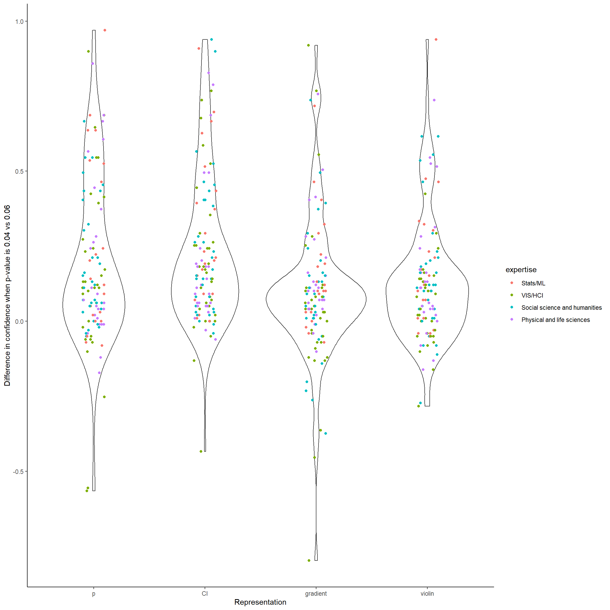
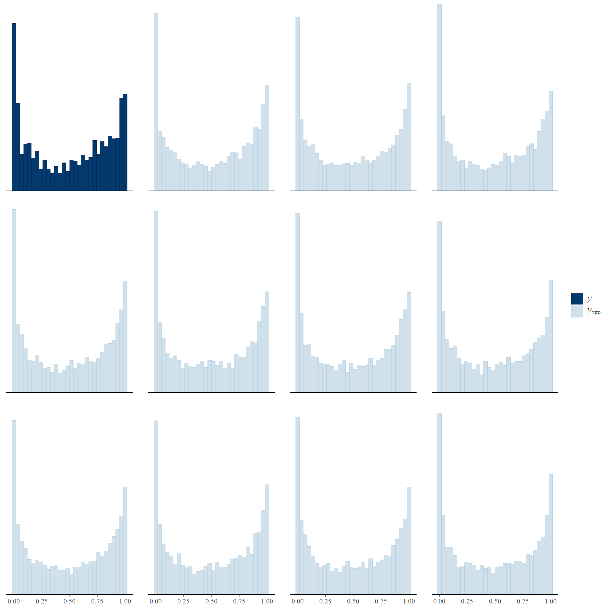
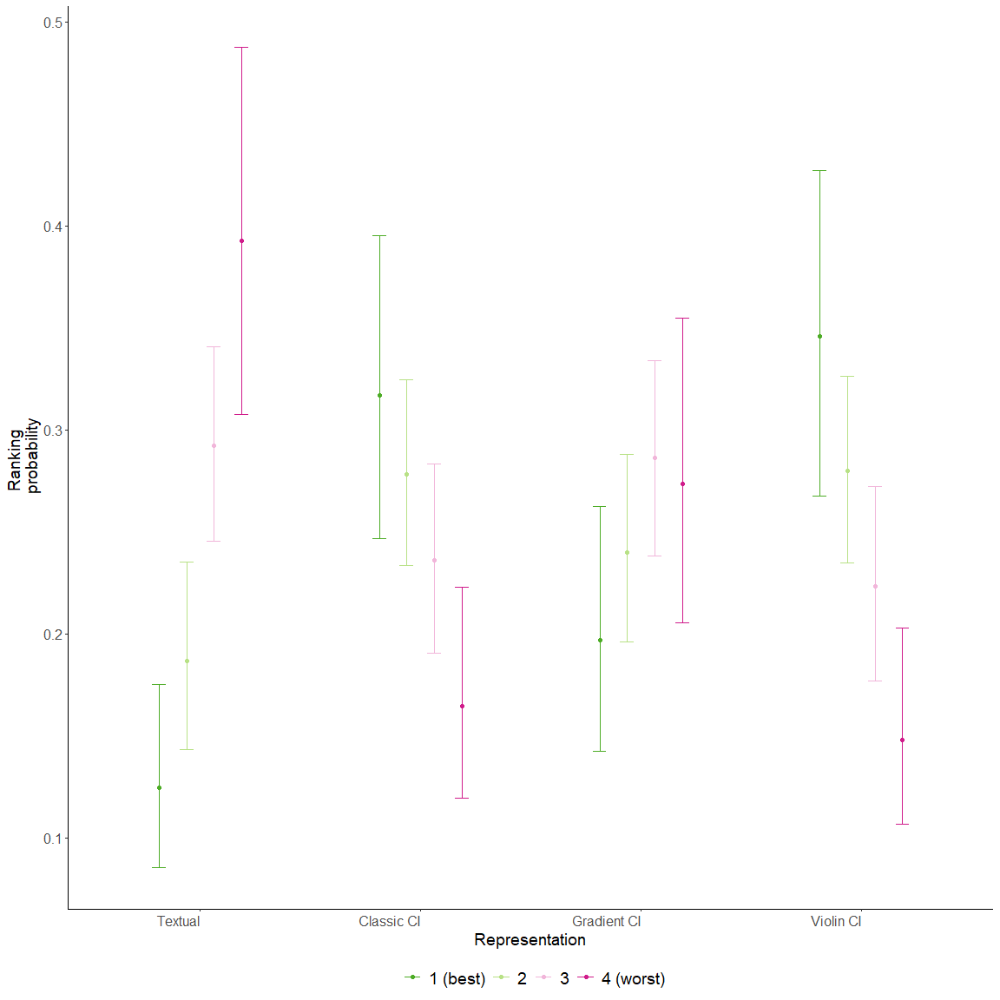
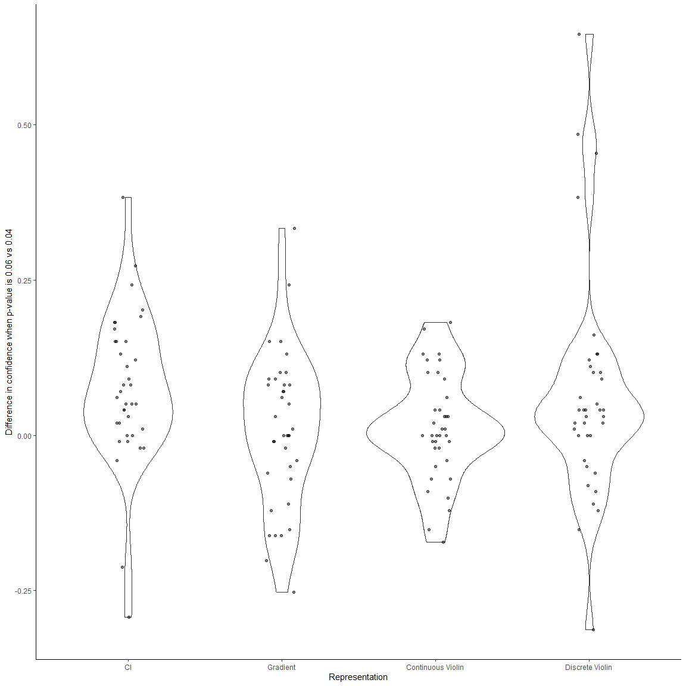
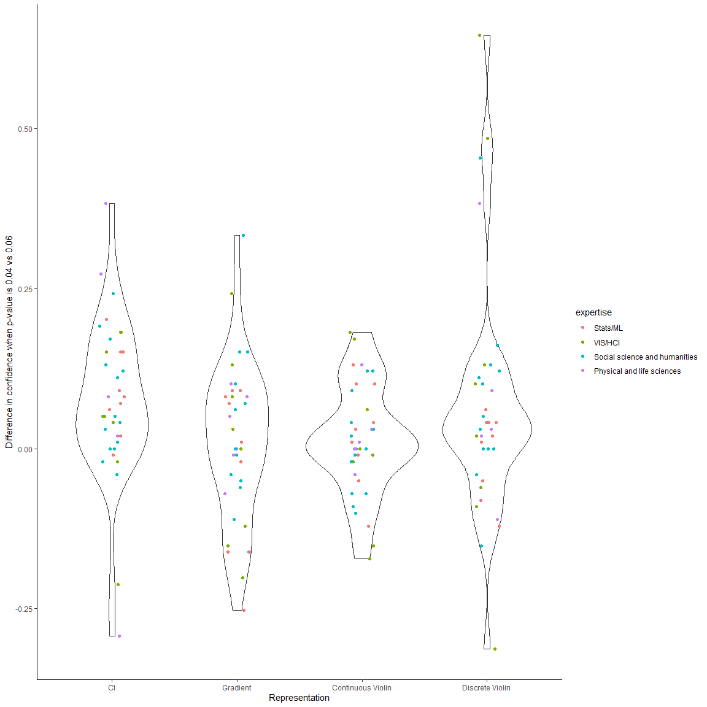
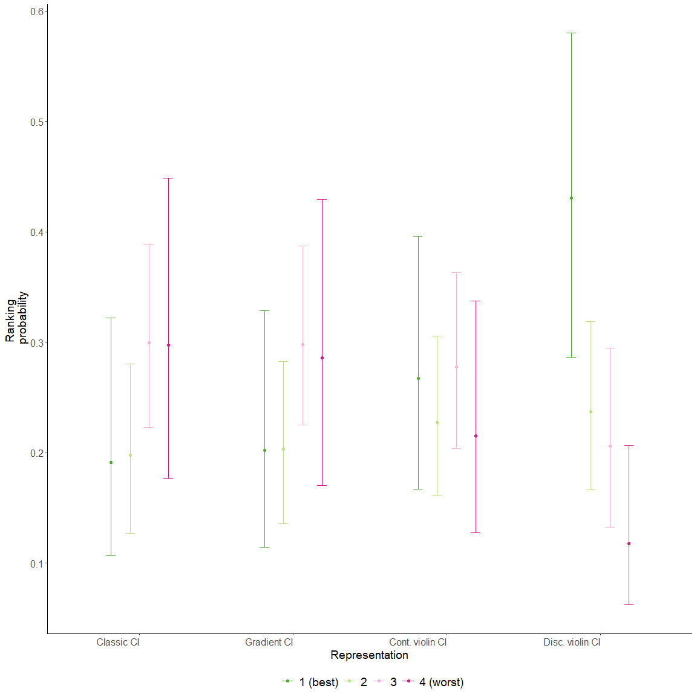

# What is this

This repository contains data and scripts for reproducing the analysis of the paper *Are You Sure You're Sure? - Effects of Visual Representation on the Cliff Effect in Statistical Inference* by Jouni Helske, Satu Helske, Matthew Cooper, Anders Ynnerman, and Lonni Besançon. The original raw R scripts and results (except the files with model fits which are too large to include in GitHub) are in folders `experiment1` (one sample case) and `experiment2` (two sample case), but we will also reproduce the whole analysis workflow here. See the [paper on Arvix](https://arxiv.org/abs/2002.07671). 


## One-sample experiment

### Creating the dataset

First, we load some packages:

```r
suppressPackageStartupMessages({
  library(brms)
  library(modelr)
  library(ggplot2)
  library(dplyr)
  library(magrittr)
  library(jsonlite)
  library(loo)
})
```

Then we transform the raw data to suitable format for analysis:


```r
path <- "experiment1/data"
answers <- list.files(path, pattern="answers", full.names = TRUE)

# fetch number of participants
n <- length(answers)

# create a data frame for the results
data_raw <- data.frame(id = rep(1:n, each = 32), viz = NA, replication = NA, value = NA,
                       expertise = NA, degree = NA)

# read in answers, not optimal way will do
for(i in 1:n){
  x <- strsplit(fromJSON(answers[i]), ",")
  dem <- fromJSON(paste0(path,  "/demography", x[[1]][1], ".txt"))
  for(j in 1:32) {
    data_raw[32*(i-1) + j, c("id", "viz", "replication", "value")] <- x[[j]]
    data_raw[32*(i-1) + j, c("expertise", "degree")] <- dem[c("expertise", "level")]
  }
}
# remove person who didn't answer reasonably on the demography part
# Degree is None and more imporantly expertise is 1..?
data_all <- data_raw[data_raw$degree != "None",]

# true p-values
true_p <- c(0.001, 0.01, 0.04, 0.05, 0.06, 0.1, 0.5, 0.8)

# convert to factors and numeric
data_all <- data_all %>% mutate(n = factor(ifelse(as.numeric(id) %% 8 < 4, 50, 200)),
                                id = factor(id),
                                viz = relevel(factor(viz, labels = c("CI", "gradient", "p", "violin")), "p"),
                                replication = as.numeric(replication),
                                value = as.numeric(value),
                                p = true_p[replication],
                                true_p = factor(p), # for monotonic but non-linear effect on confidence
                                confidence = (value - 1) / 99,
                                expertise = factor(expertise)) %>% arrange(id, viz)


# Try to classify participants into Stats/ML, VIS/HCI and Others
data_all$expertise <- recode_factor(data_all$expertise, 
                                    "Statistics" = "Stats/ML",
                                    "statistics" = "Stats/ML",
                                    "statistics/machine learning" = "Stats/ML",
                                    "Analytics" = "Stats/ML",
                                    "Statistics/Medicine" = "Stats/ML",
                                    "Data science" = "Stats/ML",
                                    "Biostatistics" = "Stats/ML",
                                    "IT & Business Data Science" = "Stats/ML",
                                    "methods" = "Stats/ML",
                                    
                                    "interaction design and evaluation" = "VIS/HCI",
                                    "Human-Computer Interaction" = "VIS/HCI",
                                    "HCI" = "VIS/HCI",
                                    "Vis" = "VIS/HCI",
                                    "Visualization" = "VIS/HCI",
                                    "Data Visualization" = "VIS/HCI",
                                    "CS, Visualization, HCI" = "VIS/HCI",
                                    "Infovis" = "VIS/HCI",
                                    "Visualization / Computer Science" = "VIS/HCI",
                                    "AI" = "Stats/ML",
                                    "Virtual Reality" = "VIS/HCI",
                                    "Visualisation" = "VIS/HCI",
                                    "Neuroscience and Statistics" = "Stats/ML",
                                    "research in HCI" = "VIS/HCI",
                                    
                                    "Social science" = "Other",
                                    "Political science" = "Other",
                                    "sociology" = "Other",
                                    "Sociology" = "Other",
                                    "Analytical Sociology" = "Other",
                                    "Education research" = "Other",
                                    "Economics" = "Other", 
                                    "market research" = "Other",
                                    "Politics" = "Other",
                                    "Finance" = "Other",
                                    "Linguistics" = "Other",
                                    "Education Poliy" = "Other",
                                    "Political Science" = "Other",
                                    "Psychology" =  "Other",
                                    "psychology" =  "Other",
                                    "Animal science" = "Other",
                                    "Biology" = "Other",
                                    "Botany" = "Other",
                                    "ecology" = "Other",
                                    "Zoology" = "Other",
                                    "Physics" = "Other",
                                    "cognitive neuroscience" = "Other",
                                    "Neuroscience" = "Other",
                                    "neuroscience/motor control" = "Other",
                                    "Biomechanics" = "Other",
                                    "Neurocognitive Psychology" = "Other",
                                    "pharma" =  "Other",
                                    "Public health" = "Other",
                                    "neurobiology" = "Other",
                                    "medicine" = "Other",
                                    "Molcular Biology" = "Other",
                                    "Wind Energy" = "Other",
                                    "Mathematical Biology" = "Other",
                                    "segregation" = "Other",
                                    "Philosophy" = "Other",
                                    "Pain" = "Other",
                                    "genomics" = "Other",
                                    "organizational science" = "Other",
                                    "Psychometric" = "Other",
                                    "Medicine" = "Other",
                                    "Water engineering" = "Other",
                                    "Strategic Management" = "Other",
                                    "network analysis" = "Other",
                                    "CSS" = "Other",
                                    "Management"  = "Other",
                                    "Computer science" = "Other",
                                    "Computer Science" = "Other",
                                    "HCI, Visualization" = "VIS/HCI",
                                    "HCI/Visualization" = "VIS/HCI",
                                    "Computer vision" = "Stats/ML")
data_all$expertise <- relevel(data_all$expertise, "Other")
```

We will then check for potential outliers, which we define as a person who had less confidence with $p = 0.001$ than with $p = 0.8$, i.e. the relationship between $p$-value and confidence has and opposite relationship compared to correct one:


```r
outliers <- data_all %>% group_by(id, viz) %>% 
  summarize(
    mistake = confidence[p == 0.001] < confidence[p == 0.8]) %>% 
  filter(mistake)

n_out <- nrow(outliers)

data_all %>% 
  filter((interaction(id,viz) %in% interaction(outliers$id, outliers$viz))) %>%
  ggplot(aes(x = p, y = confidence, group = id, colour = id)) + 
  geom_line() + 
  geom_point() +
  theme_bw() + 
  facet_wrap(~ viz)
```

<!-- -->

In our previous versions of the analysis we used more strict criterion with $p \leq 0.01$ vs $p \geq 0.1$ which lead to the removal of 78 p-confidence curves. But as we did not preregister the exclusion criteria we do not exclude any cases from the subsequent analysis (Except the one participant who did not answer properly to demography questions). If would like to remove these 15 cases from the further analysis, it could be accomplished by uncommenting the end of the following line:


```r
data <- data_all #%>% filter(!(interaction(id,viz) %in% interaction(outliers$id, outliers$viz)))
```

Overall the removal of these 15 (or 78) cases does not have a major effect on the results, and the overall conclusions of the analysis do not depend on whether we use the full or cleaned dataset.

### Descriptive statistics

Let's look some descriptive statistics, first the cliff effect as difference between confidence when $p$-value=0.04 versus $p$-value=0.06:

```r
data %>% group_by(id, viz) %>% 
  summarize(difference = confidence[true_p==0.04] - confidence[true_p==0.06])  %>% 
  group_by(viz) %>%
  summarise(
    mean = mean(difference), 
    sd = sd(difference), 
    se = sd(difference) / sqrt(length(difference)),
    "2.5%" = quantile(difference, 0.025), 
    "97.5%" = quantile(difference, 0.975))
```

```
## # A tibble: 4 x 6
##   viz       mean    sd     se  `2.5%` `97.5%`
##   <fct>    <dbl> <dbl>  <dbl>   <dbl>   <dbl>
## 1 p        0.192 0.274 0.0257 -0.188    0.721
## 2 CI       0.232 0.250 0.0235 -0.0525   0.842
## 3 gradient 0.102 0.239 0.0225 -0.366    0.741
## 4 violin   0.126 0.204 0.0192 -0.162    0.616
```

```r
data %>% group_by(id, viz) %>% 
  summarize(difference = confidence[true_p==0.04] - confidence[true_p==0.06]) %>%
  ggplot(aes(x = viz, y = difference)) + 
  geom_violin() +
  geom_point(alpha = 0.5, position = position_jitter(0.1)) +
  scale_y_continuous("Difference in confidence when p-value is 0.06 vs 0.04") +
  scale_x_discrete("Representation") +
  theme_bw() 
```

<!-- -->

The cliff effect seems to be largest when information is presented as traditional CI or $p$-value which behave similarly. Gradient CI and Violin CI plots are pretty close to each other.

Now same but with subgrouping using sample size:

```r
data %>% group_by(id, viz, n) %>% 
  summarize(diff = confidence[true_p==0.04] - confidence[true_p==0.06])  %>% 
  group_by(viz, n) %>%
  summarise(
    mean = mean(diff), 
    sd = sd(diff), 
    se = sd(diff) / sqrt(length(diff)),
    "2.5%" = quantile(diff, 0.025), 
    "97.5%" = quantile(diff, 0.975))
```

```
## # A tibble: 8 x 7
## # Groups:   viz [4]
##   viz      n       mean    sd     se  `2.5%` `97.5%`
##   <fct>    <fct>  <dbl> <dbl>  <dbl>   <dbl>   <dbl>
## 1 p        50    0.215  0.266 0.0359 -0.0535   0.687
## 2 p        200   0.169  0.280 0.0368 -0.218    0.777
## 3 CI       50    0.207  0.187 0.0252 -0.0263   0.638
## 4 CI       200   0.254  0.297 0.0390 -0.101    0.905
## 5 gradient 50    0.117  0.218 0.0294 -0.220    0.669
## 6 gradient 200   0.0888 0.259 0.0340 -0.369    0.729
## 7 violin   50    0.116  0.167 0.0225 -0.162    0.504
## 8 violin   200   0.136  0.235 0.0308 -0.123    0.686
```
and expertise:

```r
data %>% group_by(id, viz, expertise) %>% 
  summarize(diff = confidence[true_p==0.04] - confidence[true_p==0.06])  %>% 
  group_by(viz, expertise) %>%
  summarise(
    mean = mean(diff), 
    sd = sd(diff), 
    se = sd(diff) / sqrt(length(diff)),
    "2.5%" = quantile(diff, 0.025), 
    "97.5%" = quantile(diff, 0.975))
```

```
## # A tibble: 12 x 7
## # Groups:   viz [4]
##    viz      expertise   mean    sd     se   `2.5%` `97.5%`
##    <fct>    <fct>      <dbl> <dbl>  <dbl>    <dbl>   <dbl>
##  1 p        Other     0.199  0.240 0.0307 -0.0859    0.677
##  2 p        Stats/ML  0.237  0.298 0.0666 -0.0760    0.835
##  3 p        VIS/HCI   0.149  0.318 0.0562 -0.558     0.735
##  4 CI       Other     0.229  0.239 0.0306 -0.0354    0.864
##  5 CI       Stats/ML  0.308  0.262 0.0585  0.00480   0.808
##  6 CI       VIS/HCI   0.189  0.259 0.0457 -0.199     0.744
##  7 gradient Other     0.119  0.208 0.0266 -0.247     0.621
##  8 gradient Stats/ML  0.148  0.189 0.0424 -0.0563    0.597
##  9 gradient VIS/HCI   0.0417 0.310 0.0547 -0.532     0.802
## 10 violin   Other     0.153  0.215 0.0275 -0.146     0.616
## 11 violin   Stats/ML  0.174  0.230 0.0515 -0.0457    0.714
## 12 violin   VIS/HCI   0.0442 0.136 0.0241 -0.189     0.322
```

In terms of sample size, there doesn't seem to be clear differences in cliff effect expect the variation in case of $p$-value seems to depend on the sample size. In terms of expertise, there seems to be some differences especially in terms of variability (most notably the Violin plot for VIS/HCI), but the differences are likely due to few very extreme cases:

```r
data %>% group_by(id, viz, expertise) %>% 
  summarize(
    difference = confidence[true_p==0.04] - confidence[true_p==0.06]) %>%
  ggplot(aes(x=viz, y = difference)) + geom_violin() + theme_bw() + 
  scale_y_continuous("Difference in confidence when p-value is 0.04 vs 0.06") +
  scale_x_discrete("Representation") +
  geom_point(aes(colour = expertise), position=position_jitter(0.1))
```

<!-- -->

Let's check how the much extreme answers (full or zero confidence) there are in different groups:

```r
data %>% group_by(id, viz, n) %>% 
  mutate(extreme = confidence %in% c(0, 1))  %>% 
  group_by(viz, n) %>%
  summarise(
    mean = mean(extreme),
    sd = sd(extreme), 
    se = sd(extreme) / sqrt(length(extreme)))
```

```
## # A tibble: 8 x 5
## # Groups:   viz [4]
##   viz      n      mean    sd     se
##   <fct>    <fct> <dbl> <dbl>  <dbl>
## 1 p        50    0.159 0.366 0.0175
## 2 p        200   0.164 0.370 0.0172
## 3 CI       50    0.148 0.355 0.0169
## 4 CI       200   0.179 0.384 0.0178
## 5 gradient 50    0.127 0.334 0.0159
## 6 gradient 200   0.153 0.360 0.0167
## 7 violin   50    0.123 0.328 0.0157
## 8 violin   200   0.159 0.367 0.0170
```

```r
data %>% group_by(id, viz, expertise) %>% 
  mutate(extreme = confidence %in% c(0, 1))  %>% 
  group_by(viz, expertise) %>%
  summarise(
    mean = mean(extreme),
    sd = sd(extreme), 
    se = sd(extreme) / sqrt(length(extreme)))
```

```
## # A tibble: 12 x 5
## # Groups:   viz [4]
##    viz      expertise  mean    sd     se
##    <fct>    <fct>     <dbl> <dbl>  <dbl>
##  1 p        Other     0.139 0.347 0.0157
##  2 p        Stats/ML  0.194 0.396 0.0313
##  3 p        VIS/HCI   0.184 0.388 0.0242
##  4 CI       Other     0.137 0.345 0.0156
##  5 CI       Stats/ML  0.206 0.406 0.0321
##  6 CI       VIS/HCI   0.188 0.391 0.0244
##  7 gradient Other     0.119 0.324 0.0147
##  8 gradient Stats/ML  0.206 0.406 0.0321
##  9 gradient VIS/HCI   0.141 0.348 0.0218
## 10 violin   Other     0.115 0.319 0.0144
## 11 violin   Stats/ML  0.194 0.396 0.0313
## 12 violin   VIS/HCI   0.160 0.367 0.0230
```

Looks like the "Other" group is less prone to extreme values than other groups but the differences are quite small.

### Creating the model

Now we create the necessary functions for our model:

```r
stan_funs <- "
 real logit_p_gaussian_lpdf(real y, real mu, real sigma,
                            real zoi, real coi) {
     if (y == 0) { 
       return bernoulli_lpmf(1 | zoi) + bernoulli_lpmf(0 | coi); 
     } else if (y == 1) {
       return bernoulli_lpmf(1 | zoi) + bernoulli_lpmf(1 | coi);
     } else { 
       return bernoulli_lpmf(0 | zoi) + normal_lpdf(logit(y) | mu, sigma);
     } 
                                    }
  real logit_p_gaussian_rng(real y, real mu, real sigma,
                            real zoi, real coi) {
    // 0 or 1
    int zero_one = bernoulli_rng(zoi);
    if (zero_one == 1) {
      // casting to real
      int one = bernoulli_rng(coi);
      if (one == 1) {
        return 1.0;
      } else {
        return 0.0;
      }
    } else {
      return inv_logit(normal_rng(mu, sigma));
    }
  }
"

log_lik_logit_p_gaussian <- function(i, draws) {
  mu <- draws$dpars$mu[, i]
  zoi <- draws$dpars$zoi[, i]
  coi <- draws$dpars$coi[, i]
  sigma <- draws$dpars$sigma
  y <- draws$data$Y[i]
  if (y == 0) { 
    dbinom(1, 1, zoi, TRUE) + dbinom(0, 1, coi, TRUE)
  } else if (y == 1) {
    dbinom(1, 1, zoi, TRUE) + dbinom(1, 1, coi, TRUE)
  } else { 
    dbinom(0, 1, zoi, TRUE) + dnorm(qlogis(y), mu, sigma, TRUE)
  } 
}


predict_logit_p_gaussian <- function(i, draws, ...) {
  mu <- draws$dpars$mu[, i]
  zoi <- draws$dpars$zoi[, i]
  coi <- draws$dpars$coi[, i]
  sigma <- draws$dpars$sigma
  zero_one <- rbinom(length(zoi), 1, zoi)
  ifelse(zero_one, rbinom(length(coi), 1, coi), plogis(rnorm(length(mu), mu, sigma)))
}

fitted_logit_p_gaussian <- function(draws) {
  mu <- draws$dpars$mu
  zoi <- draws$dpars$zoi
  coi <- draws$dpars$coi
  sigma <- draws$dpars$sigma
  # no analytical solution for the mean of logistic normal distribution, rely on simulation
  for (i in 1:ncol(mu)) {
    for(j in 1:nrow(mu)) {
      mu[j, i] <- mean(plogis(rnorm(1000, mu[j, i], sigma[j])))
    }
  }
  zoi * coi + (1 - zoi) * mu
}


logit_p_gaussian <- custom_family(
  "logit_p_gaussian", 
  dpars = c("mu", "sigma", "zoi", "coi"),
  links = c("identity", "log", "logit", "logit"),
  lb = c(NA, 0, 0, 0), ub = c(NA, NA, 1, 1),
  type = "real", 
  log_lik = log_lik_logit_p_gaussian,
  predict = predict_logit_p_gaussian,
  fitted = fitted_logit_p_gaussian)
```

And create few additional variables:

```r
data <- data %>% 
  mutate(
    logit_p = qlogis(p),
    p_lt0.05 = factor(p < 0.05, levels = c(TRUE, FALSE), labels = c("Yes", "No")),
    p_eq0.05 = factor(p == 0.05, levels = c(TRUE, FALSE), labels = c("Yes", "No")),
    cat_p = recode_factor(true_p, "0.06" = ">0.05", "0.1" = ">0.05", "0.5" = ">0.05", "0.8" = ">0.05",
                          .ordered = TRUE))
```

### Model

Now we fit several models of increasing complexity (non-exhaustively), and then test for potential overfitting via 10-fold cross-validation (CV). The often recommended approximations of leave-one-out CV indicated poor suitability here, likely due to some peculiar cases still in the data (removing some of the aforementioned outliers would help to some extend). **Note: Estimating all these models takes some time (~few hours and additional day or so for cross validation, unless fully parallelized)!**.

Our first model contains interaction of visualization style and $p-value$ (in logit-scale), and we allow these effects vary depending whether we are under or over the $p=0.05$. The individual random effect part contains only main effects, and the zero-one cases are explained with visualization and p-value, with a simple random intercept for participant level variation. Note that given that the answer is 0 or 1 (equation of `zoi`), the classification between these two should depend only on $p$-value (equation of `coi`).


```r
fit1 <- brm(bf(
  confidence ~ 
    viz * p_lt0.05 * logit_p + 
    viz * p_eq0.05 +
    (viz + p_lt0.05 + logit_p | id),
  zoi ~ 
    viz * true_p + (1 | id),
  coi ~ mo(cat_p)),
  data = data,
  family = logit_p_gaussian,
  stanvars = stanvar(scode = stan_funs, block = "functions"),
  chains = 4, iter = 2000, init = 0, save_warmup = FALSE,
  cores = 4, refresh = 0)
saveRDS(fit1, file = "experiment1/results/fit1.rds")
```
For the second model, we also add the participants expertise as an explanatory variable, and allow it depend on the visualization:

```r
fit2 <- brm(bf(
  confidence ~ 
    viz * expertise + 
    viz * p_lt0.05 * logit_p + 
    viz * p_eq0.05 +
    (viz + p_lt0.05 + logit_p | id),
  zoi ~ 
    viz * expertise + 
    viz * true_p + (1 | id),
  coi ~ mo(cat_p)),
  data = data,
  family = logit_p_gaussian,
  stanvars = stanvar(scode = stan_funs, block = "functions"),
  chains = 4, iter = 2000, init = 0, save_warmup = FALSE,
  cores = 4, refresh = 0)
saveRDS(fit2, file = "experiment1/results/fit2.rds")
```

Third case adds participant level coefficient of visualization to explain the extreme answers (`zoi`): 

```r
fit3 <- brm(bf(
  confidence ~ 
    viz * expertise + 
    viz * p_lt0.05 * logit_p + 
    viz * p_eq0.05 +
    (viz + p_lt0.05 + logit_p | id),
  zoi ~ 
    viz * expertise + 
    viz * true_p + (viz | id),
  coi ~ mo(cat_p)),
  data = data, 
  family = logit_p_gaussian,
  stanvars = stanvar(scode = stan_funs, block = "functions"),
  chains = 4, iter = 2000, init = 0, save_warmup = FALSE,
  cores = 4, refresh = 0)
saveRDS(fit3, file = "experiment1/results/fit3.rds")
```
For the fourth model we add interaction to the random effects, allowing the effect of visualization and $logit(p)$ depend on whether the true $p$-value was less than 0.05:

```r
fit4 <- brm(bf(
  confidence ~ 
    viz * expertise + 
    viz * p_lt0.05 * logit_p + 
    viz * p_eq0.05 +
    (viz * p_lt0.05 + viz * logit_p + p_lt0.05 * logit_p | id),
  zoi ~ 
    viz * expertise + 
    viz * true_p + (viz | id),
  coi ~ mo(cat_p)),
  data = data,
  family = logit_p_gaussian,
  stanvars = stanvar(scode = stan_funs, block = "functions"),
  chains = 4, iter = 2000, init = 0, save_warmup = FALSE,
  cores = 4, refresh = 0)
saveRDS(fit4, file = "experiment1/results/fit4.rds")
```

Now we try to drop the expertise from previous (fourth) model as it might do more harm than good:

```r
fit5 <- brm(bf(
  confidence ~ 
    viz * p_lt0.05 * logit_p + 
    viz * p_eq0.05 +
    (viz * p_lt0.05 + viz * logit_p + p_lt0.05 * logit_p | id),
  zoi ~ 
    viz * true_p + (viz | id),
  coi ~ mo(cat_p)),
  data = data,
  family = logit_p_gaussian,
  stanvars = stanvar(scode = stan_funs, block = "functions"),
  chains = 4, iter = 2000, init = 0, save_warmup = FALSE,
  cores = 4, refresh = 0)
saveRDS(fit5, file = "experiment1/results/fit5.rds")
```
Going into more complex direction, we keep expertise (fourth model) and add also three-way interactions to random effects:

```r
fit6 <- brm(bf(
  confidence ~ 
    viz * expertise + 
    viz * p_lt0.05 * logit_p + 
    viz * p_eq0.05 +
    (viz * logit_p * p_lt0.05 | id),
  zoi ~ 
    viz * expertise + 
    viz * true_p + (viz | id),
  coi ~ mo(cat_p)),
  data = data,
  family = logit_p_gaussian,
  stanvars = stanvar(scode = stan_funs, block = "functions"),
  chains = 4, iter = 2000, init = 0, save_warmup = FALSE,
  cores = 4, refresh = 0)
saveRDS(fit6, file = "experiment1/results/fit6.rds")
```
And then same without expertise:

```r
fit7 <- brm(bf(
  confidence ~ 
    viz * p_lt0.05 * logit_p + 
    viz * p_eq0.05 +
    (viz * logit_p * p_lt0.05 | id),
  zoi ~ 
    viz * true_p + (viz | id),
  coi ~ mo(cat_p)),
  data = data, 
  family = logit_p_gaussian,
  stanvars = stanvar(scode = stan_funs, block = "functions"),
  chains = 4, iter = 2000, init = 0, save_warmup = FALSE,
  cores = 4, refresh = 0)
saveRDS(fit7, file = "experiment1/results/fit7.rds")
```
Finally, test if adding expertise only to non-extreme confidence helps:

```r
fit8 <- brm(bf(
  confidence ~ 
    viz * expertise +
    viz * p_lt0.05 * logit_p + 
    viz * p_eq0.05 +
    (viz * p_lt0.05 + viz * logit_p + p_lt0.05 * logit_p | id),
  zoi ~ 
    viz * true_p + (viz | id),
  coi ~ mo(cat_p)),
  data = data, 
  family = logit_p_gaussian,
  stanvars = stanvar(scode = stan_funs, block = "functions"),
  chains = 4, iter = 2000, init = 0, save_warmup = FALSE,
  cores = 4, refresh = 0)
saveRDS(fit8, file = "experiment1/results/fit8.rds")
```

Let's perform cross-validation for these models and see which one performs best:

```r
K <- 10
folds <- loo::kfold_split_grouped(K = K, x = fit1$data$id)
kfold1 <- kfold(fit1, folds = folds)
kfold2 <- kfold(fit2, folds = folds)
kfold3 <- kfold(fit3, folds = folds)
kfold4 <- kfold(fit4, folds = folds)
kfold5 <- kfold(fit5, folds = folds)
kfold6 <- kfold(fit6, folds = folds)
kfold7 <- kfold(fit7, folds = folds)
kfold8 <- kfold(fit8, folds = folds)
```


```r
save(kfold1, kfold2, kfold3, kfold4, kfold5, kfold6, kfold7, kfold8, folds,
     file = "experiment1/results/experiment1_kfolds_full_data.rds")
```


```r
load("experiment1/results/experiment1_kfolds_full_data.rds")
loo::compare(kfold1, kfold2, kfold3, kfold4, 
             kfold5, kfold6, kfold7, kfold8)
```

```
##        elpd_diff se_diff elpd_kfold p_kfold
## kfold1     0.0       0.0 -7566.3         NA
## kfold3    -8.4      10.7 -7574.7         NA
## kfold2    -9.0      10.7 -7575.3         NA
## kfold7   -74.3       7.0 -7640.6         NA
## kfold8   -89.8      10.8 -7656.1         NA
## kfold6   -96.1      12.6 -7662.4         NA
## kfold5   -99.1       7.6 -7665.4         NA
## kfold4  -105.1      12.6 -7671.4         NA
```

Differences are quite small between some of the models (note the standard errors), so let's choose the simplest one (model 1, no expertise). 

### Results

First, let us check the parameter estimates of the model:


```r
fit_exp1 <- readRDS("experiment1/results/fit1.rds")
fit_exp1
```

```
##  Family: logit_p_gaussian 
##   Links: mu = identity; sigma = identity; zoi = logit; coi = logit 
## Formula: confidence ~ viz * p_lt0.05 * logit_p + viz * p_eq0.05 + (viz + p_lt0.05 + logit_p | id) 
##          zoi ~ viz * true_p + (1 | id)
##          coi ~ mo(cat_p)
##    Data: data (Number of observations: 3616) 
## Samples: 4 chains, each with iter = 2000; warmup = 1000; thin = 1;
##          total post-warmup samples = 4000
## 
## Group-Level Effects: 
## ~id (Number of levels: 113) 
##                             Estimate Est.Error l-95% CI u-95% CI Rhat
## sd(Intercept)                   1.19      0.12     0.96     1.42 1.00
## sd(vizCI)                       0.69      0.08     0.55     0.85 1.01
## sd(vizgradient)                 0.95      0.08     0.80     1.12 1.00
## sd(vizviolin)                   0.95      0.08     0.80     1.13 1.00
## sd(p_lt0.05No)                  0.69      0.08     0.54     0.86 1.01
## sd(logit_p)                     0.26      0.02     0.22     0.30 1.01
## sd(zoi_Intercept)               2.10      0.21     1.74     2.54 1.00
## cor(Intercept,vizCI)           -0.23      0.13    -0.48     0.03 1.00
## cor(Intercept,vizgradient)     -0.37      0.11    -0.57    -0.14 1.00
## cor(vizCI,vizgradient)          0.46      0.11     0.23     0.66 1.01
## cor(Intercept,vizviolin)       -0.29      0.12    -0.51    -0.05 1.00
## cor(vizCI,vizviolin)            0.55      0.10     0.33     0.72 1.00
## cor(vizgradient,vizviolin)      0.78      0.06     0.65     0.87 1.00
## cor(Intercept,p_lt0.05No)       0.28      0.16    -0.02     0.60 1.00
## cor(vizCI,p_lt0.05No)           0.00      0.15    -0.28     0.30 1.01
## cor(vizgradient,p_lt0.05No)    -0.14      0.13    -0.39     0.13 1.00
## cor(vizviolin,p_lt0.05No)      -0.03      0.13    -0.29     0.23 1.00
## cor(Intercept,logit_p)          0.16      0.12    -0.08     0.38 1.00
## cor(vizCI,logit_p)             -0.09      0.13    -0.33     0.16 1.00
## cor(vizgradient,logit_p)        0.08      0.12    -0.15     0.30 1.00
## cor(vizviolin,logit_p)          0.10      0.12    -0.14     0.32 1.00
## cor(p_lt0.05No,logit_p)         0.26      0.14    -0.03     0.53 1.00
##                             Bulk_ESS Tail_ESS
## sd(Intercept)                   1689     2433
## sd(vizCI)                       1451     2586
## sd(vizgradient)                  924     2044
## sd(vizviolin)                    977     2323
## sd(p_lt0.05No)                   989     1196
## sd(logit_p)                     1064     1748
## sd(zoi_Intercept)                903     1679
## cor(Intercept,vizCI)            1141     2070
## cor(Intercept,vizgradient)       827     1505
## cor(vizCI,vizgradient)           516     1228
## cor(Intercept,vizviolin)         838     1318
## cor(vizCI,vizviolin)             789     1585
## cor(vizgradient,vizviolin)      1330     2583
## cor(Intercept,p_lt0.05No)        619      863
## cor(vizCI,p_lt0.05No)            960     2071
## cor(vizgradient,p_lt0.05No)     1185     2099
## cor(vizviolin,p_lt0.05No)       1412     2379
## cor(Intercept,logit_p)           793     1599
## cor(vizCI,logit_p)               732     1393
## cor(vizgradient,logit_p)         954     1764
## cor(vizviolin,logit_p)           808     1316
## cor(p_lt0.05No,logit_p)          482      932
## 
## Population-Level Effects: 
##                                Estimate Est.Error l-95% CI u-95% CI Rhat
## Intercept                          0.15      0.25    -0.36     0.66 1.00
## zoi_Intercept                     -2.09      0.36    -2.84    -1.42 1.00
## coi_Intercept                     -3.74      0.35    -4.49    -3.10 1.00
## vizCI                              0.53      0.33    -0.11     1.18 1.00
## vizgradient                       -1.32      0.34    -1.97    -0.66 1.00
## vizviolin                         -0.73      0.33    -1.38    -0.08 1.00
## p_lt0.05No                        -1.69      0.21    -2.11    -1.25 1.01
## logit_p                           -0.42      0.04    -0.51    -0.33 1.00
## p_eq0.05No                        -0.63      0.12    -0.88    -0.39 1.00
## vizCI:p_lt0.05No                  -0.72      0.29    -1.26    -0.14 1.00
## vizgradient:p_lt0.05No             0.90      0.29     0.34     1.46 1.00
## vizviolin:p_lt0.05No               0.59      0.29     0.02     1.16 1.00
## vizCI:logit_p                      0.07      0.06    -0.04     0.18 1.00
## vizgradient:logit_p               -0.11      0.06    -0.22    -0.00 1.00
## vizviolin:logit_p                 -0.08      0.05    -0.18     0.03 1.00
## p_lt0.05No:logit_p                -0.23      0.05    -0.33    -0.13 1.01
## vizCI:p_eq0.05No                   0.24      0.17    -0.08     0.58 1.00
## vizgradient:p_eq0.05No             0.58      0.17     0.25     0.93 1.00
## vizviolin:p_eq0.05No               0.48      0.17     0.16     0.82 1.00
## vizCI:p_lt0.05No:logit_p          -0.13      0.07    -0.27     0.01 1.00
## vizgradient:p_lt0.05No:logit_p     0.10      0.07    -0.05     0.24 1.00
## vizviolin:p_lt0.05No:logit_p       0.03      0.07    -0.11     0.17 1.00
## zoi_vizCI                          0.72      0.39    -0.04     1.49 1.00
## zoi_vizgradient                    0.30      0.39    -0.46     1.06 1.00
## zoi_vizviolin                      0.72      0.38    -0.02     1.50 1.00
## zoi_true_p0.01                    -1.37      0.46    -2.27    -0.48 1.00
## zoi_true_p0.04                    -2.48      0.59    -3.69    -1.38 1.00
## zoi_true_p0.05                    -2.78      0.65    -4.18    -1.60 1.00
## zoi_true_p0.06                    -1.67      0.49    -2.62    -0.72 1.00
## zoi_true_p0.1                     -1.12      0.45    -2.01    -0.27 1.00
## zoi_true_p0.5                      0.78      0.38     0.05     1.54 1.00
## zoi_true_p0.8                      1.22      0.38     0.49     1.98 1.00
## zoi_vizCI:true_p0.01               0.33      0.61    -0.88     1.49 1.00
## zoi_vizgradient:true_p0.01        -1.17      0.73    -2.62     0.21 1.00
## zoi_vizviolin:true_p0.01          -1.18      0.68    -2.54     0.10 1.00
## zoi_vizCI:true_p0.04              -0.47      0.81    -2.04     1.09 1.00
## zoi_vizgradient:true_p0.04        -0.97      0.92    -2.83     0.75 1.00
## zoi_vizviolin:true_p0.04          -1.95      1.06    -4.09    -0.02 1.00
## zoi_vizCI:true_p0.05              -0.43      0.88    -2.17     1.31 1.00
## zoi_vizgradient:true_p0.05        -1.24      1.07    -3.45     0.75 1.00
## zoi_vizviolin:true_p0.05          -0.72      0.92    -2.57     1.04 1.00
## zoi_vizCI:true_p0.06              -1.54      0.75    -3.06    -0.06 1.00
## zoi_vizgradient:true_p0.06        -0.86      0.73    -2.31     0.54 1.00
## zoi_vizviolin:true_p0.06          -1.53      0.77    -3.11    -0.07 1.00
## zoi_vizCI:true_p0.1               -0.98      0.63    -2.22     0.26 1.00
## zoi_vizgradient:true_p0.1         -0.56      0.63    -1.77     0.68 1.00
## zoi_vizviolin:true_p0.1           -1.43      0.67    -2.75    -0.08 1.00
## zoi_vizCI:true_p0.5               -1.35      0.53    -2.39    -0.32 1.00
## zoi_vizgradient:true_p0.5         -0.71      0.54    -1.77     0.32 1.00
## zoi_vizviolin:true_p0.5           -1.42      0.54    -2.51    -0.38 1.00
## zoi_vizCI:true_p0.8               -1.03      0.53    -2.08     0.00 1.00
## zoi_vizgradient:true_p0.8         -0.48      0.52    -1.53     0.56 1.00
## zoi_vizviolin:true_p0.8           -0.90      0.52    -1.95     0.10 1.00
## coi_mocat_p                        1.43      0.11     1.23     1.66 1.00
##                                Bulk_ESS Tail_ESS
## Intercept                           731     1337
## zoi_Intercept                       619     1123
## coi_Intercept                      4522     3025
## vizCI                               888     1649
## vizgradient                         937     1574
## vizviolin                           830     1626
## p_lt0.05No                          659     1415
## logit_p                             773     1521
## p_eq0.05No                         1616     2527
## vizCI:p_lt0.05No                    772     1753
## vizgradient:p_lt0.05No              842     1417
## vizviolin:p_lt0.05No                747     1415
## vizCI:logit_p                       811     1716
## vizgradient:logit_p                 844     1578
## vizviolin:logit_p                   768     1463
## p_lt0.05No:logit_p                  777     1531
## vizCI:p_eq0.05No                   2253     2786
## vizgradient:p_eq0.05No             2078     2688
## vizviolin:p_eq0.05No               2295     2534
## vizCI:p_lt0.05No:logit_p            977     1934
## vizgradient:p_lt0.05No:logit_p     1000     2008
## vizviolin:p_lt0.05No:logit_p        955     1651
## zoi_vizCI                           660     1220
## zoi_vizgradient                     727     1426
## zoi_vizviolin                       814     1573
## zoi_true_p0.01                     1039     2197
## zoi_true_p0.04                     1406     2300
## zoi_true_p0.05                     1424     2260
## zoi_true_p0.06                     1105     1839
## zoi_true_p0.1                      1005     2119
## zoi_true_p0.5                       792     1473
## zoi_true_p0.8                       823     1385
## zoi_vizCI:true_p0.01               1227     2178
## zoi_vizgradient:true_p0.01         1460     2493
## zoi_vizviolin:true_p0.01           1508     2514
## zoi_vizCI:true_p0.04               1696     2539
## zoi_vizgradient:true_p0.04         1977     2712
## zoi_vizviolin:true_p0.04           2608     2827
## zoi_vizCI:true_p0.05               1522     2414
## zoi_vizgradient:true_p0.05         1946     2873
## zoi_vizviolin:true_p0.05           1701     2512
## zoi_vizCI:true_p0.06               1642     2812
## zoi_vizgradient:true_p0.06         1402     2660
## zoi_vizviolin:true_p0.06           1621     2573
## zoi_vizCI:true_p0.1                1180     2302
## zoi_vizgradient:true_p0.1          1222     2304
## zoi_vizviolin:true_p0.1            1455     2555
## zoi_vizCI:true_p0.5                 847     1698
## zoi_vizgradient:true_p0.5           981     1840
## zoi_vizviolin:true_p0.5            1163     2018
## zoi_vizCI:true_p0.8                 953     1849
## zoi_vizgradient:true_p0.8           971     1828
## zoi_vizviolin:true_p0.8            1047     2473
## coi_mocat_p                        4252     3099
## 
## Simplex Parameters: 
##                 Estimate Est.Error l-95% CI u-95% CI Rhat Bulk_ESS
## coi_mocat_p1[1]     0.94      0.03     0.86     0.99 1.00     6030
## coi_mocat_p1[2]     0.02      0.02     0.00     0.06 1.00     5017
## coi_mocat_p1[3]     0.02      0.02     0.00     0.06 1.00     6241
## coi_mocat_p1[4]     0.03      0.02     0.00     0.09 1.00     4607
##                 Tail_ESS
## coi_mocat_p1[1]     2410
## coi_mocat_p1[2]     2072
## coi_mocat_p1[3]     3018
## coi_mocat_p1[4]     2534
## 
## Family Specific Parameters: 
##       Estimate Est.Error l-95% CI u-95% CI Rhat Bulk_ESS Tail_ESS
## sigma     0.96      0.01     0.94     0.99 1.00     3198     3109
## 
## Samples were drawn using sampling(NUTS). For each parameter, Eff.Sample 
## is a crude measure of effective sample size, and Rhat is the potential 
## scale reduction factor on split chains (at convergence, Rhat = 1).
```

Now we look at some figures. First we draw some samples from posterior predictive distribution and see how well our simulated replications match with our data:

```r
pp_check(fit_exp1, type = "hist", nsamples = 11)
```

```
## `stat_bin()` using `bins = 30`. Pick better value with `binwidth`.
```

<!-- -->

We see that the histograms of the replicated datasets are similar to observed one, perhaps slight exaggeration of the tails. Next, same thing but grouped with underlying $p$-value:


```r
pp_check(fit_exp1, type = "stat_grouped", group = "true_p")
```

```
## Using all posterior samples for ppc type 'stat_grouped' by default.
```

```
## `stat_bin()` using `bins = 30`. Pick better value with `binwidth`.
```

<!-- -->

Noting the scale on the x-axis, our histograms look reasonable given our data.

Finally, grouping based on visualization:

```r
pp_check(fit_exp1, type = "stat_grouped", group = "viz")
```

```
## Using all posterior samples for ppc type 'stat_grouped' by default.
```

```
## `stat_bin()` using `bins = 30`. Pick better value with `binwidth`.
```

<!-- -->

Looks fine. Now we are ready to analyze the results. First, the posterior curves of the confidence given the underlying $p$-value:

```r
combinations_exp1 <- fit_exp1$data %>% 
  data_grid(viz, logit_p, p_lt0.05, p_eq0.05, cat_p, true_p) %>% 
  filter(interaction(logit_p, p_lt0.05, p_eq0.05, cat_p, true_p) %in% 
           unique(interaction(fit_exp1$data$logit_p, fit_exp1$data$p_lt0.05, 
                              fit_exp1$data$p_eq0.05, fit_exp1$data$cat_p, 
                              fit_exp1$data$true_p)))

f_mu_exp1 <- fitted(fit_exp1, newdata = combinations_exp1, re_formula = NA)
f_zoi_exp1 <- fitted(fit_exp1, newdata = combinations_exp1, re_formula = NA, dpar = "zoi")

f_df_mu_exp1 <- data.frame(
  p = plogis(combinations_exp1$logit_p), 
  viz = combinations_exp1$viz, 
  f_mu_exp1)
```


```r
x_ticks <- c(0.001, 0.01, 0.04, 0.05, 0.06, 0.1, 0.5, 0.8)
y_ticks <- c(0.05, seq(0.1, 0.9, by = 0.1), 0.95)

p1 <- f_df_mu_exp1 %>% 
  ggplot(aes(x = p, y = Estimate, colour = viz)) + 
  geom_line(
    position = position_dodge(0.19)) +
  geom_linerange(
    aes(ymin = Q2.5, ymax = Q97.5), 
    position = position_dodge(0.19)) + 
  ylab("Confidence") + xlab("p-value") + 
  scale_color_discrete("Representation", 
                       labels = c("p-value", "CI", "Gradient CI", "Violin CI")) + 
  scale_fill_discrete("Representation", 
                      labels = c("p-value", "CI", "Gradient CI", "Violin CI")) + 
  theme_bw() + 
  scale_y_continuous(trans="logit", breaks = y_ticks, minor_breaks = NULL, labels = y_ticks) + 
  scale_x_continuous(trans="logit",
                     breaks = x_ticks, labels = x_ticks, minor_breaks = NULL) + 
  theme(axis.text.x = element_text(angle = 90, hjust = 1, size = 10), legend.position = "bottom",  
        axis.title.x = element_text(size = 12),
        axis.text.y = element_text(size = 10), axis.title.y = element_text(size = 12),
        legend.text=element_text(size = 10), strip.text.x = element_text(size = 10))  + 
  geom_rect(xmin=qlogis(0.04), xmax=qlogis(0.06), ymin=qlogis(0.25), ymax=qlogis(0.72), 
            color = "grey70", alpha=0, linetype="dashed")


p2 <- f_df_mu_exp1 %>% filter(p > 0.02 & p < 0.09) %>%
  ggplot(aes(x = p, y = Estimate, colour = viz)) + 
  geom_line(position = position_dodge(0.05)) +
  geom_linerange(
    aes(ymin = Q2.5, ymax = Q97.5), 
    position = position_dodge(0.05)) + 
  ylab("Confidence") + xlab("p-value") + 
  theme_bw() + 
  scale_y_continuous(trans="logit", breaks = y_ticks,# position = "right",
                     minor_breaks = NULL, labels = y_ticks) + 
  scale_x_continuous(trans="logit",
                     breaks = x_ticks, labels = x_ticks, 
                     minor_breaks = NULL) + 
  theme(axis.text.x = element_text(size = 10), legend.position = "none",  
        axis.title.x = element_text(size = 12),
        axis.text.y = element_text(size = 10), axis.title.y = element_text(size = 12),
        strip.text.x = element_text(size = 10),
        plot.background = element_blank()) 

p1 + annotation_custom(
  ggplotGrob(p2), 
  xmin = qlogis(0.15), xmax = qlogis(0.85), ymin = qlogis(0.2), ymax = qlogis(0.95))
```

<!-- -->

The confidence level with traditional CI is most constant of all techniques when are within "statistically significant region" i.e. $p<0.05$, but there is a large drop when moving to $p>0.05$, even larger than with textual information with $p$-value, which behaves nearly identically with the Violin CI plot until $p=0.05$, when the confidence in $p$-value representation drops below all other techniques. The Gradient CI plot and Violin CI plot behave similarly, except the confidence level in case of Gradient CI plot is constantly below the Violin CI plot.

The probability curves of extreme answer show that traditional CI produces more easily extreme answers when $p<0.05$ (so the extreme answer is likely of full confidence), whereas $p$-value is more likely to lead extreme answer (zero confidence) when $p>0.05$. Differences between techniques seem nevertheless quite small compared to overall variation in the estimates.


```r
df_01_exp1 <- data.frame(
  p = plogis(combinations_exp1$logit_p), 
  viz = combinations_exp1$viz, 
  f_zoi_exp1)

y_ticks <- c(0.001, 0.01, seq(0.1,0.9,by=0.2))

df_01_exp1 %>% 
  ggplot(aes(x = p, y = Estimate, colour = viz)) +
  geom_linerange(aes(ymin = Q2.5, ymax = Q97.5),
                 position = position_dodge(width=0.19)) + 
  geom_line(alpha=0.5, position = position_dodge(width=0.19))  + 
  ylab("Probability of all-or-none answer") + xlab("p-value") + 
  scale_fill_discrete("Representation", 
                      labels = c("p-value", "CI", "Gradient CI", "Violin CI")) + 
  scale_colour_discrete("Representation", 
                        labels = c("p-value", "CI", "Gradient CI", "Violin CI")) + 
  theme_bw() + 
  scale_y_continuous(trans = "logit",
                     breaks = y_ticks, labels = y_ticks, minor_breaks = NULL) + 
  scale_x_continuous(trans = "logit",
                     breaks = x_ticks, labels = x_ticks, minor_breaks = NULL) + 
  theme(axis.text.x = element_text(angle = 90, hjust = 1, size = 10), legend.position = "bottom",   
        axis.title.x = element_text(size = 12),
        axis.text.y = element_text(size = 10), axis.title.y = element_text(size = 12),
        legend.text=element_text(size = 10), strip.text.x = element_text(size = 10)) 
```

<!-- -->

Finally, we can compute the average drop in perceived confidence when moving from $p = 0.04$ to $p=0.06$:


```r
dc <- combinations_exp1 %>%
  filter(true_p == "0.04" | true_p == "0.06")
f_mu_exp1 <- fitted(fit_exp1, newdata = dc, re_formula = NA, summary = FALSE)

d <- data.frame(value = c(f_mu_exp1), 
                p = rep(dc$true_p, each = nrow(f_mu_exp1)),
                viz = rep(dc$viz, each = nrow(f_mu_exp1)),
                iter = 1:nrow(f_mu_exp1))

d %>% group_by(viz, iter) %>% 
  summarise(difference = value[p == "0.04"] - value[p == "0.06"]) %>%
  summarise(mean = mean(difference), sd = sd(difference),
      "2.5%" = quantile(difference, 0.025), 
      "97.5" = quantile(difference, 0.975))
```

```
## # A tibble: 4 x 5
##   viz       mean     sd `2.5%` `97.5`
##   <fct>    <dbl>  <dbl>  <dbl>  <dbl>
## 1 p        0.263 0.0272 0.209   0.316
## 2 CI       0.305 0.0268 0.253   0.358
## 3 gradient 0.142 0.0281 0.0852  0.196
## 4 violin   0.160 0.0272 0.105   0.213
```

### Subjective rankings of the representation styles

Now we focus on analysis the subjective rankings of the technique. Read the feedback data and merge it with the previous data which contains the expertise information: 


```r
files <- list.files(path, pattern = "subjective", full.names = TRUE)
n <- length(files)

rankdata <- data.frame(id = rep(1:n, each=4),
                       viz = factor(rep(c("p", "ci", "violin", "gradient")), 
                                    levels=c("p", "ci", "violin", "gradient")),
                       rank = factor(NA, levels=1:4))

for(i in 1:n) {
  fb <- fromJSON(files[i])
  rankdata$id[4*(i-1) + 1:4] <- strsplit(strsplit(files[i], "subjective")[[1]], ".txt")[[2]]
  rankdata$rank[4*(i-1) + 1:4] <- factor(fb$rank)
}

rankdata$viz <- recode_factor(rankdata$viz, "p" = "p", "ci" = "CI",
                              "gradient" = "gradient", "violin" = "violin")
rankdata$rank <- factor(rankdata$rank, ordered = TRUE)
rankdata$id <- factor(rankdata$id, levels = levels(data$id))
ranks_exp1 <- distinct(inner_join(rankdata, data[,c("id", "viz", "expertise")]))
```

```
## Joining, by = c("id", "viz")
```

For analysing the subjective rankings of the representation styles, we use a Bayesian ordinal regression model. We test two models, one with expertise and another without it:

```r
fit_rank11 <- brm(rank ~ viz * expertise + (1 | id), family = cumulative, 
                  data = ranks_exp1, refresh = 0)
```

```
## Compiling the C++ model
```

```
## Start sampling
```

```r
fit_rank21 <- brm(rank ~ viz + (1 | id), family=cumulative, 
                  data = ranks_exp1, refresh = 0)
```

```
## Compiling the C++ model
```

```
## recompiling to avoid crashing R session
```

```
## Start sampling
```

```r
fit_rank11 <- add_criterion(fit_rank11, "loo")
fit_rank21 <- add_criterion(fit_rank21, "loo")

loo_compare(fit_rank11, fit_rank21)
```

```
##            elpd_diff se_diff
## fit_rank21  0.0       0.0   
## fit_rank11 -6.2       2.5
```
Expertise doesn't add much, so we use the simpler model:

```r
fit_rank1 <- fit_rank21
fit_rank1
```

```
##  Family: cumulative 
##   Links: mu = logit; disc = identity 
## Formula: rank ~ viz + (1 | id) 
##    Data: ranks_exp1 (Number of observations: 428) 
## Samples: 4 chains, each with iter = 2000; warmup = 1000; thin = 1;
##          total post-warmup samples = 4000
## 
## Group-Level Effects: 
## ~id (Number of levels: 107) 
##               Estimate Est.Error l-95% CI u-95% CI Rhat Bulk_ESS Tail_ESS
## sd(Intercept)     0.08      0.06     0.00     0.22 1.00     4112     2352
## 
## Population-Level Effects: 
##              Estimate Est.Error l-95% CI u-95% CI Rhat Bulk_ESS Tail_ESS
## Intercept[1]    -1.95      0.21    -2.37    -1.55 1.00     5870     2667
## Intercept[2]    -0.79      0.19    -1.17    -0.41 1.00     5520     3286
## Intercept[3]     0.44      0.19     0.06     0.82 1.00     5298     3320
## vizCI           -1.19      0.25    -1.67    -0.70 1.00     5171     3123
## vizgradient     -0.55      0.25    -1.04    -0.06 1.00     5512     3497
## vizviolin       -1.31      0.26    -1.83    -0.81 1.00     5456     3192
## 
## Samples were drawn using sampling(NUTS). For each parameter, Eff.Sample 
## is a crude measure of effective sample size, and Rhat is the potential 
## scale reduction factor on split chains (at convergence, Rhat = 1).
```

Plot ranking probabilities:

```r
effects_exp1 <- marginal_effects(fit_rank1, effects = "viz", plot = FALSE, categorical = TRUE, 
                                 reformula=NA)
ggplot(effects_exp1[[1]], aes(x = viz, y = estimate__, colour = cats__)) + 
  geom_point(position=position_dodge(0.5)) + 
  geom_errorbar(width=0.25, aes(ymin=lower__, ymax = upper__),position=position_dodge(0.5)) + 
  theme_bw() + 
  ylab("Ranking probability") + xlab("Representation") +
  scale_x_discrete(labels =c("p-value", "CI", "Gradient CI", "Violin CI")) +
  scale_color_discrete("Rank", 
                       labels = c("1 (best)", "2", "3", "4 (worst)")) + 
  theme(axis.text.x = element_text(size = 10), legend.position = "bottom", 
        axis.title.x = element_text(size = 12),
        axis.text.y = element_text(size = 10), axis.title.y = element_text(size = 12),
        legend.text = element_text(size = 10), strip.text.x = element_text(size = 10))
```

<!-- -->

We see that the $p$-values are likely to be ranked very low, while violin CI and classic CI are the most preferred options, and gradient CI seems to divide opinion most.

## Two-sample experiment

Let us turn our attention to the second experiment, for which we essentially use the same workflow as for the first experiment.

### Creating the dataset


```r
path <- "experiment2/data"
answers <- list.files(path, pattern="answers", full.names = TRUE)
n <- length(answers)
# create a data frame for the results
data_raw <- data.frame(id = rep(1:n, each = 32), viz = NA, 
                       replication = NA, value = NA,
                       expertise = NA, degree = NA)
# read in answers
for(i in 1:n){
  x <- strsplit(fromJSON(answers[i]), ",")
  dem <- fromJSON(paste0(path,  "/demography", x[[1]][1], ".txt"))
  for(j in 1:32) {
    data_raw[32*(i-1) + j, c("id", "viz", "replication", "value")] <- x[[j]]
    data_raw[32*(i-1) + j, c("expertise", "degree")] <- dem[c("expertise", "level")]
  }
}
true_p <- c(0.001, 0.01, 0.04, 0.05, 0.06, 0.1, 0.5, 0.8)

data_all <- data_raw %>% mutate(n = factor(ifelse(as.numeric(id) %% 8 < 4, 50, 200)),
                                id = factor(id),
                                viz = relevel(factor(viz, labels = c("CI", 
                                                                     "Gradient", 
                                                                     "Continuous Violin", 
                                                                     "Discrete Violin")),
                                              "CI"),
                                replication = as.numeric(replication),
                                value = as.numeric(value),
                                p = true_p[replication],
                                true_p = factor(p), # for monotonic but non-linear effect on confidence
                                confidence = (value - 1) / 99,
                                expertise = factor(expertise)) %>% arrange(id, viz)

data_all$expertise <- recode_factor(data_all$expertise, 
                                    "Statistics" = "Stats/ML",
                                    "machine learning, statistics" = "Stats/ML",
                                    "infovis" = "VIS/HCI",
                                    "HCI and VIS" = "VIS/HCI",
                                    "HCI" = "VIS/HCI",
                                    "vis" = "VIS/HCI",
                                    "Vis and HCI" = "VIS/HCI", 
                                    "Visualisation" = "VIS/HCI",
                                    "Visualization" = "VIS/HCI",
                                    .default = "Other")
data_all$expertise <- relevel(data_all$expertise, "Other")

# no outliers using the strict criterion below
# outliers <- data_all %>% group_by(id, viz) %>% 
#   summarize(
#     mistake = confidence[p == 0.001] < confidence[p == 0.8]) %>% 
#   filter(mistake)
# 
# n_out <- nrow(outliers)
# 
# data_all %>% 
#   filter((interaction(id,viz) %in% interaction(outliers$id, outliers$viz))) %>%
#   ggplot(aes(x = p, y = confidence, group = id, colour = id)) + 
#   geom_line() + 
#   geom_point() +
#   theme_bw() + 
#   facet_wrap(~ viz)

data2 <- data_all #%>% filter(!(interaction(id,viz) %in% interaction(outliers$id, outliers$viz)))
```

### Descriptive statistics

As in first experiment, we first look at some descriptive statistics. First the cliff effect as difference between confidence when $p$-value=0.04 versus $p$-value=0.06:

```r
data2 %>% group_by(id, viz) %>% 
  summarize(difference = confidence[true_p==0.04] - confidence[true_p==0.06])  %>% 
  group_by(viz) %>%
  summarise(
    mean = mean(difference), 
    sd = sd(difference), 
    se = sd(difference) / sqrt(length(difference)),
    "2.5%" = quantile(difference, 0.025), 
    "97.5%" = quantile(difference, 0.975))
```

```
## # A tibble: 4 x 6
##   viz                 mean     sd     se `2.5%` `97.5%`
##   <fct>              <dbl>  <dbl>  <dbl>  <dbl>   <dbl>
## 1 CI                0.0681 0.122  0.0195 -0.216   0.278
## 2 Gradient          0.0192 0.129  0.0206 -0.205   0.276
## 3 Continuous Violin 0.0130 0.0832 0.0133 -0.153   0.172
## 4 Discrete Violin   0.0531 0.181  0.0290 -0.188   0.493
```

```r
data2 %>% group_by(id, viz) %>% 
  summarize(difference = confidence[true_p==0.04] - confidence[true_p==0.06]) %>%
  ggplot(aes(x = viz, y = difference)) + 
  geom_violin() +
  geom_point(alpha = 0.5, position = position_jitter(0.1)) +
  scale_y_continuous("Difference in confidence when p-value is 0.06 vs 0.04") +
  scale_x_discrete("Representation") +
  theme_bw() 
```

<!-- -->

Interestingly, while the cliff effect is again largest with classic CI, there are some cases where the discrete Violin CI has lead to very large drop in confidence. Overall the cliff effect seems to be much smaller than in the one-sample case (there the average drop was around 0.1-0.25 depending on the technique).

Now same but with subgrouping using sample size:

```r
data2 %>% group_by(id, viz, n) %>% 
  summarize(diff = confidence[true_p==0.04] - confidence[true_p==0.06])  %>% 
  group_by(viz, n) %>%
  summarise(
    mean = mean(diff), 
    sd = sd(diff), 
    se = sd(diff) / sqrt(length(diff)),
    "2.5%" = quantile(diff, 0.025), 
    "97.5%" = quantile(diff, 0.975))
```

```
## # A tibble: 8 x 7
## # Groups:   viz [4]
##   viz               n        mean     sd     se  `2.5%` `97.5%`
##   <fct>             <fct>   <dbl>  <dbl>  <dbl>   <dbl>   <dbl>
## 1 CI                50    0.0712  0.108  0.0249 -0.0460   0.320
## 2 CI                200   0.0652  0.136  0.0305 -0.255    0.239
## 3 Gradient          50    0.0213  0.128  0.0294 -0.212    0.218
## 4 Gradient          200   0.0172  0.133  0.0297 -0.183    0.290
## 5 Continuous Violin 50    0.00213 0.0702 0.0161 -0.112    0.140
## 6 Continuous Violin 200   0.0232  0.0946 0.0212 -0.162    0.158
## 7 Discrete Violin   50    0.0803  0.185  0.0425 -0.141    0.560
## 8 Discrete Violin   200   0.0273  0.177  0.0396 -0.236    0.437
```
and expertise:

```r
data2 %>% group_by(id, viz, expertise) %>% 
  summarize(diff = confidence[true_p==0.04] - confidence[true_p==0.06])  %>% 
  group_by(viz, expertise) %>%
  summarise(
    mean = mean(diff), 
    sd = sd(diff), 
    se = sd(diff) / sqrt(length(diff)),
    "2.5%" = quantile(diff, 0.025), 
    "97.5%" = quantile(diff, 0.975))
```

```
## # A tibble: 12 x 7
## # Groups:   viz [4]
##    viz               expertise    mean     sd     se   `2.5%` `97.5%`
##    <fct>             <fct>       <dbl>  <dbl>  <dbl>    <dbl>   <dbl>
##  1 CI                Other     0.0677  0.126  0.0243 -0.135    0.312 
##  2 CI                Stats/ML  0.101   0.0944 0.0472 -0.00480  0.198 
##  3 CI                VIS/HCI   0.0530  0.130  0.0460 -0.179    0.182 
##  4 Gradient          Other     0.0239  0.127  0.0245 -0.193    0.294 
##  5 Gradient          Stats/ML  0.0227  0.123  0.0616 -0.144    0.0909
##  6 Gradient          VIS/HCI   0.00126 0.152  0.0538 -0.193    0.223 
##  7 Continuous Violin Other     0.00860 0.0704 0.0135 -0.108    0.125 
##  8 Continuous Violin Stats/ML  0.0530  0.0537 0.0268  0.0116   0.124 
##  9 Continuous Violin VIS/HCI   0.00758 0.130  0.0460 -0.168    0.180 
## 10 Discrete Violin   Other     0.0419  0.138  0.0265 -0.162    0.409 
## 11 Discrete Violin   Stats/ML  0.00505 0.0847 0.0424 -0.109    0.0591
## 12 Discrete Violin   VIS/HCI   0.115   0.313  0.111  -0.274    0.618
```

```r
data2 %>% group_by(id, viz,expertise) %>% 
  summarize(
    difference = confidence[true_p==0.04] - confidence[true_p==0.06]) %>%
  ggplot(aes(x=viz, y = difference)) + geom_violin() + theme_bw() + 
  scale_y_continuous("Difference in confidence when p-value is 0.04 vs 0.06") +
  scale_x_discrete("Representation") +
  geom_point(aes(colour = expertise), position=position_jitter(0.1))
```

<!-- -->

It is difficult to say anything definite but there doesn't seem to be clear differences between samples sizes or expertise, although again it is VIS/HCI group which can be "blamed" for extreme drops in violin cases.

Let's check how the much extreme answers (full or zero confidence) there are in different groups:

```r
data2 %>% group_by(id, viz, n) %>% 
  mutate(extreme = confidence %in% c(0, 1))  %>% 
  group_by(viz, n) %>%
  summarise(
    mean = mean(extreme),
    sd = sd(extreme), 
    se = sd(extreme) / sqrt(length(extreme)))
```

```
## # A tibble: 8 x 5
## # Groups:   viz [4]
##   viz               n      mean    sd     se
##   <fct>             <fct> <dbl> <dbl>  <dbl>
## 1 CI                50    0.112 0.316 0.0256
## 2 CI                200   0.156 0.364 0.0288
## 3 Gradient          50    0.151 0.360 0.0292
## 4 Gradient          200   0.169 0.376 0.0297
## 5 Continuous Violin 50    0.125 0.332 0.0269
## 6 Continuous Violin 200   0.162 0.370 0.0293
## 7 Discrete Violin   50    0.132 0.339 0.0275
## 8 Discrete Violin   200   0.119 0.325 0.0257
```

```r
data2 %>% group_by(id, viz, expertise) %>% 
  mutate(extreme = confidence %in% c(0, 1))  %>% 
  group_by(viz, expertise) %>%
  summarise(
    mean = mean(extreme),
    sd = sd(extreme), 
    se = sd(extreme) / sqrt(length(extreme)))
```

```
## # A tibble: 12 x 5
## # Groups:   viz [4]
##    viz               expertise   mean    sd     se
##    <fct>             <fct>      <dbl> <dbl>  <dbl>
##  1 CI                Other     0.144  0.351 0.0239
##  2 CI                Stats/ML  0.0938 0.296 0.0524
##  3 CI                VIS/HCI   0.125  0.333 0.0417
##  4 Gradient          Other     0.162  0.369 0.0251
##  5 Gradient          Stats/ML  0.0625 0.246 0.0435
##  6 Gradient          VIS/HCI   0.203  0.406 0.0507
##  7 Continuous Violin Other     0.148  0.356 0.0242
##  8 Continuous Violin Stats/ML  0.0625 0.246 0.0435
##  9 Continuous Violin VIS/HCI   0.172  0.380 0.0475
## 10 Discrete Violin   Other     0.144  0.351 0.0239
## 11 Discrete Violin   Stats/ML  0.0625 0.246 0.0435
## 12 Discrete Violin   VIS/HCI   0.0938 0.294 0.0367
```
Compared to first experiment, here Stats/ML group performs best, but we must keep in mind that there was only 4 participants in that group (versus 8 and 27 in VIS/HIC and Other respectively).

### Model

Again, create some additional variables:

```r
data2 <- data2 %>% 
  mutate(
    logit_p = qlogis(p),
    p_lt0.05 = factor(p < 0.05, levels = c(TRUE, FALSE), labels = c("Yes", "No")),
    p_eq0.05 = factor(p == 0.05, levels = c(TRUE, FALSE), labels = c("Yes", "No")),
    cat_p = recode_factor(true_p, "0.06" = ">0.05", "0.1" = ">0.05", "0.5" = ">0.05", "0.8" = ">0.05",
                          .ordered = TRUE))
```

And fit the same eight models as in first experiment:

```r
fit1 <- brm(bf(
  confidence ~ 
    viz * p_lt0.05 * logit_p + 
    viz * p_eq0.05 +
    (viz + p_lt0.05 + logit_p | id),
  zoi ~ 
    viz * true_p + (1 | id),
  coi ~ mo(cat_p)),
  data = data2,
  family = logit_p_gaussian,
  stanvars = stanvar(scode = stan_funs, block = "functions"),
  chains = 4, iter = 2000, init = 0, save_warmup = FALSE,
  cores = 4, refresh = 0)

fit2 <- brm(bf(
  confidence ~ 
    viz * expertise + 
    viz * p_lt0.05 * logit_p + 
    viz * p_eq0.05 +
    (viz + p_lt0.05 + logit_p | id),
  zoi ~ 
    viz * expertise + 
    viz * true_p + (1 | id),
  coi ~ mo(cat_p)),
  data = data2,
  family = logit_p_gaussian,
  stanvars = stanvar(scode = stan_funs, block = "functions"),
  chains = 4, iter = 2000, init = 0, save_warmup = FALSE,
  cores = 4, refresh = 0)

fit3 <- brm(bf(
  confidence ~ 
    viz * expertise + 
    viz * p_lt0.05 * logit_p + 
    viz * p_eq0.05 +
    (viz + p_lt0.05 + logit_p | id),
  zoi ~ 
    viz * expertise + 
    viz * true_p + (viz | id),
  coi ~ mo(cat_p)),
  data = data2, 
  family = logit_p_gaussian,
  stanvars = stanvar(scode = stan_funs, block = "functions"),
  chains = 4, iter = 2000, init = 0, save_warmup = FALSE,
  cores = 4, refresh = 0)

fit4 <- brm(bf(
  confidence ~ 
    viz * expertise + 
    viz * p_lt0.05 * logit_p + 
    viz * p_eq0.05 +
    (viz * p_lt0.05 + viz * logit_p + p_lt0.05 * logit_p | id),
  zoi ~ 
    viz * expertise + 
    viz * true_p + (viz | id),
  coi ~ mo(cat_p)),
  data = data2,
  family = logit_p_gaussian,
  stanvars = stanvar(scode = stan_funs, block = "functions"),
  chains = 4, iter = 2000, init = 0, save_warmup = FALSE,
  cores = 4, refresh = 0)

fit5 <- brm(bf(
  confidence ~ 
    viz * p_lt0.05 * logit_p + 
    viz * p_eq0.05 +
    (viz * p_lt0.05 + viz * logit_p + p_lt0.05 * logit_p | id),
  zoi ~ 
    viz * true_p + (viz | id),
  coi ~ mo(cat_p)),
  data = data2,
  family = logit_p_gaussian,
  stanvars = stanvar(scode = stan_funs, block = "functions"),
  chains = 4, iter = 2000, init = 0, save_warmup = FALSE,
  cores = 4, refresh = 0)

fit6 <- brm(bf(
  confidence ~ 
    viz * expertise + 
    viz * p_lt0.05 * logit_p + 
    viz * p_eq0.05 +
    (viz * logit_p * p_lt0.05 | id),
  zoi ~ 
    viz * expertise + 
    viz * true_p + (viz | id),
  coi ~ mo(cat_p)),
  data = data2,
  family = logit_p_gaussian,
  stanvars = stanvar(scode = stan_funs, block = "functions"),
  chains = 4, iter = 2000, init = 0, save_warmup = FALSE,
  cores = 4, refresh = 0)

fit7 <- brm(bf(
  confidence ~ 
    viz * p_lt0.05 * logit_p + 
    viz * p_eq0.05 +
    (viz * logit_p * p_lt0.05 | id),
  zoi ~ 
    viz * true_p + (viz | id),
  coi ~ mo(cat_p)),
  data = data2, 
  family = logit_p_gaussian,
  stanvars = stanvar(scode = stan_funs, block = "functions"),
  chains = 4, iter = 2000, init = 0, save_warmup = FALSE,
  cores = 4, refresh = 0)

fit8 <- brm(bf(
  confidence ~ 
    viz * expertise +
    viz * p_lt0.05 * logit_p + 
    viz * p_eq0.05 +
    (viz * p_lt0.05 + viz * logit_p + p_lt0.05 * logit_p | id),
  zoi ~ 
    viz * true_p + (viz | id),
  coi ~ mo(cat_p)),
  data = data2, 
  family = logit_p_gaussian,
  stanvars = stanvar(scode = stan_funs, block = "functions"),
  chains = 4, iter = 2000, init = 0, save_warmup = FALSE,
  cores = 4, refresh = 0)

saveRDS(fit1, file = "experiment2/results/fit1.rds")
saveRDS(fit2, file = "experiment2/results/fit2.rds")
saveRDS(fit3, file = "experiment2/results/fit3.rds")
saveRDS(fit4, file = "experiment2/results/fit4.rds")
saveRDS(fit5, file = "experiment2/results/fit5.rds")
saveRDS(fit6, file = "experiment2/results/fit6.rds")
saveRDS(fit7, file = "experiment2/results/fit7.rds")
saveRDS(fit8, file = "experiment2/results/fit8.rds")
```

As in first experiment, we perform cross-validation for these models and see which one performs best:

```r
K <- 10
folds <- loo::kfold_split_grouped(K = K, x = fit1$data$id)
kfold1 <- kfold(fit1, folds = folds)
kfold2 <- kfold(fit2, folds = folds)
kfold3 <- kfold(fit3, folds = folds)
kfold4 <- kfold(fit4, folds = folds)
kfold5 <- kfold(fit5, folds = folds)
kfold6 <- kfold(fit6, folds = folds)
kfold7 <- kfold(fit7, folds = folds)
kfold8 <- kfold(fit8, folds = folds)
```


```r
save(kfold1, kfold2, kfold3, kfold4, kfold5, kfold6, kfold7, kfold8, folds,
     file = "experiment2/results/experiment1_kfolds_full_data.rds")
```


```r
load("experiment2/results/experiment2_kfolds_full_data.rds")
loo::compare(kfold1, kfold2, kfold3, kfold4,
             kfold5, kfold6, kfold7, kfold8)
```

```
##        elpd_diff se_diff elpd_kfold p_kfold
## kfold1     0.0       0.0 -2555.3         NA
## kfold2   -37.9       5.5 -2593.2         NA
## kfold3   -41.3       5.5 -2596.6         NA
## kfold7   -78.2      12.5 -2633.4         NA
## kfold5   -98.6      13.2 -2653.9         NA
## kfold8  -119.9      13.2 -2675.2         NA
## kfold6  -121.8      13.2 -2677.1         NA
## kfold4  -135.3      14.0 -2690.6         NA
```

For this smaller dataset of the second experiment, the simplest model (model 1) is more reasonable choice than the models with more complex interaction terms and expertise as added explanatory variable.

Here are the parameter estimates:

### Results


```r
fit_exp2 <- readRDS("experiment2/results/fit1.rds")
fit_exp2
```

```
##  Family: logit_p_gaussian 
##   Links: mu = identity; sigma = identity; zoi = logit; coi = logit 
## Formula: confidence ~ viz * p_lt0.05 * logit_p + viz * p_eq0.05 + (viz + p_lt0.05 + logit_p | id) 
##          zoi ~ viz * true_p + (1 | id)
##          coi ~ mo(cat_p)
##    Data: data (Number of observations: 1248) 
## Samples: 4 chains, each with iter = 2000; warmup = 1000; thin = 1;
##          total post-warmup samples = 4000
## 
## Group-Level Effects: 
## ~id (Number of levels: 39) 
##                                            Estimate Est.Error l-95% CI
## sd(Intercept)                                  1.12      0.18     0.80
## sd(vizGradient)                                0.57      0.12     0.35
## sd(vizContinuousViolin)                        0.66      0.12     0.43
## sd(vizDiscreteViolin)                          0.98      0.15     0.70
## sd(p_lt0.05No)                                 0.16      0.10     0.01
## sd(logit_p)                                    0.25      0.03     0.19
## sd(zoi_Intercept)                              4.16      0.79     2.90
## cor(Intercept,vizGradient)                     0.07      0.21    -0.34
## cor(Intercept,vizContinuousViolin)             0.28      0.19    -0.12
## cor(vizGradient,vizContinuousViolin)           0.44      0.20     0.00
## cor(Intercept,vizDiscreteViolin)              -0.06      0.19    -0.41
## cor(vizGradient,vizDiscreteViolin)             0.09      0.21    -0.34
## cor(vizContinuousViolin,vizDiscreteViolin)     0.36      0.18    -0.04
## cor(Intercept,p_lt0.05No)                      0.32      0.32    -0.40
## cor(vizGradient,p_lt0.05No)                    0.05      0.33    -0.60
## cor(vizContinuousViolin,p_lt0.05No)            0.13      0.33    -0.54
## cor(vizDiscreteViolin,p_lt0.05No)             -0.05      0.33    -0.66
## cor(Intercept,logit_p)                         0.45      0.15     0.11
## cor(vizGradient,logit_p)                       0.15      0.20    -0.24
## cor(vizContinuousViolin,logit_p)              -0.05      0.19    -0.42
## cor(vizDiscreteViolin,logit_p)                -0.14      0.18    -0.48
## cor(p_lt0.05No,logit_p)                        0.02      0.31    -0.57
##                                            u-95% CI Rhat Bulk_ESS Tail_ESS
## sd(Intercept)                                  1.51 1.00     1480     2313
## sd(vizGradient)                                0.82 1.00     1686     1713
## sd(vizContinuousViolin)                        0.92 1.00     1623     2623
## sd(vizDiscreteViolin)                          1.31 1.00     1445     2631
## sd(p_lt0.05No)                                 0.37 1.00     1233     1298
## sd(logit_p)                                    0.32 1.00     1660     2150
## sd(zoi_Intercept)                              5.97 1.00      985     2061
## cor(Intercept,vizGradient)                     0.48 1.00     2175     2327
## cor(Intercept,vizContinuousViolin)             0.63 1.00     1773     2474
## cor(vizGradient,vizContinuousViolin)           0.76 1.00     1353     1878
## cor(Intercept,vizDiscreteViolin)               0.34 1.00     1471     2099
## cor(vizGradient,vizDiscreteViolin)             0.48 1.00      839     1446
## cor(vizContinuousViolin,vizDiscreteViolin)     0.67 1.00      951     1898
## cor(Intercept,p_lt0.05No)                      0.83 1.00     4106     3015
## cor(vizGradient,p_lt0.05No)                    0.68 1.00     3472     2811
## cor(vizContinuousViolin,p_lt0.05No)            0.72 1.00     3572     3117
## cor(vizDiscreteViolin,p_lt0.05No)              0.61 1.00     3537     3169
## cor(Intercept,logit_p)                         0.71 1.00     1399     2238
## cor(vizGradient,logit_p)                       0.51 1.00     1414     2015
## cor(vizContinuousViolin,logit_p)               0.34 1.00     1686     1961
## cor(vizDiscreteViolin,logit_p)                 0.22 1.00     2263     2774
## cor(p_lt0.05No,logit_p)                        0.63 1.01      353      858
## 
## Population-Level Effects: 
##                                        Estimate Est.Error l-95% CI
## Intercept                                 -2.62      0.36    -3.32
## zoi_Intercept                             -3.19      0.96    -5.12
## coi_Intercept                             -2.47      0.35    -3.22
## vizGradient                                0.24      0.44    -0.62
## vizContinuousViolin                        0.12      0.45    -0.79
## vizDiscreteViolin                          1.32      0.46     0.41
## p_lt0.05No                                -0.07      0.28    -0.63
## logit_p                                   -0.72      0.07    -0.85
## p_eq0.05No                                -0.05      0.17    -0.38
## vizGradient:p_lt0.05No                    -0.55      0.38    -1.31
## vizContinuousViolin:p_lt0.05No            -0.19      0.38    -0.92
## vizDiscreteViolin:p_lt0.05No              -0.98      0.38    -1.74
## vizGradient:logit_p                        0.21      0.07     0.07
## vizContinuousViolin:logit_p                0.12      0.07    -0.02
## vizDiscreteViolin:logit_p                  0.22      0.07     0.09
## p_lt0.05No:logit_p                         0.01      0.07    -0.13
## vizGradient:p_eq0.05No                     0.27      0.24    -0.19
## vizContinuousViolin:p_eq0.05No             0.20      0.24    -0.27
## vizDiscreteViolin:p_eq0.05No              -0.02      0.24    -0.48
## vizGradient:p_lt0.05No:logit_p            -0.28      0.10    -0.46
## vizContinuousViolin:p_lt0.05No:logit_p    -0.27      0.10    -0.45
## vizDiscreteViolin:p_lt0.05No:logit_p      -0.34      0.10    -0.53
## zoi_vizGradient                           -0.03      0.93    -1.88
## zoi_vizContinuousViolin                   -0.03      0.95    -1.92
## zoi_vizDiscreteViolin                     -0.02      0.93    -1.85
## zoi_true_p0.01                            -6.92      2.38   -12.11
## zoi_true_p0.04                            -3.83      1.71    -7.46
## zoi_true_p0.05                            -3.91      1.75    -7.56
## zoi_true_p0.06                            -2.09      1.30    -4.88
## zoi_true_p0.1                             -3.82      1.71    -7.41
## zoi_true_p0.5                              0.70      0.86    -0.94
## zoi_true_p0.8                              3.25      0.84     1.65
## zoi_vizGradient:true_p0.01                 6.44      2.57     1.81
## zoi_vizContinuousViolin:true_p0.01         6.43      2.60     1.77
## zoi_vizDiscreteViolin:true_p0.01           5.80      2.63     1.14
## zoi_vizGradient:true_p0.04                 1.74      2.10    -2.31
## zoi_vizContinuousViolin:true_p0.04         0.04      2.37    -4.66
## zoi_vizDiscreteViolin:true_p0.04           0.04      2.36    -4.60
## zoi_vizGradient:true_p0.05                 1.87      2.16    -2.23
## zoi_vizContinuousViolin:true_p0.05         1.83      2.14    -2.17
## zoi_vizDiscreteViolin:true_p0.05           0.15      2.39    -4.55
## zoi_vizGradient:true_p0.06                 0.02      1.82    -3.66
## zoi_vizContinuousViolin:true_p0.06        -1.72      2.16    -6.00
## zoi_vizDiscreteViolin:true_p0.06          -1.75      2.09    -5.84
## zoi_vizGradient:true_p0.1                  2.72      2.02    -1.02
## zoi_vizContinuousViolin:true_p0.1          0.00      2.36    -4.80
## zoi_vizDiscreteViolin:true_p0.1           -0.01      2.35    -4.62
## zoi_vizGradient:true_p0.5                  0.06      1.22    -2.34
## zoi_vizContinuousViolin:true_p0.5          0.04      1.23    -2.36
## zoi_vizDiscreteViolin:true_p0.5           -0.69      1.26    -3.14
## zoi_vizGradient:true_p0.8                  0.04      1.16    -2.15
## zoi_vizContinuousViolin:true_p0.8         -0.20      1.17    -2.47
## zoi_vizDiscreteViolin:true_p0.8           -0.67      1.17    -2.95
## coi_mocat_p                                0.93      0.13     0.69
##                                        u-95% CI Rhat Bulk_ESS Tail_ESS
## Intercept                                 -1.92 1.00     1132     1979
## zoi_Intercept                             -1.38 1.00      996     1770
## coi_Intercept                             -1.84 1.00     4104     2713
## vizGradient                                1.10 1.00     1669     2657
## vizContinuousViolin                        0.99 1.00     1507     1806
## vizDiscreteViolin                          2.24 1.00     1669     2232
## p_lt0.05No                                 0.48 1.00      977     1237
## logit_p                                   -0.59 1.00     1087     1773
## p_eq0.05No                                 0.29 1.00     2448     2668
## vizGradient:p_lt0.05No                     0.20 1.00     1276     2301
## vizContinuousViolin:p_lt0.05No             0.57 1.00     1207     1895
## vizDiscreteViolin:p_lt0.05No              -0.25 1.00     1160     2119
## vizGradient:logit_p                        0.35 1.00     1379     2192
## vizContinuousViolin:logit_p                0.26 1.00     1245     1771
## vizDiscreteViolin:logit_p                  0.37 1.00     1236     1789
## p_lt0.05No:logit_p                         0.14 1.00     1179     1608
## vizGradient:p_eq0.05No                     0.75 1.00     3017     2897
## vizContinuousViolin:p_eq0.05No             0.67 1.00     3047     3218
## vizDiscreteViolin:p_eq0.05No               0.44 1.00     2983     3145
## vizGradient:p_lt0.05No:logit_p            -0.09 1.00     1485     2423
## vizContinuousViolin:p_lt0.05No:logit_p    -0.07 1.00     1445     2283
## vizDiscreteViolin:p_lt0.05No:logit_p      -0.15 1.00     1424     1518
## zoi_vizGradient                            1.76 1.00     1363     1957
## zoi_vizContinuousViolin                    1.85 1.00     1356     2189
## zoi_vizDiscreteViolin                      1.78 1.00     1458     2429
## zoi_true_p0.01                            -2.76 1.00     1567     1797
## zoi_true_p0.04                            -0.85 1.00     2154     2655
## zoi_true_p0.05                            -0.88 1.00     1773     1918
## zoi_true_p0.06                             0.27 1.00     2101     2550
## zoi_true_p0.1                             -0.84 1.00     1866     2462
## zoi_true_p0.5                              2.44 1.00     1470     1963
## zoi_true_p0.8                              4.96 1.00     1427     1923
## zoi_vizGradient:true_p0.01                12.02 1.00     1537     1880
## zoi_vizContinuousViolin:true_p0.01        12.02 1.00     1534     1845
## zoi_vizDiscreteViolin:true_p0.01          11.40 1.00     1731     2072
## zoi_vizGradient:true_p0.04                 5.99 1.00     2216     2529
## zoi_vizContinuousViolin:true_p0.04         4.68 1.00     2347     2659
## zoi_vizDiscreteViolin:true_p0.04           4.71 1.00     2573     2798
## zoi_vizGradient:true_p0.05                 6.27 1.00     1756     2293
## zoi_vizContinuousViolin:true_p0.05         6.08 1.00     1920     2338
## zoi_vizDiscreteViolin:true_p0.05           4.88 1.00     2490     2910
## zoi_vizGradient:true_p0.06                 3.51 1.00     2071     2559
## zoi_vizContinuousViolin:true_p0.06         2.42 1.00     2818     2746
## zoi_vizDiscreteViolin:true_p0.06           2.30 1.00     2861     3011
## zoi_vizGradient:true_p0.1                  6.84 1.00     1845     2554
## zoi_vizContinuousViolin:true_p0.1          4.63 1.00     2364     2903
## zoi_vizDiscreteViolin:true_p0.1            4.63 1.00     2573     2598
## zoi_vizGradient:true_p0.5                  2.42 1.00     1650     2286
## zoi_vizContinuousViolin:true_p0.5          2.52 1.00     1697     2636
## zoi_vizDiscreteViolin:true_p0.5            1.80 1.00     1875     2615
## zoi_vizGradient:true_p0.8                  2.35 1.00     1609     2185
## zoi_vizContinuousViolin:true_p0.8          2.11 1.00     1650     2173
## zoi_vizDiscreteViolin:true_p0.8            1.63 1.00     1697     2573
## coi_mocat_p                                1.20 1.00     4554     2703
## 
## Simplex Parameters: 
##                 Estimate Est.Error l-95% CI u-95% CI Rhat Bulk_ESS
## coi_mocat_p1[1]     0.87      0.07     0.72     0.97 1.00     6089
## coi_mocat_p1[2]     0.04      0.04     0.00     0.14 1.00     5162
## coi_mocat_p1[3]     0.04      0.03     0.00     0.13 1.00     5702
## coi_mocat_p1[4]     0.05      0.05     0.00     0.19 1.00     4440
##                 Tail_ESS
## coi_mocat_p1[1]     2709
## coi_mocat_p1[2]     2438
## coi_mocat_p1[3]     2833
## coi_mocat_p1[4]     2564
## 
## Family Specific Parameters: 
##       Estimate Est.Error l-95% CI u-95% CI Rhat Bulk_ESS Tail_ESS
## sigma     0.79      0.02     0.75     0.83 1.00     3918     2941
## 
## Samples were drawn using sampling(NUTS). For each parameter, Eff.Sample 
## is a crude measure of effective sample size, and Rhat is the potential 
## scale reduction factor on split chains (at convergence, Rhat = 1).
```

Now we look at some figures. First we draw some samples from posterior predictive distribution and see how well our simulated replications match with our data:

```r
pp_check(fit_exp2, type = "hist", nsamples = 11)
```

```
## `stat_bin()` using `bins = 30`. Pick better value with `binwidth`.
```

<!-- -->

```r
pp_check(fit_exp2, type = "stat_grouped", group = "true_p")
```

```
## Using all posterior samples for ppc type 'stat_grouped' by default.
## `stat_bin()` using `bins = 30`. Pick better value with `binwidth`.
```

<!-- -->

```r
pp_check(fit_exp2, type = "stat_grouped", group = "viz")
```

```
## Using all posterior samples for ppc type 'stat_grouped' by default.
## `stat_bin()` using `bins = 30`. Pick better value with `binwidth`.
```

<!-- -->

Note the difference compared to the first experiment: There is much less extremely confident answers than in the first case which was pretty symmetrical between the zero and full confidence answers. But posterior predictive samples are nicely in line with the data as in the first experiment (it is feasible that the data could have been generated by this model).

Now we are ready to analyze the results. First, the posterior curves of the confidence given the underlying $p$-value:

```r
combinations_exp2 <- fit_exp2$data %>%
  data_grid(viz, logit_p, p_lt0.05, p_eq0.05, cat_p, true_p) %>%
  filter(interaction(logit_p, p_lt0.05, p_eq0.05, cat_p, true_p) %in%
           unique(interaction(fit_exp2$data$logit_p, fit_exp2$data$p_lt0.05,
                              fit_exp2$data$p_eq0.05, 
                              fit_exp2$data$cat_p, fit_exp2$data$true_p)))

f_mu_exp2 <- fitted(fit_exp2, newdata = combinations_exp2, re_formula = NA)
f_zoi_exp2 <- fitted(fit_exp2, newdata = combinations_exp2, re_formula = NA, dpar = "zoi")

f_df_mu_exp2 <- data.frame(
  p = plogis(combinations_exp2$logit_p),
  viz = combinations_exp2$viz,
  f_mu_exp2)


x_ticks <- c(0.001, 0.01, 0.04, 0.05, 0.06, 0.1, 0.5, 0.8)
y_ticks <- c(0.05, seq(0.1, 0.9, by = 0.1), 0.95)

p1 <- f_df_mu_exp2 %>%
  ggplot(aes(x = p, y = Estimate, colour = viz)) +
  geom_line(
    position = position_dodge(0.19)) +
  geom_linerange(
    aes(ymin = Q2.5, ymax = Q97.5),
    position = position_dodge(0.19)) +
  ylab("Confidence") + xlab("p-value") +
  scale_color_discrete("Representation",
                       labels = c("CI", "Gradient CI", "Cont. Violin CI", "Disc. Violin CI")) + 
  scale_fill_discrete("Representation",
                      labels = c("CI", "Gradient CI", "Cont. Violin CI", "Disc. Violin CI")) + 
  theme_bw() +
  scale_y_continuous(trans="logit", breaks = y_ticks, minor_breaks = NULL, labels = y_ticks) +
  scale_x_continuous(trans="logit",
                     breaks = x_ticks, labels = x_ticks, minor_breaks = NULL) +
  theme(axis.text.x = element_text(angle = 90, hjust = 1, size = 10), legend.position = "bottom",
        axis.title.x = element_text(size = 12),
        axis.text.y = element_text(size = 10), axis.title.y = element_text(size = 12),
        legend.text=element_text(size = 10), strip.text.x = element_text(size = 10))  +
  geom_rect(xmin=qlogis(0.04), xmax=qlogis(0.06), ymin=qlogis(0.25), ymax=qlogis(0.72),
            color = "grey70", alpha=0, linetype="dashed")


p2 <- f_df_mu_exp2 %>% filter(p > 0.02 & p < 0.09) %>%
  ggplot(aes(x = p, y = Estimate, colour = viz)) +
  geom_line(position = position_dodge(0.05)) +
  geom_linerange(
    aes(ymin = Q2.5, ymax = Q97.5),
    position = position_dodge(0.05)) +
  ylab("Confidence") + xlab("p-value") +
  theme_bw() +
  scale_y_continuous(trans="logit", breaks = y_ticks,# position = "right",
                     minor_breaks = NULL, labels = y_ticks) +
  scale_x_continuous(trans="logit",
                     breaks = x_ticks, labels = x_ticks,
                     minor_breaks = NULL) +
  theme(axis.text.x = element_text(size = 10), legend.position = "none",
        axis.title.x = element_text(size = 12),
        axis.text.y = element_text(size = 10), axis.title.y = element_text(size = 12),
        strip.text.x = element_text(size = 10),
        plot.background = element_blank())

p1 + annotation_custom(
  ggplotGrob(p2),
  xmin = qlogis(0.15), xmax = qlogis(0.85), ymin = qlogis(0.2), ymax = qlogis(0.95))
```

<!-- -->

And the probability of extreme answer:

```r
df_01_exp2 <- data.frame(
  p = plogis(combinations_exp2$logit_p),
  viz = combinations_exp2$viz,
  f_zoi_exp2)

y_ticks <- c(0.001, 0.01, seq(0.1,0.9,by=0.2))

df_01_exp2 %>%
  ggplot(aes(x = p, y = Estimate, colour = viz)) +
  geom_linerange(aes(ymin = Q2.5, ymax = Q97.5),
                 position = position_dodge(width=0.19)) +
  geom_line(alpha=0.5, position = position_dodge(width=0.19))  +
  ylab("Probability of all-or-none answer") + xlab("p-value") +
  scale_fill_discrete("Representation",
                      labels = c("CI", "Gradient CI", "Cont. Violin CI", "Disc. Violin CI")) + 
  scale_colour_discrete("Representation",
                        labels = c("CI", "Gradient CI", "Cont. Violin CI", "Disc. Violin CI")) + 
  theme_bw() +
  scale_y_continuous(trans = "logit",
                     breaks = y_ticks, labels = y_ticks, minor_breaks = NULL) +
  scale_x_continuous(trans = "logit",
                     breaks = x_ticks, labels = x_ticks, minor_breaks = NULL) +
  theme(axis.text.x = element_text(angle = 90, hjust = 1, size = 10), legend.position = "bottom",
        axis.title.x = element_text(size = 12),
        axis.text.y = element_text(size = 10), axis.title.y = element_text(size = 12),
        legend.text=element_text(size = 10), strip.text.x = element_text(size = 10))
```

<!-- -->


Again we can compute the average drop in perceived confidence when moving from $p = 0.04$ to $p=0.06$:


```r
dc <- combinations_exp2 %>%
  filter(true_p == "0.04" | true_p == "0.06")
f_mu_exp2 <- fitted(fit_exp2, newdata = dc, 
                    re_formula = NA, summary = FALSE)

d <- data.frame(value = c(f_mu_exp2), 
                p = rep(dc$true_p, each = nrow(f_mu_exp2)),
                viz = rep(dc$viz, each = nrow(f_mu_exp2)),
                iter = 1:nrow(f_mu_exp2))

d %>% group_by(viz, iter) %>% 
  summarise(difference = value[p == "0.04"] - value[p == "0.06"]) %>%
  summarise(mean = mean(difference), sd = sd(difference),
      "2.5%" = quantile(difference, 0.025), 
      "97.5" = quantile(difference, 0.975))
```

```
## # A tibble: 4 x 5
##   viz                  mean     sd   `2.5%` `97.5`
##   <fct>               <dbl>  <dbl>    <dbl>  <dbl>
## 1 CI                 0.0853 0.0333  0.0197  0.152 
## 2 Gradient           0.0267 0.0336 -0.0378  0.0932
## 3 Continuous Violin -0.0387 0.0334 -0.104   0.0258
## 4 Discrete Violin    0.0747 0.0342  0.00689 0.141
```

There is a peculiar rise in confidence level in case of continuous Violin CI when the underlying $p$-value is 0.05, but overall, compared to the first experiment the results here do not show strong differences in cliff effect or dichotomous thinking, and actually is no clear signs of these phenomena in this experiment.


### Subjective rankings for second experiment

Read the data:

```r
path <- "experiment2/data"
files <- list.files(path, pattern = "subjective", full.names = TRUE)
n <- length(files)
rankdata2 <- data.frame(id = rep(1:n, each = 4),
                        viz = factor(rep(c("violin2", "ci", "violin", "gradient")), 
                                     levels = c("violin2", "ci", "violin", "gradient")),
                        rank = factor(NA, levels = 1:4))
for(i in 1:n) {
  fb <- fromJSON(files[i])
  rankdata2$id[4*(i-1) + 1:4] <- strsplit(strsplit(files[i], "subjective")[[1]], ".txt")[[2]]
  rankdata2$rank[4*(i-1) + 1:4] <- factor(fb$rank)
}
rankdata2$viz <- recode_factor(rankdata2$viz, "ci" = "CI", 
                               "gradient" = "Gradient", 
                               "violin" = "Continuous Violin", 
                               "violin2" = "Discrete Violin")
rankdata2$viz <- relevel(rankdata2$viz, "CI")
rankdata2$rank <- factor(rankdata2$rank, ordered = TRUE)
rankdata2$id <- factor(rankdata2$id, levels = levels(data2$id))
ranks_exp2 <- distinct(inner_join(rankdata2, data2[, c("id", "viz", "expertise")]))
```

```
## Joining, by = c("id", "viz")
```

And fit the same models as in the first experiment:

```r
fit_rank21 <- brm(rank ~ viz * expertise + (1 | id), family = cumulative, 
                  data = ranks_exp2, refresh = 0)
```

```
## Compiling the C++ model
```

```
## Start sampling
```

```r
fit_rank22 <- brm(rank ~ viz + (1 | id), family = cumulative, 
                  data = ranks_exp2, refresh = 0)
```

```
## Compiling the C++ model
```

```
## recompiling to avoid crashing R session
```

```
## Start sampling
```

Let's run approximate leave-one-out CV for these models (due to warnings from `loo` we use option `reloo` in the first call which re-estimates the model multiple times leaving three problemtatic observations out of the data one at the time):

```r
fit_rank21 <- add_criterion(fit_rank21, "loo", reloo = TRUE) # reloo due to warning
```

```
## 3 problematic observation(s) found.
## The model will be refit 3 times.
```

```
## 
## Fitting model 1 out of 3 (leaving out observation 74)
```

```
## 
## Fitting model 2 out of 3 (leaving out observation 102)
```

```
## 
## Fitting model 3 out of 3 (leaving out observation 144)
```

```
## Start sampling
## Start sampling
## Start sampling
```

```r
fit_rank22 <- add_criterion(fit_rank22, "loo")

loo_compare(fit_rank21, fit_rank22)
```

```
##            elpd_diff se_diff
## fit_rank22  0.0       0.0   
## fit_rank21 -8.3      11.5
```

Again, we use simpler model:

```r
fit_rank2 <- fit_rank22
fit_rank2
```

```
##  Family: cumulative 
##   Links: mu = logit; disc = identity 
## Formula: rank ~ viz + (1 | id) 
##    Data: ranks_exp2 (Number of observations: 144) 
## Samples: 4 chains, each with iter = 2000; warmup = 1000; thin = 1;
##          total post-warmup samples = 4000
## 
## Group-Level Effects: 
## ~id (Number of levels: 36) 
##               Estimate Est.Error l-95% CI u-95% CI Rhat Bulk_ESS Tail_ESS
## sd(Intercept)     0.14      0.10     0.01     0.38 1.00     3139     2343
## 
## Population-Level Effects: 
##                     Estimate Est.Error l-95% CI u-95% CI Rhat Bulk_ESS
## Intercept[1]           -1.45      0.36    -2.16    -0.73 1.00     3678
## Intercept[2]           -0.43      0.35    -1.11     0.26 1.00     3968
## Intercept[3]            0.87      0.35     0.18     1.55 1.00     4032
## vizGradient            -0.06      0.46    -0.97     0.83 1.00     4184
## vizContinuousViolin    -0.44      0.44    -1.29     0.43 1.00     4357
## vizDiscreteViolin      -1.16      0.46    -2.05    -0.26 1.00     4121
##                     Tail_ESS
## Intercept[1]            2791
## Intercept[2]            2912
## Intercept[3]            2841
## vizGradient             3409
## vizContinuousViolin     2605
## vizDiscreteViolin       3039
## 
## Samples were drawn using sampling(NUTS). For each parameter, Eff.Sample 
## is a crude measure of effective sample size, and Rhat is the potential 
## scale reduction factor on split chains (at convergence, Rhat = 1).
```

And finally the ranking probabilities:

```r
effects_exp2 <- marginal_effects(fit_rank2, effects = "viz", plot = FALSE, categorical = TRUE, 
                                 reformula=NA)

ggplot(effects_exp2[[1]], aes(x=viz, y = estimate__, colour = cats__)) + 
  geom_point(position=position_dodge(0.5)) + 
  geom_errorbar(width=0.25, aes(ymin=lower__, ymax = upper__),position=position_dodge(0.5)) + 
  theme_bw() + 
  ylab("Ranking probability") + xlab("Representation") +
  scale_x_discrete(labels = c("CI", "Gradient CI", "Cont. Violin CI", "Disc. Violin CI")) +
  scale_color_discrete("Rank", 
                       labels = c("1 (best)", "2", "3", "4 (worst)")) + 
  theme(axis.text.x = element_text(size = 10), legend.position = "bottom", 
        axis.title.x = element_text(size = 12),
        axis.text.y = element_text(size = 10), axis.title.y = element_text(size = 12),
        legend.text=element_text(size = 10), strip.text.x = element_text(size = 10))
```

<!-- -->

Preferences between different techniques seem to be quite similar, except there seems to be preferences towards discrete Violin CI plot.
