# What is this

This repository contains data and scripts for reproducing the analysis of the paper *Are You Sure You're Sure? - Effects of Visual Representation on the Cliff Effect in Statistical Inference* by Jouni Helske, Satu Helske, Matthew Cooper, Anders Ynnerman, and Lonni Besançon. 

The raw data for both experiments can be found in folders `experiment1/data/` and `experiment2/data/` respectively, which also contains the R data frames used in the analysis (`exp1_data.rds` and `exp2_data.rds`). The web pages for the surveys are in folder `web`, with some screenshots in folder `screenshots`.

## One-sample experiment

### Creating the dataset

First, we load some packages:

```r
suppressPackageStartupMessages({
  library(brms)
  library(modelr)
  library(ggplot2)
  library(dplyr)
  library(jsonlite)
  library(loo)
  library(ggthemes)
})
```

Then we transform the raw data to suitable format for analysis:


```r
path <- "experiment1/data"
answers <- list.files(path, pattern="answers", full.names = TRUE)

# fetch number of participants
n <- length(answers)

# create a data frame for the results
data_raw <- data.frame(id = rep(1:n, each = 32), viz = NA, replication = NA, value = NA,
  expertise = NA, degree = NA, age = NA, experience = NA, tools = NA)

# read in answers, not optimal way will do
for(i in 1:n){
  x <- strsplit(fromJSON(answers[i]), ",")
  dem <- fromJSON(paste0(path,  "/demography", x[[1]][1], ".txt"))
  for(j in 1:32) {
    data_raw[32*(i-1) + j, c("id", "viz", "replication", "value")] <- x[[j]]
    data_raw[32*(i-1) + j, c("expertise", "degree", "age", "experience", "tools")] <- 
      dem[c("expertise", "level", "age", "experience", "tools")]
  }
}
saveRDS(data_raw, file = "experiment1/data/data_raw.rds")
# remove person who didn't answer reasonably on the demography part
# Degree is None and more importantly expertise is 1..?
data <- data_raw[data_raw$degree != "None",]

# true p-values
true_p <- c(0.001, 0.01, 0.04, 0.05, 0.06, 0.1, 0.5, 0.8)

# convert to factors and numeric
data <- data %>% mutate(n = factor(ifelse(as.numeric(id) %% 8 < 4, 50, 200)),
  id = factor(id),
  viz = relevel(factor(viz, labels = c("CI", "gradient", "p", "violin")), "p"),
  replication = as.numeric(replication),
  value = as.numeric(value),
  p = true_p[replication],
  true_p = factor(p), # for monotonic but non-linear effect on confidence
  confidence = (value - 1) / 99,
  expertise = factor(expertise)) %>% arrange(id, viz)


# Classify expertise
data$expertise <- recode_factor(data$expertise, 
  
  "Statistics" = "Stats/ML",
  "statistics" = "Stats/ML",
  "statistics/machine learning" = "Stats/ML",
  "Analytics" = "Stats/ML",
  "Statistics/Medicine" = "Stats/ML",
  "Data science" = "Stats/ML",
  "Biostatistics" = "Stats/ML",
  "IT & Business Data Science" = "Stats/ML",
  "methods" = "Stats/ML",
  "AI" = "Stats/ML",
  "Neuroscience and Statistics" = "Stats/ML",
  "Computer vision" = "Stats/ML",
  "Psychometric" = "Stats/ML",
  
  "HCI, Visualization" = "VIS/HCI",
  "HCI/Visualization" = "VIS/HCI",
  "interaction design and evaluation" = "VIS/HCI",
  "Human-Computer Interaction" = "VIS/HCI",
  "HCI" = "VIS/HCI",
  "Vis" = "VIS/HCI",
  "Visualization" = "VIS/HCI",
  "Data Visualization" = "VIS/HCI",
  "CS, Visualization, HCI" = "VIS/HCI",
  "Infovis" = "VIS/HCI",
  "Visualization / Computer Science" = "VIS/HCI",
  "Virtual Reality" = "VIS/HCI",
  "Visualisation" = "VIS/HCI",
  "research in HCI" = "VIS/HCI",
  "Computer science" = "VIS/HCI",
  "Computer Science" = "VIS/HCI",
  
  "Social science" = "Social science and humanities",
  "Political science" = "Social science and humanities",
  "sociology" = "Social science and humanities",
  "Sociology" = "Social science and humanities",
  "Analytical Sociology" = "Social science and humanities",
  "Education research" = "Social science and humanities",
  "Economics" = "Social science and humanities", 
  "market research" = "Social science and humanities",
  "Politics" = "Social science and humanities",
  "Finance" = "Social science and humanities",
  "Linguistics" = "Social science and humanities",
  "Education Poliy" = "Social science and humanities",
  "Political Science" = "Social science and humanities",
  "Psychology" =  "Social science and humanities",
  "psychology" =  "Social science and humanities",
  "segregation" = "Social science and humanities",
  "Philosophy" = "Social science and humanities",
  "organizational science" = "Social science and humanities",
  "Strategic Management" = "Social science and humanities",
  "network analysis" = "Social science and humanities",
  "CSS" = "Social science and humanities",
  "Management" = "Social science and humanities",
  
  "Animal science" = "Physical and life sciences",
  "Biology" = "Physical and life sciences",
  "Botany" = "Physical and life sciences",
  "ecology" = "Physical and life sciences",
  "Zoology" = "Physical and life sciences",
  "Physics" = "Physical and life sciences",
  "cognitive neuroscience" = "Physical and life sciences",
  "Neuroscience" = "Physical and life sciences",
  "neuroscience/motor control" = "Physical and life sciences",
  "Biomechanics" = "Physical and life sciences",
  "Neurocognitive Psychology" = "Physical and life sciences",
  "pharma" =  "Physical and life sciences",
  "Public health" = "Physical and life sciences",
  "neurobiology" = "Physical and life sciences",
  "medicine" = "Physical and life sciences",
  "Molcular Biology" = "Physical and life sciences",
  "Wind Energy" = "Physical and life sciences",
  "Mathematical Biology" = "Physical and life sciences",
  "Pain" = "Physical and life sciences",
  "genomics" = "Physical and life sciences",
  "Medicine" = "Physical and life sciences",
  "Water engineering" = "Physical and life sciences")
data$expertise <- relevel(data$expertise, "Stats/ML")
```


### Descriptive statistics


Let's first look at some descriptive statistic:

```r
ids <- which(!duplicated(data$id))
barplot(table(data$expertise[ids]))
```

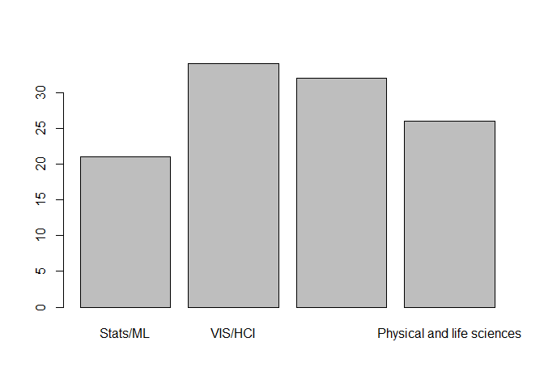<!-- -->

```r
barplot(table(data$degree[ids]))
```

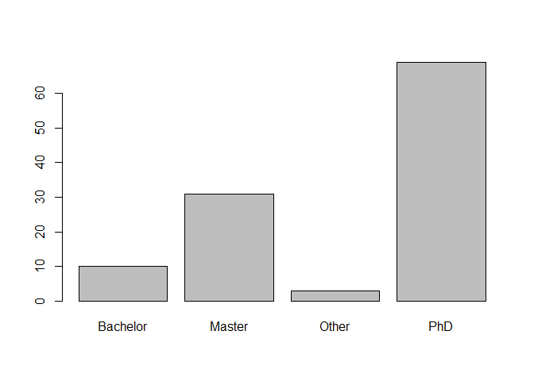<!-- -->

```r
hist(as.numeric(data$age[ids]))
```

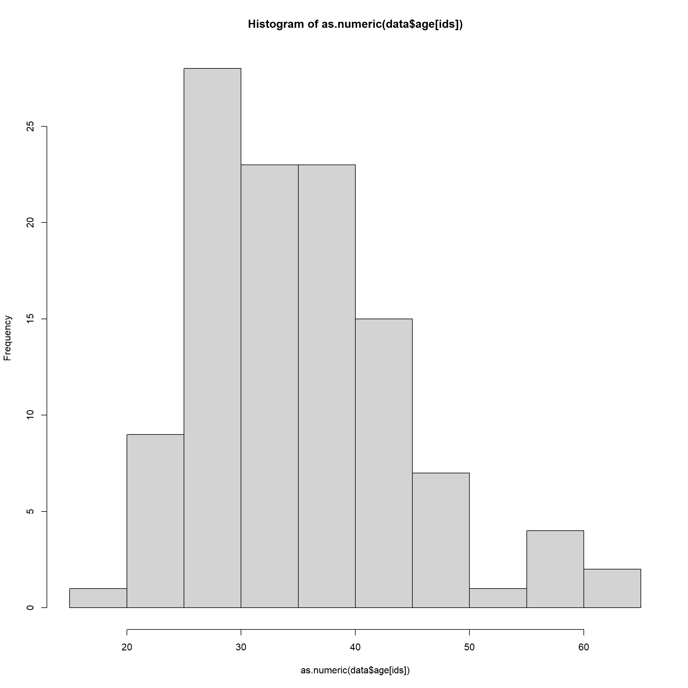<!-- -->

Let us now focus on the cliff effect as difference between confidence when $p$-value=0.04 versus $p$-value=0.06:

```r
data %>% group_by(id, viz) %>% 
  summarize(difference = confidence[true_p==0.04] - confidence[true_p==0.06])  %>% 
  group_by(viz) %>%
  summarise(
    mean = mean(difference), 
    median = median(difference),
    sd = sd(difference), 
    se = sd(difference) / sqrt(length(difference)),
    "2.5%" = quantile(difference, 0.025), 
    "97.5%" = quantile(difference, 0.975))
```

```
## `summarise()` regrouping output by 'id' (override with `.groups` argument)
```

```
## `summarise()` ungrouping output (override with `.groups` argument)
```

```
## # A tibble: 4 x 7
##   viz       mean median    sd     se  `2.5%` `97.5%`
##   <fct>    <dbl>  <dbl> <dbl>  <dbl>   <dbl>   <dbl>
## 1 p        0.192 0.111  0.274 0.0257 -0.188    0.721
## 2 CI       0.232 0.172  0.250 0.0235 -0.0525   0.842
## 3 gradient 0.102 0.0808 0.239 0.0225 -0.366    0.741
## 4 violin   0.126 0.101  0.204 0.0192 -0.162    0.616
```

```r
data %>% group_by(id, viz) %>% 
  summarize(difference = confidence[true_p==0.04] - confidence[true_p==0.06]) %>%
  ggplot(aes(x = viz, y = difference)) + 
  geom_violin() +
  geom_point(alpha = 0.5, position = position_jitter(0.1)) +
  scale_y_continuous("Difference in confidence when p-value is 0.06 vs 0.04") +
  scale_x_discrete("Representation") +
  theme_classic() 
```

```
## `summarise()` regrouping output by 'id' (override with `.groups` argument)
```

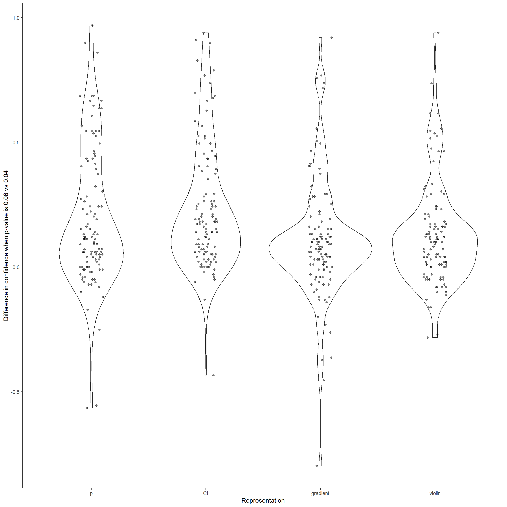<!-- -->

The cliff effect seems to be largest when information is presented as traditional CI or $p$-value which behave similarly. Gradient CI and Violin CI plots are pretty close to each other.

Now same but with subgrouping using sample size:

```r
data %>% group_by(id, viz, n) %>% 
  summarize(difference = confidence[true_p==0.04] - confidence[true_p==0.06])  %>% 
  group_by(viz, n) %>%
  summarise(
    mean = mean(difference), 
    median = median(difference),
    sd = sd(difference), 
    se = sd(difference) / sqrt(length(difference)),
    "2.5%" = quantile(difference, 0.025), 
    "97.5%" = quantile(difference, 0.975))
```

```
## `summarise()` regrouping output by 'id', 'viz' (override with `.groups` argument)
```

```
## `summarise()` regrouping output by 'viz' (override with `.groups` argument)
```

```
## # A tibble: 8 x 8
## # Groups:   viz [4]
##   viz      n       mean median    sd     se  `2.5%` `97.5%`
##   <fct>    <fct>  <dbl>  <dbl> <dbl>  <dbl>   <dbl>   <dbl>
## 1 p        50    0.215  0.111  0.266 0.0359 -0.0535   0.687
## 2 p        200   0.169  0.116  0.280 0.0368 -0.218    0.777
## 3 CI       50    0.207  0.162  0.187 0.0252 -0.0263   0.638
## 4 CI       200   0.254  0.182  0.297 0.0390 -0.101    0.905
## 5 gradient 50    0.117  0.0808 0.218 0.0294 -0.220    0.669
## 6 gradient 200   0.0888 0.0556 0.259 0.0340 -0.369    0.729
## 7 violin   50    0.116  0.121  0.167 0.0225 -0.162    0.504
## 8 violin   200   0.136  0.0758 0.235 0.0308 -0.123    0.686
```
and expertise:

```r
data %>% group_by(id, viz, expertise) %>% 
  summarize(difference = confidence[true_p==0.04] - confidence[true_p==0.06])  %>% 
  group_by(viz, expertise) %>%
  summarise(
    mean = mean(difference), 
    median = median(difference),
    sd = sd(difference), 
    se = sd(difference) / sqrt(length(difference)),
    "2.5%" = quantile(difference, 0.025), 
    "97.5%" = quantile(difference, 0.975))
```

```
## `summarise()` regrouping output by 'id', 'viz' (override with `.groups` argument)
```

```
## `summarise()` regrouping output by 'viz' (override with `.groups` argument)
```

```
## # A tibble: 16 x 8
## # Groups:   viz [4]
##    viz      expertise                  mean median    sd     se   `2.5%` `97.5%`
##    <fct>    <fct>                     <dbl>  <dbl> <dbl>  <dbl>    <dbl>   <dbl>
##  1 p        Stats/ML                 0.256  0.141  0.303 0.0661 -0.0758    0.828
##  2 p        VIS/HCI                  0.144  0.111  0.309 0.0531 -0.557     0.724
##  3 p        Social science and huma~ 0.193  0.126  0.203 0.0359 -0.0427    0.573
##  4 p        Physical and life scien~ 0.199  0.0657 0.278 0.0546 -0.140     0.751
##  5 CI       Stats/ML                 0.303  0.212  0.256 0.0559  0.00505   0.803
##  6 CI       VIS/HCI                  0.194  0.167  0.252 0.0432 -0.184     0.743
##  7 CI       Social science and huma~ 0.247  0.162  0.247 0.0436 -0.0169    0.908
##  8 CI       Physical and life scien~ 0.204  0.116  0.245 0.0481 -0.0417    0.803
##  9 gradient Stats/ML                 0.160  0.101  0.193 0.0421 -0.0556    0.591
## 10 gradient VIS/HCI                  0.0401 0.0354 0.301 0.0516 -0.515     0.794
## 11 gradient Social science and huma~ 0.0859 0.0707 0.221 0.0391 -0.288     0.549
## 12 gradient Physical and life scien~ 0.158  0.106  0.187 0.0368 -0.0631    0.600
## 13 violin   Stats/ML                 0.189  0.131  0.234 0.0511 -0.0455    0.707
## 14 violin   VIS/HCI                  0.0484 0.0303 0.133 0.0229 -0.183     0.316
## 15 violin   Social science and huma~ 0.145  0.116  0.216 0.0382 -0.147     0.616
## 16 violin   Physical and life scien~ 0.155  0.111  0.219 0.0430 -0.143     0.617
```

In terms of sample size, there doesn't seem to be clear differences in cliff effect especially when considering medians. In terms of expertise, there seems to be some differences especially in terms of variability (most notably the Violin plot for VIS/HCI), but the differences are likely due to few very extreme cases:

```r
data %>% group_by(id, viz, expertise) %>% 
  summarize(
    difference = confidence[true_p==0.04] - confidence[true_p==0.06]) %>%
  ggplot(aes(x=viz, y = difference)) + geom_violin() + theme_classic() + 
  scale_y_continuous("Difference in confidence when p-value is 0.04 vs 0.06") +
  scale_x_discrete("Representation") +
  geom_point(aes(colour = expertise), position=position_jitter(0.1))
```

```
## `summarise()` regrouping output by 'id', 'viz' (override with `.groups` argument)
```

<!-- -->

Let's check how the much extreme answers (full or zero confidence) there are in different groups:

```r
data %>% group_by(id, viz, n) %>% 
  mutate(extreme = confidence %in% c(0, 1))  %>% 
  group_by(viz, n) %>%
  summarise(
    mean = mean(extreme),
    sd = sd(extreme), 
    se = sd(extreme) / sqrt(length(extreme)))
```

```
## `summarise()` regrouping output by 'viz' (override with `.groups` argument)
```

```
## # A tibble: 8 x 5
## # Groups:   viz [4]
##   viz      n      mean    sd     se
##   <fct>    <fct> <dbl> <dbl>  <dbl>
## 1 p        50    0.159 0.366 0.0175
## 2 p        200   0.164 0.370 0.0172
## 3 CI       50    0.148 0.355 0.0169
## 4 CI       200   0.179 0.384 0.0178
## 5 gradient 50    0.127 0.334 0.0159
## 6 gradient 200   0.153 0.360 0.0167
## 7 violin   50    0.123 0.328 0.0157
## 8 violin   200   0.159 0.367 0.0170
```

```r
data %>% group_by(id, viz, expertise) %>% 
  mutate(extreme = confidence %in% c(0, 1))  %>% 
  group_by(viz, expertise) %>%
  summarise(
    mean = mean(extreme),
    sd = sd(extreme), 
    se = sd(extreme) / sqrt(length(extreme)))
```

```
## `summarise()` regrouping output by 'viz' (override with `.groups` argument)
```

```
## # A tibble: 16 x 5
## # Groups:   viz [4]
##    viz      expertise                      mean    sd     se
##    <fct>    <fct>                         <dbl> <dbl>  <dbl>
##  1 p        Stats/ML                      0.196 0.398 0.0307
##  2 p        VIS/HCI                       0.184 0.388 0.0235
##  3 p        Social science and humanities 0.145 0.352 0.0220
##  4 p        Physical and life sciences    0.125 0.332 0.0230
##  5 CI       Stats/ML                      0.202 0.403 0.0311
##  6 CI       VIS/HCI                       0.184 0.388 0.0235
##  7 CI       Social science and humanities 0.148 0.356 0.0223
##  8 CI       Physical and life sciences    0.125 0.332 0.0230
##  9 gradient Stats/ML                      0.208 0.407 0.0314
## 10 gradient VIS/HCI                       0.140 0.347 0.0211
## 11 gradient Social science and humanities 0.109 0.313 0.0195
## 12 gradient Physical and life sciences    0.125 0.332 0.0230
## 13 violin   Stats/ML                      0.196 0.398 0.0307
## 14 violin   VIS/HCI                       0.162 0.369 0.0224
## 15 violin   Social science and humanities 0.105 0.308 0.0192
## 16 violin   Physical and life sciences    0.115 0.320 0.0222
```

Stats/ML and VIS/HCI groups tend to give slightly more extreme answers, but differences are quite small.


### Model

For modelling the data and the potential cliff effect we use piece-wise logit-normal model with following pdf:

$$
p(x)=\begin{cases}
\alpha (1 - \gamma), & \text{if $x = 0$},\\
\alpha \gamma, & \text{if $x = 1$},\\
(1 - \alpha) \phi(\logit(x), \mu, \sigma), & \text{otherwise}.\\
\end{cases}
$$

Here $\alpha = P(x \in \{0, 1\})$ is the probability of answering one of the extreme values (not at all confident or fully confident), and $\gamma = P(x = 1 \mid x \in \{0, 1\})$, is the conditional probability of full confidence given that the answer is one of the extremes.

For $\mu$,$\alpha$,$\gamma$, and $\sigma$, we define following linear predictors:

$$
\begin{align}
\begin{split}
\mu        &\sim viz \cdot I(p < 0.05) \cdot logit(p) + 
viz \cdot I(p = 0.05) \\ 
& + (viz + I(p < 0.05) \cdot logit(p) + I(p = 0.05) \mid id),\\
\alpha     &\sim  p \cdot viz + (1 \mid id),\\
\gamma     &\sim mo(p),\\
\sigma     &\sim viz + (1 \mid id),
\end{split}
\end{align}
$$
where $p$ is a categorical variable defining the true $p$-value, logit($p$) is a continuous variable of the logit-transformed $p$-value, $mo(p)$ denotes a monotonic effect of the $p$-value, the dot corresponds to interaction (\ie $I(p = 0.05) \cdot viz$ \rev{implies} both the main and two-way interaction terms) and $(z \mid id)$ denotes participant-level random effect for variable $z$. As priors we used the relatively uninformative defaults of the \texttt{brms} package.

Now in a presence of a cliff effect we should observe a discontinuity in an otherwise linear relationship (in logit-logit scale) between the true $p$-value and participants' confidence. 

We also tested submodels of this model (omitting some of the interactions or random effects), and all of these models gave very similar results. However, this encompassing model integrates over the uncertainty regarding the parameter estimates (with coefficient zero corresponding to simpler model where the variable is omitted) and is that sense "more Bayesian" than selecting some of the simpler models (note that we are not particularly interested in predictive performance).

Now we create the necessary functions for our model:

```r
stan_funs <- "
 real logit_p_gaussian_lpdf(real y, real mu, real sigma,
                            real zoi, real coi) {
     if (y == 0) { 
       return bernoulli_lpmf(1 | zoi) + bernoulli_lpmf(0 | coi); 
     } else if (y == 1) {
       return bernoulli_lpmf(1 | zoi) + bernoulli_lpmf(1 | coi);
     } else { 
       return bernoulli_lpmf(0 | zoi) + normal_lpdf(logit(y) | mu, sigma);
     } 
                                    }
  real logit_p_gaussian_rng(real y, real mu, real sigma,
                            real zoi, real coi) {
    // 0 or 1
    int zero_one = bernoulli_rng(zoi);
    if (zero_one == 1) {
      // casting to real
      int one = bernoulli_rng(coi);
      if (one == 1) {
        return 1.0;
      } else {
        return 0.0;
      }
    } else {
      return inv_logit(normal_rng(mu, sigma));
    }
  }
"

log_lik_logit_p_gaussian <- function(i, draws) {
  # mu <- draws$dpars$mu[, i]
  # zoi <- draws$dpars$zoi[, i]
  # coi <- draws$dpars$coi[, i]
  # sigma <- draws$dpars$sigma
  # y <- draws$data$Y[i]
  mu <- brms:::get_dpar(draws, "mu", i = i)
  zoi <- brms:::get_dpar(draws, "zoi", i = i)
  coi <- brms:::get_dpar(draws, "coi", i = i)
  sigma <- brms:::get_dpar(draws, "sigma", i = i)
  y <- draws$data$Y[i]
  if (y == 0) { 
    dbinom(1, 1, zoi, TRUE) + dbinom(0, 1, coi, TRUE)
  } else if (y == 1) {
    dbinom(1, 1, zoi, TRUE) + dbinom(1, 1, coi, TRUE)
  } else { 
    dbinom(0, 1, zoi, TRUE) + dnorm(qlogis(y), mu, sigma, TRUE)
  } 
}

predict_logit_p_gaussian <- function(i, draws, ...) {
  mu <- brms:::get_dpar(draws, "mu", i = i)
  zoi <- brms:::get_dpar(draws, "zoi", i = i)
  coi <- brms:::get_dpar(draws, "coi", i = i)
  sigma <- brms:::get_dpar(draws, "sigma", i = i)
  zero_one <- rbinom(length(zoi), 1, zoi)
  ifelse(zero_one, rbinom(length(coi), 1, coi), plogis(rnorm(length(mu), mu, sigma)))
}

fitted_logit_p_gaussian <- function(draws) {
  mu <- draws$dpars$mu
  zoi <- draws$dpars$zoi
  coi <- draws$dpars$coi
  sigma <- draws$dpars$sigma
  # no analytical solution for the mean of logistic normal distribution, rely on simulation
  for (i in 1:ncol(mu)) {
    for(j in 1:nrow(mu)) {
      mu[j, i] <- mean(plogis(rnorm(1000, mu[j, i], sigma[j])))
    }
  }
  zoi * coi + (1 - zoi) * mu
}


logit_p_gaussian <- custom_family(
  "logit_p_gaussian", 
  dpars = c("mu", "sigma", "zoi", "coi"),
  links = c("identity", "log", "logit", "logit"),
  lb = c(NA, 0, 0, 0), ub = c(NA, NA, 1, 1),
  type = "real", 
  log_lik = log_lik_logit_p_gaussian,
  predict = predict_logit_p_gaussian,
  fitted = fitted_logit_p_gaussian)
```

```
## Warning: Argument 'predict' is deprecated. Please use argument
## 'posterior_predict' instead.
```

```
## Warning: Argument 'fitted' is deprecated. Please use argument 'posterior_epred'
## instead.
```

And create few additional variables:

```r
data <- data %>% 
  mutate(
    logit_p = qlogis(p),
    p_lt0.05 = factor(p < 0.05, levels = c(TRUE, FALSE), labels = c("Yes", "No")),
    p_eq0.05 = factor(p == 0.05, levels = c(TRUE, FALSE), labels = c("Yes", "No")),
    cat_p = recode_factor(true_p, 
      "0.06" = ">0.05", "0.1" = ">0.05", "0.5" = ">0.05", "0.8" = ">0.05",
      .ordered = TRUE))
```


```r
fit_exp1 <- brm(bf(
  confidence ~ 
    viz * p_lt0.05 * logit_p + 
    viz * p_eq0.05 +
    (viz + p_lt0.05 * logit_p + p_eq0.05 | id),
  zoi ~ 
    viz * true_p + (viz | id),
  coi ~ mo(cat_p),
  sigma ~ viz + (1 | id)),
  data = data,
  family = logit_p_gaussian,
  stanvars = stanvar(scode = stan_funs, block = "functions"),
  chains = 4, cores = 4, iter = 2000, init = 0, 
  save_warmup = FALSE, save_all_pars = TRUE, refresh = 0)
```

### Results

First, let us check the parameter estimates of the model:


```r
fit_exp1
```

```
##  Family: logit_p_gaussian 
##   Links: mu = identity; sigma = log; zoi = logit; coi = logit 
## Formula: confidence ~ viz * p_lt0.05 * logit_p + viz * p_eq0.05 + (viz + p_lt0.05 * logit_p + p_eq0.05 | id) 
##          zoi ~ viz * true_p + (viz | id)
##          coi ~ mo(cat_p)
##          sigma ~ viz + (1 | id)
##    Data: data (Number of observations: 3616) 
## Samples: 4 chains, each with iter = 4000; warmup = 2000; thin = 1;
##          total post-warmup samples = 8000
## 
## Group-Level Effects: 
## ~id (Number of levels: 113) 
##                                     Estimate Est.Error l-95% CI u-95% CI Rhat
## sd(Intercept)                           1.39      0.13     1.15     1.66 1.00
## sd(vizCI)                               0.66      0.07     0.52     0.81 1.00
## sd(vizgradient)                         0.89      0.09     0.73     1.07 1.00
## sd(vizviolin)                           0.88      0.08     0.73     1.06 1.00
## sd(p_lt0.05No)                          0.86      0.12     0.65     1.10 1.00
## sd(logit_p)                             0.20      0.03     0.15     0.25 1.00
## sd(p_eq0.05No)                          0.18      0.07     0.03     0.30 1.01
## sd(p_lt0.05No:logit_p)                  0.27      0.03     0.21     0.33 1.00
## sd(zoi_Intercept)                       2.06      0.23     1.65     2.54 1.00
## sd(zoi_vizCI)                           0.26      0.18     0.01     0.67 1.00
## sd(zoi_vizgradient)                     0.40      0.28     0.02     1.04 1.00
## sd(zoi_vizviolin)                       0.47      0.30     0.02     1.14 1.00
## sd(sigma_Intercept)                     0.40      0.03     0.34     0.46 1.00
## cor(Intercept,vizCI)                   -0.08      0.13    -0.33     0.19 1.00
## cor(Intercept,vizgradient)             -0.36      0.11    -0.57    -0.13 1.00
## cor(vizCI,vizgradient)                  0.43      0.11     0.20     0.62 1.00
## cor(Intercept,vizviolin)               -0.21      0.12    -0.43     0.03 1.00
## cor(vizCI,vizviolin)                    0.44      0.11     0.19     0.63 1.00
## cor(vizgradient,vizviolin)              0.75      0.06     0.61     0.86 1.00
## cor(Intercept,p_lt0.05No)              -0.14      0.14    -0.40     0.15 1.00
## cor(vizCI,p_lt0.05No)                  -0.18      0.15    -0.46     0.12 1.00
## cor(vizgradient,p_lt0.05No)            -0.12      0.15    -0.40     0.16 1.00
## cor(vizviolin,p_lt0.05No)              -0.09      0.15    -0.37     0.19 1.00
## cor(Intercept,logit_p)                  0.05      0.14    -0.24     0.32 1.00
## cor(vizCI,logit_p)                     -0.04      0.15    -0.33     0.24 1.00
## cor(vizgradient,logit_p)                0.04      0.14    -0.24     0.32 1.00
## cor(vizviolin,logit_p)                  0.12      0.14    -0.16     0.38 1.00
## cor(p_lt0.05No,logit_p)                 0.34      0.17     0.00     0.67 1.00
## cor(Intercept,p_eq0.05No)              -0.33      0.23    -0.71     0.18 1.00
## cor(vizCI,p_eq0.05No)                  -0.26      0.25    -0.69     0.27 1.00
## cor(vizgradient,p_eq0.05No)             0.14      0.24    -0.36     0.59 1.00
## cor(vizviolin,p_eq0.05No)               0.12      0.25    -0.38     0.59 1.00
## cor(p_lt0.05No,p_eq0.05No)              0.30      0.24    -0.23     0.70 1.00
## cor(logit_p,p_eq0.05No)                 0.46      0.24    -0.08     0.83 1.00
## cor(Intercept,p_lt0.05No:logit_p)      -0.33      0.12    -0.55    -0.08 1.00
## cor(vizCI,p_lt0.05No:logit_p)          -0.09      0.14    -0.35     0.20 1.00
## cor(vizgradient,p_lt0.05No:logit_p)    -0.04      0.14    -0.31     0.24 1.00
## cor(vizviolin,p_lt0.05No:logit_p)      -0.15      0.13    -0.41     0.12 1.00
## cor(p_lt0.05No,p_lt0.05No:logit_p)      0.69      0.09     0.49     0.83 1.00
## cor(logit_p,p_lt0.05No:logit_p)        -0.17      0.15    -0.44     0.14 1.00
## cor(p_eq0.05No,p_lt0.05No:logit_p)     -0.04      0.25    -0.50     0.47 1.00
## cor(zoi_Intercept,zoi_vizCI)           -0.21      0.43    -0.89     0.71 1.00
## cor(zoi_Intercept,zoi_vizgradient)      0.26      0.40    -0.63     0.88 1.00
## cor(zoi_vizCI,zoi_vizgradient)         -0.04      0.44    -0.82     0.79 1.00
## cor(zoi_Intercept,zoi_vizviolin)        0.35      0.37    -0.53     0.89 1.00
## cor(zoi_vizCI,zoi_vizviolin)           -0.07      0.43    -0.83     0.77 1.00
## cor(zoi_vizgradient,zoi_vizviolin)      0.31      0.44    -0.66     0.91 1.00
##                                     Bulk_ESS Tail_ESS
## sd(Intercept)                           3073     4573
## sd(vizCI)                               2490     4291
## sd(vizgradient)                         1715     3516
## sd(vizviolin)                           1701     3349
## sd(p_lt0.05No)                          1564     2522
## sd(logit_p)                             1213     2368
## sd(p_eq0.05No)                          1424     1125
## sd(p_lt0.05No:logit_p)                  1628     3823
## sd(zoi_Intercept)                       1989     3544
## sd(zoi_vizCI)                           2797     3301
## sd(zoi_vizgradient)                     1807     3129
## sd(zoi_vizviolin)                       1600     2897
## sd(sigma_Intercept)                     2333     3586
## cor(Intercept,vizCI)                    1501     3162
## cor(Intercept,vizgradient)              1455     2227
## cor(vizCI,vizgradient)                  1496     2984
## cor(Intercept,vizviolin)                1420     2666
## cor(vizCI,vizviolin)                    1323     2669
## cor(vizgradient,vizviolin)              1917     3218
## cor(Intercept,p_lt0.05No)               1695     3423
## cor(vizCI,p_lt0.05No)                   1529     2717
## cor(vizgradient,p_lt0.05No)             1789     3981
## cor(vizviolin,p_lt0.05No)               1962     3812
## cor(Intercept,logit_p)                  1454     2774
## cor(vizCI,logit_p)                      1674     3196
## cor(vizgradient,logit_p)                1754     3019
## cor(vizviolin,logit_p)                  1857     3309
## cor(p_lt0.05No,logit_p)                  793     1494
## cor(Intercept,p_eq0.05No)               5932     4361
## cor(vizCI,p_eq0.05No)                   3038     3885
## cor(vizgradient,p_eq0.05No)             4685     5091
## cor(vizviolin,p_eq0.05No)               5149     5404
## cor(p_lt0.05No,p_eq0.05No)              3138     3040
## cor(logit_p,p_eq0.05No)                 2989     2534
## cor(Intercept,p_lt0.05No:logit_p)       1645     3425
## cor(vizCI,p_lt0.05No:logit_p)           2069     3914
## cor(vizgradient,p_lt0.05No:logit_p)     2146     3735
## cor(vizviolin,p_lt0.05No:logit_p)       2450     3733
## cor(p_lt0.05No,p_lt0.05No:logit_p)      1474     2842
## cor(logit_p,p_lt0.05No:logit_p)         1264     2666
## cor(p_eq0.05No,p_lt0.05No:logit_p)      1465     2158
## cor(zoi_Intercept,zoi_vizCI)            7699     5789
## cor(zoi_Intercept,zoi_vizgradient)      6804     5292
## cor(zoi_vizCI,zoi_vizgradient)          2972     4635
## cor(zoi_Intercept,zoi_vizviolin)        5690     4752
## cor(zoi_vizCI,zoi_vizviolin)            3177     4656
## cor(zoi_vizgradient,zoi_vizviolin)      2295     5500
## 
## Population-Level Effects: 
##                                Estimate Est.Error l-95% CI u-95% CI Rhat
## Intercept                         -0.07      0.24    -0.55     0.39 1.00
## sigma_Intercept                   -0.08      0.05    -0.18     0.02 1.00
## zoi_Intercept                     -2.06      0.36    -2.77    -1.39 1.00
## coi_Intercept                     -3.76      0.37    -4.53    -3.11 1.00
## vizCI                              0.69      0.26     0.18     1.21 1.00
## vizgradient                       -0.98      0.27    -1.51    -0.45 1.00
## vizviolin                         -0.60      0.25    -1.10    -0.11 1.00
## p_lt0.05No                        -1.53      0.20    -1.91    -1.14 1.00
## logit_p                           -0.42      0.04    -0.50    -0.35 1.00
## p_eq0.05No                        -0.48      0.10    -0.68    -0.28 1.00
## vizCI:p_lt0.05No                  -0.70      0.23    -1.15    -0.25 1.00
## vizgradient:p_lt0.05No             0.72      0.23     0.28     1.17 1.00
## vizviolin:p_lt0.05No               0.51      0.21     0.08     0.91 1.00
## vizCI:logit_p                      0.07      0.04    -0.02     0.15 1.00
## vizgradient:logit_p               -0.11      0.04    -0.19    -0.02 1.00
## vizviolin:logit_p                 -0.09      0.04    -0.17    -0.01 1.00
## p_lt0.05No:logit_p                -0.23      0.05    -0.33    -0.13 1.00
## vizCI:p_eq0.05No                   0.06      0.13    -0.21     0.33 1.00
## vizgradient:p_eq0.05No             0.35      0.14     0.08     0.61 1.00
## vizviolin:p_eq0.05No               0.31      0.13     0.05     0.56 1.00
## vizCI:p_lt0.05No:logit_p          -0.10      0.06    -0.21     0.01 1.00
## vizgradient:p_lt0.05No:logit_p     0.11      0.06    -0.00     0.22 1.00
## vizviolin:p_lt0.05No:logit_p       0.04      0.05    -0.06     0.14 1.00
## sigma_vizCI                       -0.13      0.05    -0.22    -0.04 1.00
## sigma_vizgradient                 -0.11      0.05    -0.21    -0.02 1.00
## sigma_vizviolin                   -0.27      0.05    -0.37    -0.17 1.00
## zoi_vizCI                          0.71      0.38    -0.05     1.44 1.00
## zoi_vizgradient                    0.18      0.41    -0.63     0.97 1.00
## zoi_vizviolin                      0.58      0.41    -0.24     1.36 1.00
## zoi_true_p0.01                    -1.39      0.46    -2.31    -0.50 1.00
## zoi_true_p0.04                    -2.48      0.58    -3.65    -1.39 1.00
## zoi_true_p0.05                    -2.78      0.64    -4.12    -1.58 1.00
## zoi_true_p0.06                    -1.67      0.49    -2.66    -0.73 1.00
## zoi_true_p0.1                     -1.13      0.44    -2.00    -0.26 1.00
## zoi_true_p0.5                      0.76      0.37     0.03     1.48 1.00
## zoi_true_p0.8                      1.20      0.37     0.49     1.93 1.00
## zoi_vizCI:true_p0.01               0.38      0.60    -0.77     1.57 1.00
## zoi_vizgradient:true_p0.01        -1.24      0.73    -2.67     0.16 1.00
## zoi_vizviolin:true_p0.01          -1.30      0.70    -2.68     0.04 1.00
## zoi_vizCI:true_p0.04              -0.40      0.79    -1.92     1.12 1.00
## zoi_vizgradient:true_p0.04        -1.11      0.95    -3.02     0.71 1.00
## zoi_vizviolin:true_p0.04          -2.16      1.07    -4.42    -0.22 1.00
## zoi_vizCI:true_p0.05              -0.35      0.87    -2.04     1.34 1.00
## zoi_vizgradient:true_p0.05        -1.37      1.11    -3.69     0.69 1.00
## zoi_vizviolin:true_p0.05          -0.89      0.92    -2.74     0.89 1.00
## zoi_vizCI:true_p0.06              -1.45      0.75    -2.94     0.02 1.00
## zoi_vizgradient:true_p0.06        -0.96      0.75    -2.46     0.54 1.00
## zoi_vizviolin:true_p0.06          -1.69      0.79    -3.29    -0.17 1.00
## zoi_vizCI:true_p0.1               -0.91      0.64    -2.19     0.32 1.00
## zoi_vizgradient:true_p0.1         -0.61      0.65    -1.86     0.65 1.00
## zoi_vizviolin:true_p0.1           -1.56      0.68    -2.93    -0.23 1.00
## zoi_vizCI:true_p0.5               -1.30      0.53    -2.33    -0.27 1.00
## zoi_vizgradient:true_p0.5         -0.68      0.54    -1.75     0.36 1.00
## zoi_vizviolin:true_p0.5           -1.43      0.54    -2.48    -0.38 1.00
## zoi_vizCI:true_p0.8               -1.01      0.51    -2.00    -0.03 1.00
## zoi_vizgradient:true_p0.8         -0.43      0.53    -1.47     0.59 1.00
## zoi_vizviolin:true_p0.8           -0.86      0.53    -1.90     0.16 1.00
## coi_mocat_p                        1.44      0.11     1.23     1.67 1.00
##                                Bulk_ESS Tail_ESS
## Intercept                          1378     2533
## sigma_Intercept                    2204     3666
## zoi_Intercept                      1085     2768
## coi_Intercept                      7238     4950
## vizCI                              2302     4077
## vizgradient                        1864     3872
## vizviolin                          1870     3869
## p_lt0.05No                         1400     2623
## logit_p                            1659     3131
## p_eq0.05No                         3353     4268
## vizCI:p_lt0.05No                   1770     3330
## vizgradient:p_lt0.05No             1637     3012
## vizviolin:p_lt0.05No               1701     2999
## vizCI:logit_p                      1951     3760
## vizgradient:logit_p                1757     3329
## vizviolin:logit_p                  1839     3098
## p_lt0.05No:logit_p                 1701     3114
## vizCI:p_eq0.05No                   4091     4778
## vizgradient:p_eq0.05No             4245     4755
## vizviolin:p_eq0.05No               4045     5249
## vizCI:p_lt0.05No:logit_p           2137     4735
## vizgradient:p_lt0.05No:logit_p     1918     3312
## vizviolin:p_lt0.05No:logit_p       2140     4209
## sigma_vizCI                        5196     5605
## sigma_vizgradient                  4838     5862
## sigma_vizviolin                    4912     5705
## zoi_vizCI                          1650     3363
## zoi_vizgradient                    1884     3679
## zoi_vizviolin                      1918     3855
## zoi_true_p0.01                     2487     4262
## zoi_true_p0.04                     2792     4238
## zoi_true_p0.05                     3216     4704
## zoi_true_p0.06                     2455     3950
## zoi_true_p0.1                      2363     3479
## zoi_true_p0.5                      1952     3900
## zoi_true_p0.8                      1735     3448
## zoi_vizCI:true_p0.01               2771     4886
## zoi_vizgradient:true_p0.01         3431     5423
## zoi_vizviolin:true_p0.01           3218     4658
## zoi_vizCI:true_p0.04               3130     4252
## zoi_vizgradient:true_p0.04         3865     5265
## zoi_vizviolin:true_p0.04           3802     5484
## zoi_vizCI:true_p0.05               3754     4785
## zoi_vizgradient:true_p0.05         4543     5915
## zoi_vizviolin:true_p0.05           3614     4876
## zoi_vizCI:true_p0.06               3467     5130
## zoi_vizgradient:true_p0.06         2993     5057
## zoi_vizviolin:true_p0.06           3283     4874
## zoi_vizCI:true_p0.1                2998     4678
## zoi_vizgradient:true_p0.1          2709     5300
## zoi_vizviolin:true_p0.1            3228     4964
## zoi_vizCI:true_p0.5                2475     4631
## zoi_vizgradient:true_p0.5          2364     4379
## zoi_vizviolin:true_p0.5            2399     4525
## zoi_vizCI:true_p0.8                2168     4567
## zoi_vizgradient:true_p0.8          2290     4386
## zoi_vizviolin:true_p0.8            2439     4374
## coi_mocat_p                        7002     4889
## 
## Simplex Parameters: 
##                 Estimate Est.Error l-95% CI u-95% CI Rhat Bulk_ESS Tail_ESS
## coi_mocat_p1[1]     0.94      0.03     0.87     0.99 1.00    11484     5684
## coi_mocat_p1[2]     0.02      0.02     0.00     0.06 1.00     9830     4602
## coi_mocat_p1[3]     0.02      0.02     0.00     0.06 1.00    10588     4927
## coi_mocat_p1[4]     0.02      0.02     0.00     0.09 1.00     8884     5567
## 
## Samples were drawn using sampling(NUTS). For each parameter, Bulk_ESS
## and Tail_ESS are effective sample size measures, and Rhat is the potential
## scale reduction factor on split chains (at convergence, Rhat = 1).
```

Now we look at some figures. First we draw some samples from posterior predictive distribution and see how well our simulated replications match with our data:

```r
pp_check(fit_exp1, type = "hist", nsamples = 11)
```

```
## `stat_bin()` using `bins = 30`. Pick better value with `binwidth`.
```

<!-- -->

We see that the histograms of the replicated datasets are similar to observed one, perhaps slight exaggeration of the tails. Next, we look the median confidence of replicated datasets grouped with underlying $p$-value:


```r
pp_check(fit_exp1, type = "stat_grouped", group = "true_p", stat = "median")
```

```
## Using all posterior samples for ppc type 'stat_grouped' by default.
```

```
## `stat_bin()` using `bins = 30`. Pick better value with `binwidth`.
```

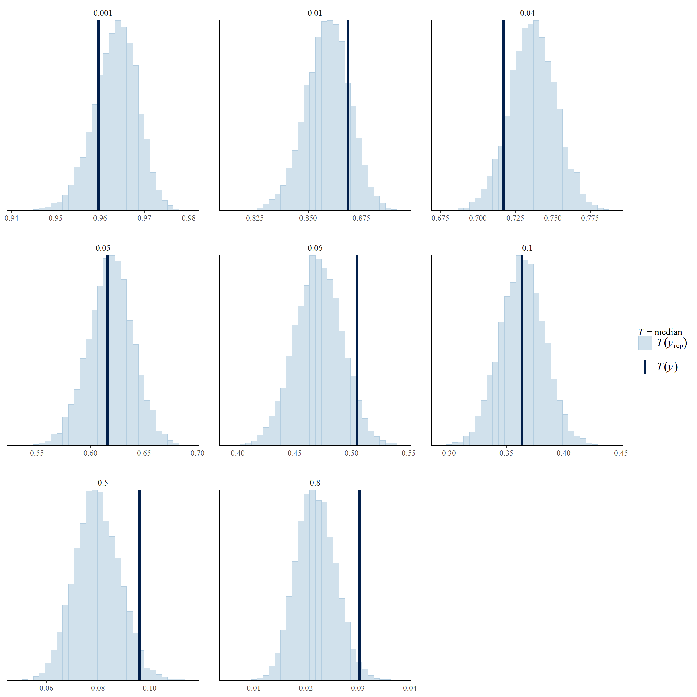<!-- -->

Now grouping based on visualization:

```r
pp_check(fit_exp1, type = "stat_grouped", group = "viz", stat = "mean")
```

```
## Using all posterior samples for ppc type 'stat_grouped' by default.
```

```
## `stat_bin()` using `bins = 30`. Pick better value with `binwidth`.
```

<!-- -->

Noting the scale on the x-axis, our histograms look reasonable given our data, although there are some subgroups where our model is slightly over- or underestimating compared to our data, especially in the violin CI group (reasonable changes to our model, such as dropping some interaction terms, did not improve this). Same posterior checks for average participants (with random effects zeroed out) we get very good results:


```r
pp_check(fit_exp1, type = "stat_grouped", group = "true_p", stat = "median", re_formula = NA)
```

```
## Using all posterior samples for ppc type 'stat_grouped' by default.
```

```
## `stat_bin()` using `bins = 30`. Pick better value with `binwidth`.
```

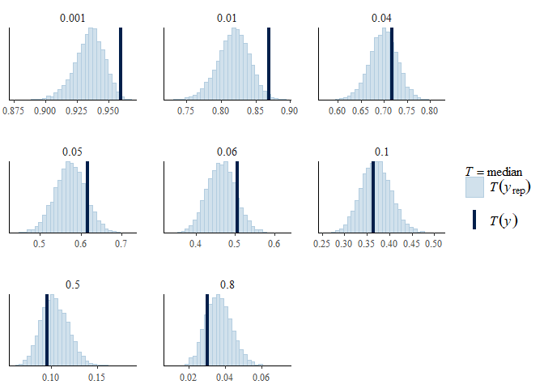<!-- -->

```r
pp_check(fit_exp1, type = "stat_grouped", group = "viz", stat = "mean", re_formula = NA)
```

```
## Using all posterior samples for ppc type 'stat_grouped' by default.
## `stat_bin()` using `bins = 30`. Pick better value with `binwidth`.
```

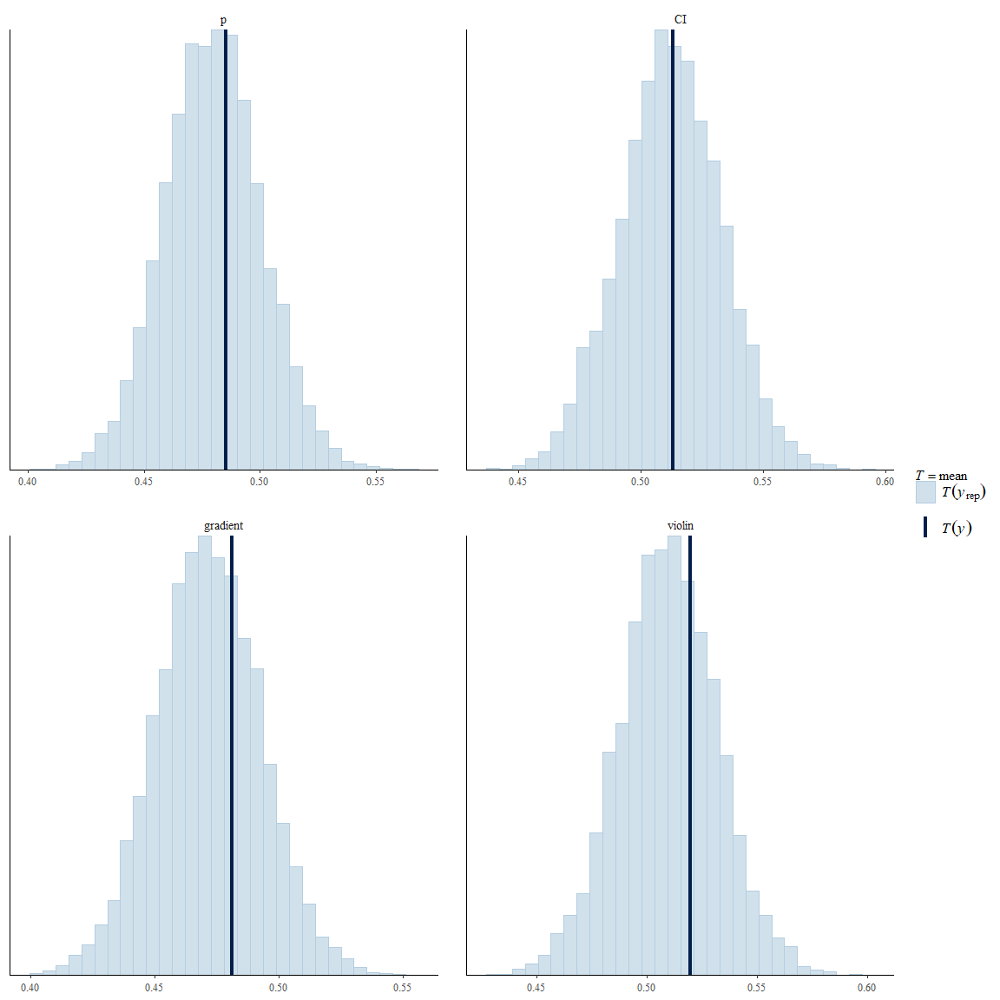<!-- -->

Now we are ready to analyze the results. First, the posterior curves of the confidence given the underlying $p$-value:


```r
comb_exp1 <- fit_exp1$data %>% 
  data_grid(viz, logit_p, p_lt0.05, p_eq0.05, cat_p, true_p) %>% 
  filter(interaction(logit_p, p_lt0.05, p_eq0.05, cat_p, true_p) %in% 
      unique(interaction( 
        fit_exp1$data$logit_p, fit_exp1$data$p_lt0.05, 
        fit_exp1$data$p_eq0.05, fit_exp1$data$cat_p, 
        fit_exp1$data$true_p)))

f_mu_exp1 <- posterior_epred(fit_exp1, newdata = comb_exp1, re_formula = NA)

d <- data.frame(value = c(f_mu_exp1), 
  p = rep(comb_exp1$true_p, each = nrow(f_mu_exp1)),
  viz = rep(comb_exp1$viz, each = nrow(f_mu_exp1)),
  iter = 1:nrow(f_mu_exp1))
levels(d$viz) <- c("Textual", "Classic CI", "Gradient CI", "Violin CI")
```


```r
sumr <- d %>% group_by(viz, p) %>%
  summarise(Estimate = mean(value), 
    Q2.5 = quantile(value, 0.025), 
    Q97.5 = quantile(value, 0.975)) %>%
  mutate(p = as.numeric(levels(p))[p])
```

```
## `summarise()` regrouping output by 'viz' (override with `.groups` argument)
```

```r
cols <- c("Textual" = "#D55E00", "Classic CI" = "#0072B2", 
  "Gradient CI" = "#009E73", "Violin CI" = "#CC79A7")
x_ticks <- c(0.001, 0.01, 0.04, 0.06, 0.1, 0.5, 0.8)
y_ticks <- c(0.05, seq(0.1, 0.9, by = 0.1), 0.95)
dodge <- 0.19

p1 <- sumr %>%
  ggplot(aes(x = p, y = Estimate, colour = viz)) + 
  geom_line(position = position_dodge(dodge), size = 0.1) +
  geom_linerange(data = sumr %>% filter(p < 0.03 | p > 0.07),
    aes(ymin = Q2.5, ymax = Q97.5), 
    position = position_dodge(dodge), size = 0.3,
    show.legend = FALSE) + 
  geom_point(position = position_dodge(dodge), size = 0.7, show.legend = FALSE) +
  ylab("Confidence") + xlab("p-value") + 
  scale_color_manual("Representation", values =  cols) + 
  scale_y_continuous(trans="logit", breaks = y_ticks, 
    minor_breaks = NULL, labels = y_ticks) + 
  scale_x_continuous(trans="logit",
    breaks = x_ticks, labels = x_ticks, minor_breaks = NULL) + 
  theme_classic() + 
  theme(legend.position = "bottom", 
    legend.title = element_blank(),
    axis.text.x = element_text(size = 12, angle = 45, hjust = 1, vjust = 1), 
    axis.text.y = element_text(size = 12),
    axis.title.x = element_text(size = 14, 
      margin = margin(t = -0.1, r = 0, b = -0.1, l = 0, unit = "cm")),
    axis.title.y = element_text(size = 14, 
      margin = margin(t = 0, r = -0.1, b = 0, l = -0.1, unit = "cm")),
    legend.text = element_text(size = 14))  + 
  geom_rect(xmin = qlogis(0.03), xmax = qlogis(0.07), ymin = qlogis(0.31), ymax = qlogis(0.82), 
    color = "grey70", alpha = 0, linetype = "dashed", size = 0.1) + 
  guides(colour = guide_legend(override.aes = list(size = 1.5)))


p2 <- sumr %>% filter(p > 0.02 & p < 0.09) %>%
  ggplot(aes(x = p, y = Estimate, colour = viz)) + 
  geom_line(position = position_dodge(0.1), size = 0.1) +
  geom_linerange(
    aes(ymin = Q2.5, ymax = Q97.5), 
    position = position_dodge(0.1), size = 0.3,
    show.legend = FALSE) + 
  geom_point(position = position_dodge(0.1), size = 0.7) +
  ylab("Confidence") + xlab("p-value") + 
  scale_color_manual("Representation", values =  cols) + 
  scale_y_continuous(trans="logit", breaks = y_ticks,
    minor_breaks = NULL, labels = y_ticks) + 
  scale_x_continuous(trans="logit",
    breaks = c(0.04, 0.05, 0.06), 
    labels = c(0.04, 0.05, 0.06), 
    minor_breaks = NULL) + 
  theme_classic() + 
  theme(legend.position = "none",  
    axis.title.x = element_blank(), axis.title.y = element_blank(),
    plot.background = element_blank(),
    plot.margin=unit(c(-4,-9,0,0), "mm"),
    axis.text.x = element_text(size = 12), 
    axis.text.y = element_text(size = 12)) 

p <- p1 + coord_cartesian(xlim = c(0.001, 0.9), ylim = c(0.045, 0.95)) + 
  annotation_custom(
    ggplotGrob(p2), 
    xmin = qlogis(0.2), xmax = qlogis(0.9), ymin = qlogis(0.3), ymax = qlogis(0.95))
p
```

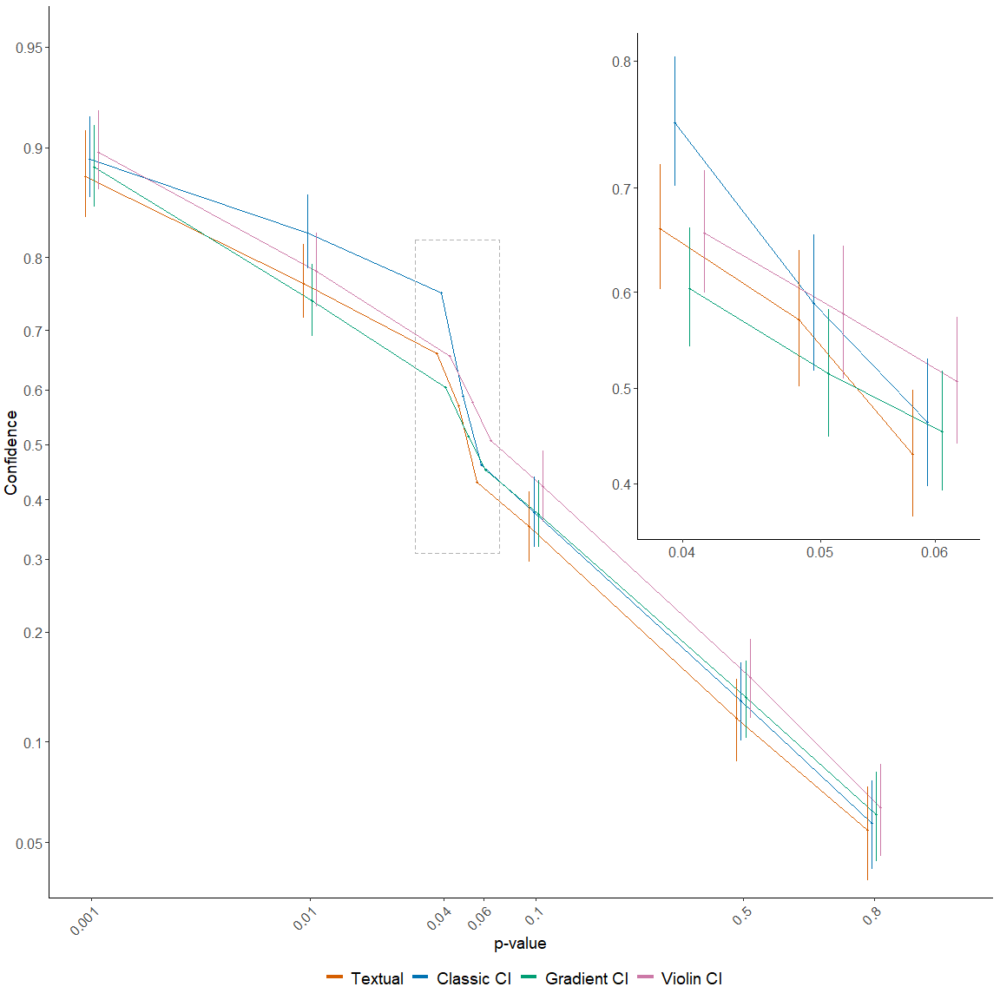<!-- -->


The confidence level with traditional CI is most constant of all techniques when are within "statistically significant region" i.e. $p<0.05$, but there is a large drop when moving to $p>0.05$, even larger than with textual information with $p$-value, which behaves nearly identically with the Violin CI plot until $p=0.05$, when the confidence in $p$-value representation drops below all other techniques. The Gradient CI plot and Violin CI plot behave similarly, except the confidence level in case of Gradient CI plot is constantly below the Violin CI plot.

The probability curves of extreme answer show that traditional CI produces more easily extreme answers when $p<0.05$ (so the extreme answer is likely of full confidence), whereas $p$-value is more likely to lead extreme answer (zero confidence) when $p>0.05$. Differences between techniques seem nevertheless quite small compared to overall variation in the estimates.


```r
f_zoi_exp1_sumr <- fitted(fit_exp1, newdata = comb_exp1, 
  re_formula = NA, dpar = "zoi")
df_01_exp1 <- data.frame(
  p = plogis(comb_exp1$logit_p), 
  viz = comb_exp1$viz, 
  f_zoi_exp1_sumr)
levels(df_01_exp1$viz) <- 
  c("Textual", "Classic CI", "Gradient CI", "Violin CI")
y_ticks <- c(0.0001, 0.01, seq(0.1,0.9,by=0.2))

p <- df_01_exp1 %>% 
  ggplot(aes(x = p, y = Estimate, colour = viz)) +
  geom_linerange(aes(ymin = Q2.5, ymax = Q97.5),
    position = position_dodge(width=0.19)) + 
  geom_line(alpha=0.5, position = position_dodge(width=0.19))  + 
  ylab("Probability of all-or-none answer") + xlab("p-value") + 
  scale_color_manual("Representation", values =  cols) + 
  theme_classic() + 
  scale_y_continuous(trans = "logit",
    breaks = y_ticks, labels = y_ticks, minor_breaks = NULL) + 
  scale_x_continuous(trans = "logit",
    breaks = x_ticks, labels = x_ticks, minor_breaks = NULL) + 
  theme(axis.text.x = element_text(angle = 90, hjust = 1, size = 10), legend.position = "bottom",   
    axis.title.x = element_text(size = 12),
    axis.text.y = element_text(size = 10), axis.title.y = element_text(size = 12),
    legend.text=element_text(size = 10), strip.text.x = element_text(size = 10)) 
p
```

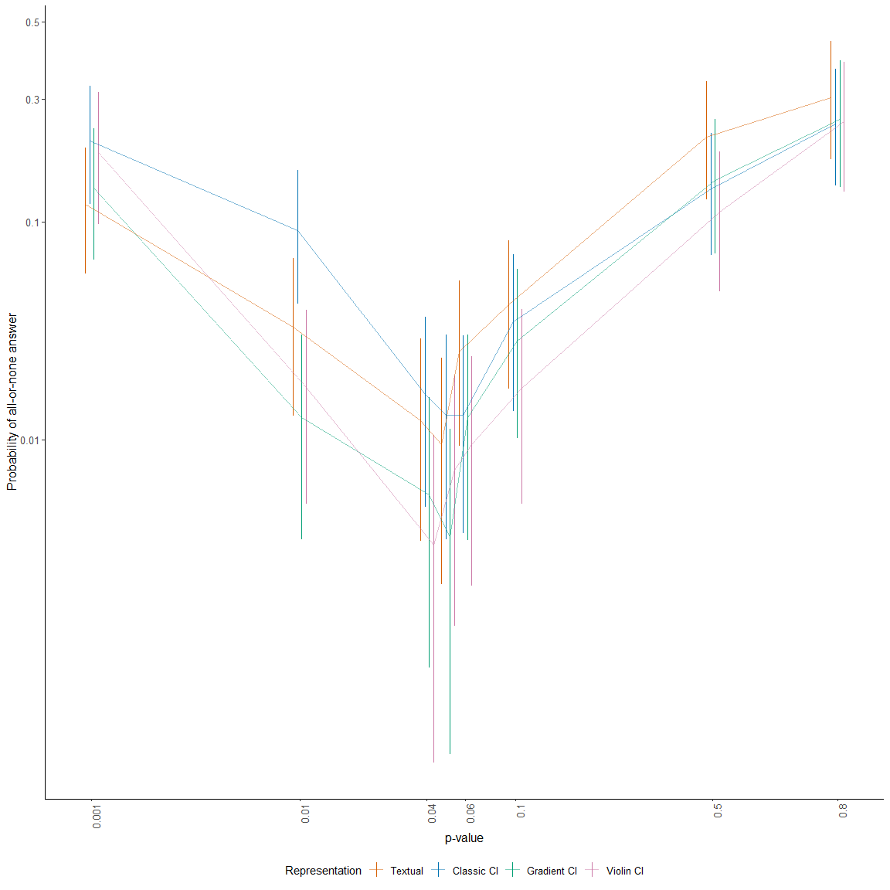<!-- -->

Finally, we can compute the average drop in perceived confidence when moving from $p = 0.04$ to $p=0.06$:


```r
d %>% group_by(viz, iter) %>% 
  summarise(difference = value[p == "0.04"] - value[p == "0.06"]) %>%
  summarise(mean = mean(difference), sd = sd(difference),
    "2.5%" = quantile(difference, 0.025), 
    "97.5" = quantile(difference, 0.975))
```

```
## `summarise()` regrouping output by 'viz' (override with `.groups` argument)
```

```
## `summarise()` ungrouping output (override with `.groups` argument)
```

```
## # A tibble: 4 x 5
##   viz          mean     sd `2.5%` `97.5`
##   <fct>       <dbl>  <dbl>  <dbl>  <dbl>
## 1 Textual     0.232 0.0254  0.182  0.282
## 2 Classic CI  0.291 0.0234  0.246  0.338
## 3 Gradient CI 0.150 0.0243  0.103  0.197
## 4 Violin CI   0.151 0.0220  0.108  0.195
```

Let's also visualize this:

```r
p <- d %>% group_by(viz, iter) %>% 
  summarise(difference = value[p == "0.04"] - value[p == "0.06"]) %>% 
  ggplot(aes(x = difference, fill = viz, colour = viz)) + 
  geom_density(bw = 0.01, alpha = 0.6) +
  theme_classic() + 
  scale_fill_manual("Representation", values =  cols) + 
  scale_colour_manual("Representation", values =  cols) + 
  ylab("Posterior density") + 
  xlab("E[confidence(p=0.04) - confidence(p=0.06)]") +
  theme(legend.position = "bottom", 
    legend.title = element_blank(),
    axis.text.x = element_text(size = 12, hjust = 1, vjust = 1), 
    axis.text.y = element_text(size = 12),
    axis.title.x = element_text(size = 14),
    axis.title.y = element_text(size = 14),
    legend.text = element_text(size = 14)) 
```

```
## `summarise()` regrouping output by 'viz' (override with `.groups` argument)
```

```r
p
```

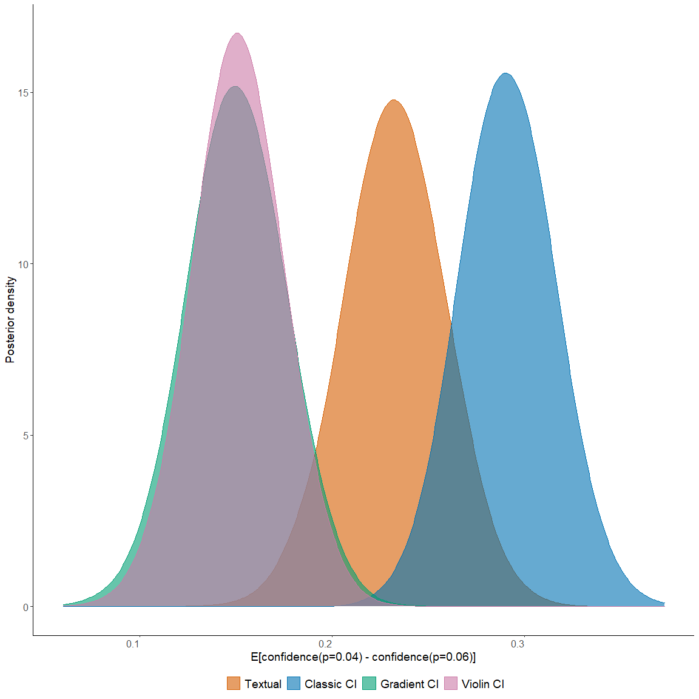<!-- -->


Note that the cliff effect between viz styles are not independent, i.e. if there is a large cliff effect with Violin CI then the cliff effect with $p$-value is likely larger as well. This can be seen from the posterior probabilities that cliff effect is larger with viz 1 (row variable) than with viz 2 (column variable):


```r
postprob <- d %>% group_by(viz, iter) %>% 
  summarise(difference = value[p == "0.04"] - value[p == "0.06"]) %>%
  group_by(iter) %>% 
  mutate(p_vs_ci = difference[viz == "Textual"] - difference[viz == "Classic CI"],
    p_vs_gradient = difference[viz == "Textual"] - difference[viz == "Gradient CI"],
    p_vs_violin = difference[viz == "Textual"] - difference[viz == "Violin CI"],
    ci_vs_gradient = difference[viz == "Classic CI"] - difference[viz == "Gradient CI"],
    ci_vs_violin = difference[viz == "Classic CI"] - difference[viz == "Violin CI"],
    gradient_vs_violin = difference[viz == "Gradient CI"] - 
      difference[viz == "Violin CI"]) %>%
  ungroup() %>% summarise(
    "P(p > CI)" = mean(p_vs_ci > 0),
    "P(p > gradient)" = mean(p_vs_gradient > 0),
    "P(p > violin)" = mean(p_vs_violin > 0),
    "P(CI > gradient)" = mean(ci_vs_gradient > 0),
    "P(CI > violin)" = mean(ci_vs_violin > 0),
    "P(gradient > violin)" = mean(gradient_vs_violin > 0),
    "P(p > CI)" = mean(p_vs_ci > 0))
```

```
## `summarise()` regrouping output by 'viz' (override with `.groups` argument)
```

```r
round(t(as.data.frame(postprob)), 2)
```

```
##                      [,1]
## P(p > CI)            0.02
## P(p > gradient)      1.00
## P(p > violin)        1.00
## P(CI > gradient)     1.00
## P(CI > violin)       1.00
## P(gradient > violin) 0.49
```

### Results for the model with expertise

Now we consider expanded model with with expertise as predictor:


```r
fit_expertise <- brm(bf(
  confidence ~ 
    expertise * viz * p_lt0.05 * logit_p + 
    expertise * viz * p_eq0.05 +
    (viz + p_lt0.05 * logit_p + p_eq0.05 | id),
  zoi ~ 
    expertise * viz + viz * true_p + (viz | id),
  coi ~ mo(cat_p),
  sigma ~ expertise * viz + (1 | id)),
  data = data,
  family = logit_p_gaussian,
  stanvars = stanvar(scode = stan_funs, block = "functions"),
  chains = 4, cores = 4, iter = 2000, init = 0, 
  save_warmup = FALSE, save_all_pars = TRUE, refresh = 0)
```


```r
comb_exp1 <- fit_expertise$data %>% 
  data_grid(expertise, viz, logit_p, p_lt0.05, p_eq0.05, cat_p, true_p) %>% 
  filter(interaction(expertise, logit_p, p_lt0.05, p_eq0.05, cat_p, true_p) %in% 
      unique(interaction(fit_expertise$data$expertise, 
        fit_expertise$data$logit_p, fit_expertise$data$p_lt0.05, 
        fit_expertise$data$p_eq0.05, fit_expertise$data$cat_p, 
        fit_expertise$data$true_p)))

f_mu_exp1 <- posterior_epred(fit_expertise, newdata = comb_exp1, re_formula = NA)

d <- data.frame(value = c(f_mu_exp1), 
  p = rep(comb_exp1$true_p, each = nrow(f_mu_exp1)),
  viz = rep(comb_exp1$viz, each = nrow(f_mu_exp1)),
  expertise = rep(comb_exp1$expertise, each = nrow(f_mu_exp1)),
  iter = 1:nrow(f_mu_exp1))

levels(d$viz) <- c("Textual", "Classic CI", "Gradient CI", "Violin CI")
```

Here are posterior curves for the four different groups:

```r
sumr <- d %>% group_by(viz, p, expertise) %>%
  summarise(Estimate = mean(value), 
    Q2.5 = quantile(value, 0.025), 
    Q97.5 = quantile(value, 0.975)) %>%
  mutate(p = as.numeric(levels(p))[p])
```

```
## `summarise()` regrouping output by 'viz', 'p' (override with `.groups` argument)
```

```r
x_ticks <- c(0.001, 0.01, 0.04, 0.06, 0.1, 0.5, 0.8)
y_ticks <- c(0.05, seq(0.1, 0.9, by = 0.1), 0.95)
dodge <- 0.19

p11 <- sumr %>% filter(expertise == "Stats/ML") %>%
  ggplot(aes(x = p, y = Estimate, colour = viz)) + 
  geom_line(position = position_dodge(dodge), size = 0.1) +
  geom_linerange(data = sumr %>% filter(p < 0.03 | p > 0.07),
    aes(ymin = Q2.5, ymax = Q97.5), 
    position = position_dodge(dodge), size = 0.3,
    show.legend = FALSE) + 
  geom_point(position = position_dodge(dodge), size = 0.7, show.legend = FALSE) +
  ylab("Confidence") + xlab("p-value") + 
  scale_color_manual("Representation", values =  cols) + 
  scale_y_continuous(trans="logit", breaks = y_ticks, 
    minor_breaks = NULL, labels = y_ticks) + 
  scale_x_continuous(trans="logit",
    breaks = x_ticks, labels = x_ticks, minor_breaks = NULL) + 
  theme_classic() + 
  theme(legend.position = "bottom", 
    legend.margin = margin(t = -0.1, b = 0, unit = "cm"),
    legend.title = element_blank(),
    axis.text.x = element_text(size = 12, angle = 45, hjust = 1, vjust = 1), 
    axis.text.y = element_text(size = 12),
    axis.title.x = element_text(size = 14, 
      margin = margin(t = -0.1, r = 0, b = -0.3, l = 0, unit = "cm")),
    axis.title.y = element_text(size = 14, 
      margin = margin(t = 0, r = -0.1, b = 0, l = -0.1, unit = "cm")),
    legend.text = element_text(size = 14))  + 
  geom_rect(xmin = qlogis(0.03), xmax = qlogis(0.07), 
    ymin = qlogis(0.31), ymax = qlogis(0.82), 
    color = "grey70", alpha = 0, linetype = "dashed", size = 0.1) + 
  guides(colour = guide_legend(override.aes = list(size = 1.5))) 


p21 <- sumr %>% filter(expertise == "Stats/ML") %>% 
  filter(p > 0.02 & p < 0.09) %>%
  ggplot(aes(x = p, y = Estimate, colour = viz)) + 
  geom_line(position = position_dodge(0.1), size = 0.1) +
  geom_linerange(
    aes(ymin = Q2.5, ymax = Q97.5), 
    position = position_dodge(0.1), size = 0.3,
    show.legend = FALSE) + 
  geom_point(position = position_dodge(0.1), size = 0.7) +
  ylab("Confidence") + xlab("p-value") + 
  scale_color_manual("Representation", values =  cols) + 
  scale_y_continuous(trans="logit", breaks = y_ticks,
    minor_breaks = NULL, labels = y_ticks) + 
  scale_x_continuous(trans="logit",
    breaks = c(0.04, 0.05, 0.06), 
    labels = c(0.04, 0.05, 0.06), 
    minor_breaks = NULL) + 
  theme_classic() + 
  theme(legend.position = "none",  
    axis.title.x = element_blank(), axis.title.y = element_blank(),
    plot.background = element_blank(),
    plot.margin=unit(c(-4,-9,0,0), "mm"),
    axis.text.x = element_text(size = 12), 
    axis.text.y = element_text(size = 12)) 

yrange <- c(min(sumr$Q2.5)-0.001, max(sumr$Q97.5) +0.001)
p1 <- p11 + coord_cartesian(xlim = c(0.001, 0.9), 
  ylim = yrange) + 
  annotation_custom(
    ggplotGrob(p21), 
    xmin = qlogis(0.2), xmax = qlogis(0.9), ymin = qlogis(0.3), ymax = qlogis(0.95))

p12 <- sumr %>% filter(expertise == "VIS/HCI") %>%
  ggplot(aes(x = p, y = Estimate, colour = viz)) + 
  geom_line(position = position_dodge(dodge), size = 0.1) +
  geom_linerange(data = sumr %>% filter(p < 0.03 | p > 0.07),
    aes(ymin = Q2.5, ymax = Q97.5), 
    position = position_dodge(dodge), size = 0.3,
    show.legend = FALSE) + 
  geom_point(position = position_dodge(dodge), size = 0.7, show.legend = FALSE) +
  ylab("Confidence") + xlab("p-value") + 
  scale_color_manual("Representation", values =  cols) + 
  scale_y_continuous(trans="logit", breaks = y_ticks, minor_breaks = NULL, labels = y_ticks) + 
  scale_x_continuous(trans="logit",
    breaks = x_ticks, labels = x_ticks, minor_breaks = NULL) + 
  theme_classic() + 
  theme(legend.position = "bottom", 
    legend.title = element_blank(),
    axis.text.x = element_text(size = 12, angle = 45, hjust = 1, vjust = 1), 
    axis.text.y = element_text(size = 12),
    axis.title.x = element_text(size = 14, margin = margin(t = -0.1, r = 0, b = -0.3, l = 0, unit = "cm")),
    axis.title.y = element_text(size = 14, margin = margin(t = 0, r = -0.1, b = 0, l = -0.1, unit = "cm")),
    legend.text = element_text(size = 14))  + 
  geom_rect(xmin = qlogis(0.03), xmax = qlogis(0.07), ymin = qlogis(0.31), ymax = qlogis(0.82), 
    color = "grey70", alpha = 0, linetype = "dashed", size = 0.1) + 
  guides(colour = guide_legend(override.aes = list(size = 1.5))) 


p22 <- sumr %>% filter(expertise == "VIS/HCI") %>% 
  filter(p > 0.02 & p < 0.09) %>%
  ggplot(aes(x = p, y = Estimate, colour = viz)) + 
  geom_line(position = position_dodge(0.1), size = 0.1) +
  geom_linerange(
    aes(ymin = Q2.5, ymax = Q97.5), 
    position = position_dodge(0.1), size = 0.3,
    show.legend = FALSE) + 
  geom_point(position = position_dodge(0.1), size = 0.7) +
  ylab("Confidence") + xlab("p-value") + 
   scale_color_manual("Representation", values =  cols) + 
  scale_y_continuous(trans="logit", breaks = y_ticks,
    minor_breaks = NULL, labels = y_ticks) + 
  scale_x_continuous(trans="logit",
    breaks = c(0.04, 0.05, 0.06), 
    labels = c(0.04, 0.05, 0.06), 
    minor_breaks = NULL) + 
  theme_classic() + 
  theme(legend.position = "none",  
    axis.title.x = element_blank(), axis.title.y = element_blank(),
    plot.background = element_blank(),
    plot.margin=unit(c(-4,-9,0,0), "mm"),
    axis.text.x = element_text(size = 12), 
    axis.text.y = element_text(size = 12)) 

p2 <- p12 + coord_cartesian(xlim = c(0.001, 0.9), ylim = yrange) + 
  annotation_custom(
    ggplotGrob(p22), 
    xmin = qlogis(0.2), xmax = qlogis(0.9), ymin = qlogis(0.3), ymax = qlogis(0.95))

p13 <- sumr %>% filter(expertise == "Social science and humanities") %>%
  ggplot(aes(x = p, y = Estimate, colour = viz)) + 
  geom_line(position = position_dodge(dodge), size = 0.1) +
  geom_linerange(data = sumr %>% filter(p < 0.03 | p > 0.07),
    aes(ymin = Q2.5, ymax = Q97.5), 
    position = position_dodge(dodge), size = 0.3,
    show.legend = FALSE) + 
  geom_point(position = position_dodge(dodge), size = 0.7, show.legend = FALSE) +
  ylab("Confidence") + xlab("p-value") + 
  scale_color_manual("Representation", values =  cols) + 
  scale_y_continuous(trans="logit", breaks = y_ticks, minor_breaks = NULL, labels = y_ticks) + 
  scale_x_continuous(trans="logit",
    breaks = x_ticks, labels = x_ticks, minor_breaks = NULL) + 
  theme_classic() + 
  theme(legend.position = "bottom", 
    legend.title = element_blank(),
    axis.text.x = element_text(size = 12, angle = 45, hjust = 1, vjust = 1), 
    axis.text.y = element_text(size = 12),
    axis.title.x = element_text(size = 14, margin = margin(t = -0.1, r = 0, b = -0.3, l = 0, unit = "cm")),
    axis.title.y = element_text(size = 14, margin = margin(t = 0, r = -0.1, b = 0, l = -0.1, unit = "cm")),
    legend.text = element_text(size = 14))  + 
  geom_rect(xmin = qlogis(0.03), xmax = qlogis(0.07), ymin = qlogis(0.31), ymax = qlogis(0.82), 
    color = "grey70", alpha = 0, linetype = "dashed", size = 0.1) + 
  guides(colour = guide_legend(override.aes = list(size = 1.5))) 


p23 <- sumr %>% filter(expertise == "Social science and humanities") %>% 
  filter(p > 0.02 & p < 0.09) %>%
  ggplot(aes(x = p, y = Estimate, colour = viz)) + 
  geom_line(position = position_dodge(0.1), size = 0.1) +
  geom_linerange(
    aes(ymin = Q2.5, ymax = Q97.5), 
    position = position_dodge(0.1), size = 0.3,
    show.legend = FALSE) + 
  geom_point(position = position_dodge(0.1), size = 0.7) +
  ylab("Confidence") + xlab("p-value") + 
  scale_color_manual("Representation", values =  cols) + 
  scale_y_continuous(trans="logit", breaks = y_ticks,
    minor_breaks = NULL, labels = y_ticks) + 
  scale_x_continuous(trans="logit",
    breaks = c(0.04, 0.05, 0.06), 
    labels = c(0.04, 0.05, 0.06), 
    minor_breaks = NULL) + 
  theme_classic() + 
  theme(legend.position = "none",  
    axis.title.x = element_blank(), axis.title.y = element_blank(),
    plot.background = element_blank(),
    plot.margin=unit(c(-4,-9,0,0), "mm"),
    axis.text.x = element_text(size = 12), 
    axis.text.y = element_text(size = 12)) 

p3 <- p13 + coord_cartesian(xlim = c(0.001, 0.9), ylim = yrange) + 
  annotation_custom(
    ggplotGrob(p23), 
    xmin = qlogis(0.2), xmax = qlogis(0.9), ymin = qlogis(0.3), ymax = qlogis(0.95))


p14 <- sumr %>% filter(expertise == "Physical and life sciences") %>%
  ggplot(aes(x = p, y = Estimate, colour = viz)) + 
  geom_line(position = position_dodge(dodge), size = 0.1) +
  geom_linerange(data = sumr %>% filter(p < 0.03 | p > 0.07),
    aes(ymin = Q2.5, ymax = Q97.5), 
    position = position_dodge(dodge), size = 0.3,
    show.legend = FALSE) + 
  geom_point(position = position_dodge(dodge), size = 0.7, show.legend = FALSE) +
  ylab("Confidence") + xlab("p-value") + 
  scale_color_manual("Representation", values =  cols) + 
  scale_y_continuous(trans="logit", breaks = y_ticks, minor_breaks = NULL, labels = y_ticks) + 
  scale_x_continuous(trans="logit",
    breaks = x_ticks, labels = x_ticks, minor_breaks = NULL) + 
  theme_classic() + 
  theme(legend.position = "bottom", 
    legend.title = element_blank(),
    axis.text.x = element_text(size = 12, angle = 45, hjust = 1, vjust = 1), 
    axis.text.y = element_text(size = 12),
    axis.title.x = element_text(size = 14, margin = margin(t = -0.1, r = 0, b = -0.3, l = 0, unit = "cm")),
    axis.title.y = element_text(size = 14, margin = margin(t = 0, r = -0.1, b = 0, l = -0.1, unit = "cm")),
    legend.text = element_text(size = 14))  + 
  geom_rect(xmin = qlogis(0.03), xmax = qlogis(0.07), ymin = qlogis(0.31), ymax = qlogis(0.82), 
    color = "grey70", alpha = 0, linetype = "dashed", size = 0.1) + 
  guides(colour = guide_legend(override.aes = list(size = 1.5))) 


p24 <- sumr %>% filter(expertise == "Physical and life sciences") %>% 
  filter(p > 0.02 & p < 0.09) %>%
  ggplot(aes(x = p, y = Estimate, colour = viz)) + 
  geom_line(position = position_dodge(0.1), size = 0.1) +
  geom_linerange(
    aes(ymin = Q2.5, ymax = Q97.5), 
    position = position_dodge(0.1), size = 0.3,
    show.legend = FALSE) + 
  geom_point(position = position_dodge(0.1), size = 0.7) +
  ylab("Confidence") + xlab("p-value") + 
  scale_color_manual("Representation", values =  cols) + 
  scale_y_continuous(trans="logit", breaks = y_ticks,
    minor_breaks = NULL, labels = y_ticks) + 
  scale_x_continuous(trans="logit",
    breaks = c(0.04, 0.05, 0.06), 
    labels = c(0.04, 0.05, 0.06), 
    minor_breaks = NULL) + 
  theme_classic() + 
  theme(legend.position = "none",  
    axis.title.x = element_blank(), axis.title.y = element_blank(),
    plot.background = element_blank(),
    plot.margin=unit(c(-4,-9,0,0), "mm"),
    axis.text.x = element_text(size = 12), 
    axis.text.y = element_text(size = 12)) 

p4 <- p14 + coord_cartesian(xlim = c(0.001, 0.9), ylim = yrange) + 
  annotation_custom(
    ggplotGrob(p24), 
    xmin = qlogis(0.2), xmax = qlogis(0.9), ymin = qlogis(0.3), ymax = qlogis(0.95))


library(patchwork)
p <- (p1 + ggtitle("Stats/ML")) + (p2 + ggtitle("VIS/HCI")) + 
  (p3 + ggtitle("Social sciences and humanities")) + 
  (p4 + ggtitle("Physical and life sciences"))
p
```

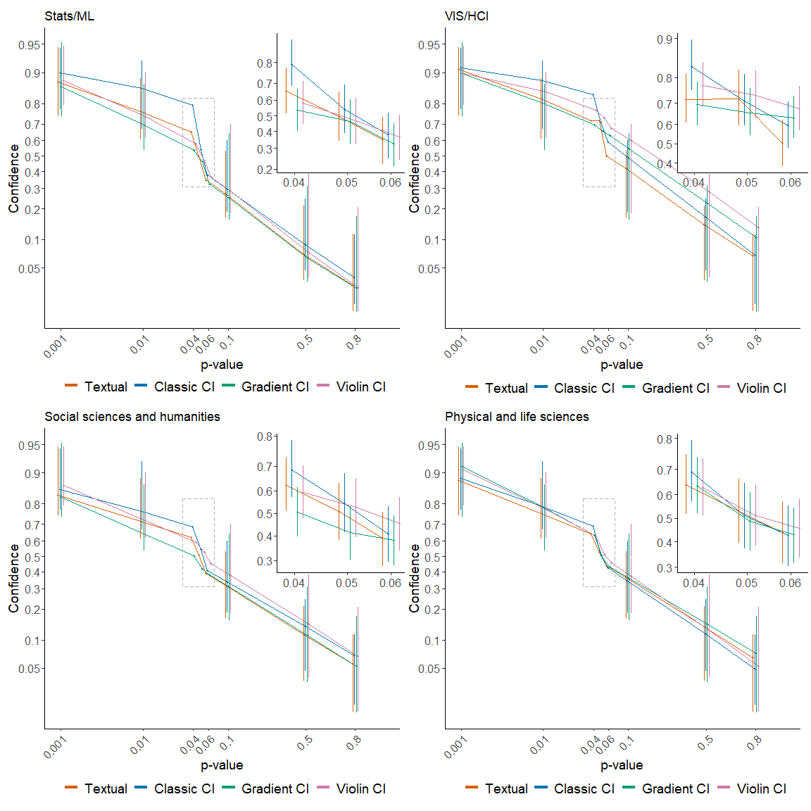<!-- -->


There are some differences between confidence curves between groups: In Physical and life sciences the visualization affects only little on the confidence curves; gradient CI and violin CI produce very linear curves in VIS/HCI group; and there is very large drop in confidence in case of classic CI in Stats/ML group. However, the ordering in terms of cliff effect is same in all groups.

We can also draw same figure when averaging over the groups:


```r
sumr <- d %>% group_by(viz, p) %>%
  summarise(Estimate = mean(value), 
    Q2.5 = quantile(value, 0.025), 
    Q97.5 = quantile(value, 0.975)) %>%
  mutate(p = as.numeric(levels(p))[p])
```

```
## `summarise()` regrouping output by 'viz' (override with `.groups` argument)
```

```r
p1 <- sumr %>%
  ggplot(aes(x = p, y = Estimate, colour = viz)) + 
  geom_line(position = position_dodge(dodge), size = 0.1) +
  geom_linerange(data = sumr %>% filter(p < 0.03 | p > 0.07),
    aes(ymin = Q2.5, ymax = Q97.5), 
    position = position_dodge(dodge), size = 0.3,
    show.legend = FALSE) + 
  geom_point(position = position_dodge(dodge), size = 0.7, show.legend = FALSE) +
  ylab("Confidence") + xlab("p-value") + 
  scale_color_manual("Representation", values =  cols) + 
  scale_y_continuous(trans="logit", breaks = y_ticks, 
    minor_breaks = NULL, labels = y_ticks) + 
  scale_x_continuous(trans="logit",
    breaks = x_ticks, labels = x_ticks, minor_breaks = NULL) + 
  theme_classic() + 
  theme(legend.position = "bottom", 
    legend.title = element_blank(),
    axis.text.x = element_text(size = 12, angle = 45, hjust = 1, vjust = 1), 
    axis.text.y = element_text(size = 12),
    axis.title.x = element_text(size = 14, 
      margin = margin(t = -0.1, r = 0, b = -0.3, l = 0, unit = "cm")),
    axis.title.y = element_text(size = 14, 
      margin = margin(t = 0, r = -0.1, b = 0, l = -0.1, unit = "cm")),
    legend.text = element_text(size = 14))  + 
  geom_rect(xmin = qlogis(0.03), xmax = qlogis(0.07), ymin = qlogis(0.31), ymax = qlogis(0.82), 
    color = "grey70", alpha = 0, linetype = "dashed", size = 0.1) + 
  guides(colour = guide_legend(override.aes = list(size = 1.5)))


p2 <- sumr %>% filter(p > 0.02 & p < 0.09) %>%
  ggplot(aes(x = p, y = Estimate, colour = viz)) + 
  geom_line(position = position_dodge(0.1), size = 0.1) +
  geom_linerange(
    aes(ymin = Q2.5, ymax = Q97.5), 
    position = position_dodge(0.1), size = 0.3,
    show.legend = FALSE) + 
  geom_point(position = position_dodge(0.1), size = 0.7) +
  ylab("Confidence") + xlab("p-value") + 
  scale_color_manual("Representation", values =  cols) + 
  scale_y_continuous(trans="logit", breaks = y_ticks,
    minor_breaks = NULL, labels = y_ticks) + 
  scale_x_continuous(trans="logit",
    breaks = c(0.04, 0.05, 0.06), 
    labels = c(0.04, 0.05, 0.06), 
    minor_breaks = NULL) + 
  theme_classic() + 
  theme(legend.position = "none",  
    axis.title.x = element_blank(), axis.title.y = element_blank(),
    plot.background = element_blank(),
    plot.margin=unit(c(-4,-9,0,0), "mm"),
    axis.text.x = element_text(size = 12), 
    axis.text.y = element_text(size = 12)) 

p <- p1 + coord_cartesian(xlim = c(0.001, 0.9), ylim = yrange) + 
  annotation_custom(
    ggplotGrob(p2), 
    xmin = qlogis(0.2), xmax = qlogis(0.9), ymin = qlogis(0.3), ymax = qlogis(0.95))
p
```

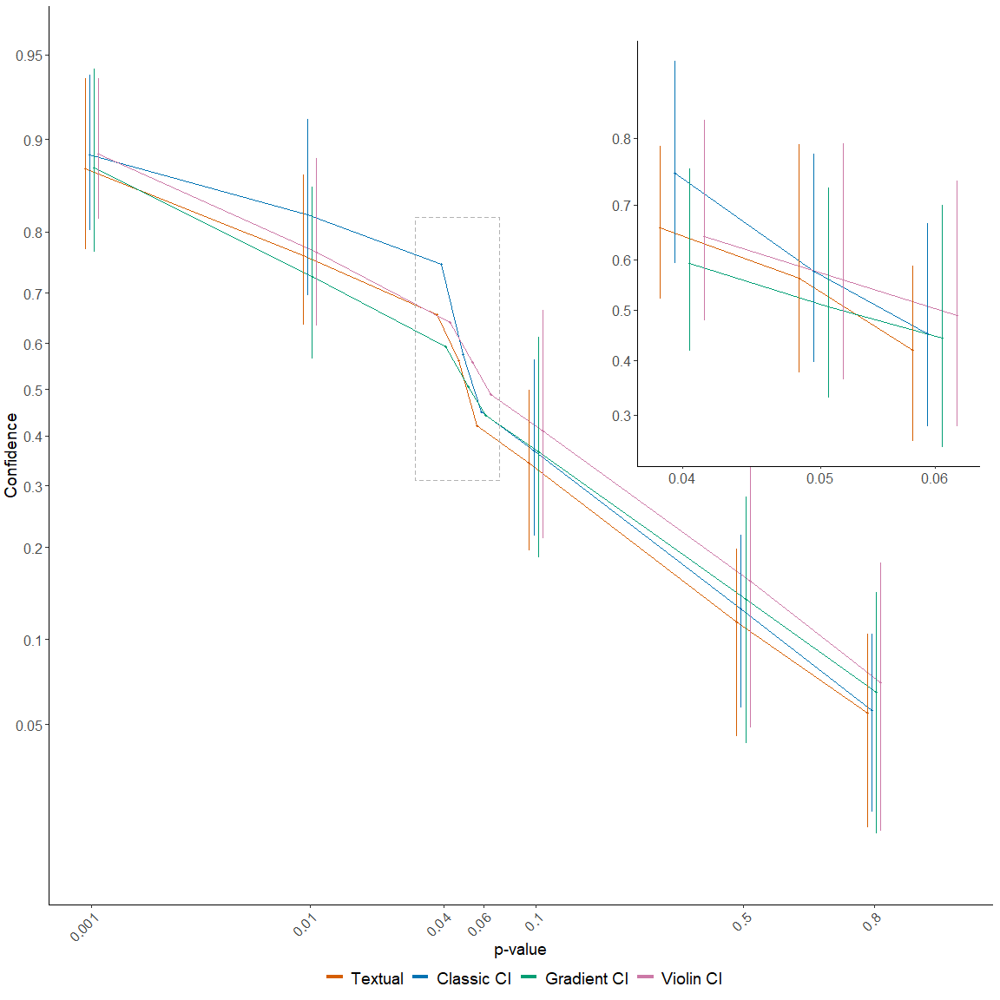<!-- -->


We see that the results are very similar to the model without the expertise variable, except naturally the credible intervals in the above figure are somewhat wider when we average over the expertise groups with different overall levels (in model without expertise, these differences are captured by the participant-level effects which are then zeroed out when considering average participant).

Now the potential cliff effect:

```r
d %>% group_by(viz, iter,expertise) %>% 
  summarise(difference = value[p == "0.04"] - value[p == "0.06"]) %>% 
  ggplot(aes(x = difference, fill = viz, colour = viz)) + 
  geom_density(bw = 0.01, alpha = 0.6) +
  theme_classic() + 
  scale_fill_manual("Representation", values =  cols) + 
  scale_color_manual("Representation", values =  cols) + 
  ylab("Posterior density") + 
  xlab("Cliff effect") +
  theme(legend.position = "bottom", 
    legend.title = element_blank(),
    axis.text.x = element_text(size = 12, hjust = 1, vjust = 1), 
    axis.text.y = element_text(size = 12),
    axis.title.x = element_text(size = 14, 
      margin = margin(t = -0.1, r = 0, b = -0.3, l = 0, unit = "cm")),
    axis.title.y = element_text(size = 14, 
      margin = margin(t = 0, r = -0.1, b = 0, l = -0.1, unit = "cm")),
    legend.text = element_text(size = 14)) +facet_wrap(~expertise)
```

```
## `summarise()` regrouping output by 'viz', 'iter' (override with `.groups` argument)
```

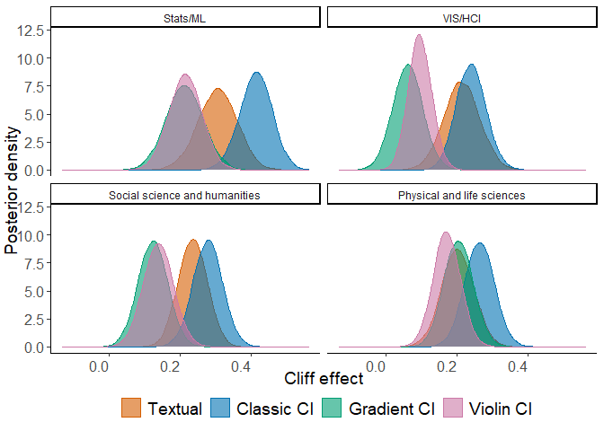<!-- -->

```r
d %>% group_by(expertise, viz, iter) %>% 
  summarise(difference = value[p == "0.04"] - value[p == "0.06"]) %>%
  summarise(mean = mean(difference), sd = sd(difference),
    "2.5%" = quantile(difference, 0.025), 
    "97.5" = quantile(difference, 0.975))
```

```
## `summarise()` regrouping output by 'expertise', 'viz' (override with `.groups` argument)
```

```
## `summarise()` regrouping output by 'expertise' (override with `.groups` argument)
```

```
## # A tibble: 16 x 6
## # Groups:   expertise [4]
##    expertise                     viz           mean     sd  `2.5%` `97.5`
##    <fct>                         <fct>        <dbl>  <dbl>   <dbl>  <dbl>
##  1 Stats/ML                      Textual     0.305  0.0547  0.194   0.409
##  2 Stats/ML                      Classic CI  0.413  0.0450  0.322   0.501
##  3 Stats/ML                      Gradient CI 0.212  0.0517  0.110   0.313
##  4 Stats/ML                      Violin CI   0.214  0.0461  0.123   0.304
##  5 VIS/HCI                       Textual     0.213  0.0501  0.116   0.312
##  6 VIS/HCI                       Classic CI  0.240  0.0409  0.162   0.321
##  7 VIS/HCI                       Gradient CI 0.0605 0.0418 -0.0217  0.144
##  8 VIS/HCI                       Violin CI   0.0955 0.0318  0.0342  0.159
##  9 Social science and humanities Textual     0.235  0.0401  0.157   0.312
## 10 Social science and humanities Classic CI  0.277  0.0410  0.198   0.359
## 11 Social science and humanities Gradient CI 0.123  0.0409  0.0431  0.203
## 12 Social science and humanities Violin CI   0.138  0.0422  0.0563  0.222
## 13 Physical and life sciences    Textual     0.202  0.0449  0.114   0.291
## 14 Physical and life sciences    Classic CI  0.264  0.0414  0.183   0.346
## 15 Physical and life sciences    Gradient CI 0.204  0.0406  0.125   0.286
## 16 Physical and life sciences    Violin CI   0.171  0.0379  0.0983  0.246
```

We see some differences between the group-wise estimates (but note the standard deviation). For example the drop in confidence seems to be smallest in the VIS/HCI group with gradient and violin CIs (and $p$-value and classic CI perform relatively similar) and somewhat surprisingly the drops are largest in the Stats/ML group for all representation values. However, in all groups the classic CI has largest drop, with $p$-value following second (expect there is a virtually tie with the gradient CI in Phys./life sciences group), and relatively equal drops with gradient and violin CIs.

When we average over these groups to obtain marginal means we see almost identical results compared to the model without expertise:


```r
d %>% group_by(expertise, viz, iter) %>% 
  summarise(difference = value[p == "0.04"] - value[p == "0.06"]) %>%
  group_by(viz) %>%
  summarise(mean = mean(difference), sd = sd(difference),
    "2.5%" = quantile(difference, 0.025), 
    "97.5" = quantile(difference, 0.975))
```

```
## `summarise()` regrouping output by 'expertise', 'viz' (override with `.groups` argument)
```

```
## `summarise()` ungrouping output (override with `.groups` argument)
```

```
## # A tibble: 4 x 5
##   viz          mean     sd  `2.5%` `97.5`
##   <fct>       <dbl>  <dbl>   <dbl>  <dbl>
## 1 Textual     0.239 0.0623 0.128    0.375
## 2 Classic CI  0.299 0.0796 0.180    0.470
## 3 Gradient CI 0.150 0.0761 0.00751  0.286
## 4 Violin CI   0.155 0.0590 0.0515   0.274
```

Density plots of course show multimodality due to group differences:

```r
d %>% group_by(viz, iter) %>% 
  summarise(difference = value[p == "0.04"] - value[p == "0.06"]) %>% 
  ggplot(aes(x = difference, fill = viz, colour = viz)) + 
  geom_density(bw = 0.01, alpha = 0.6) +
  theme_classic() + 
  scale_fill_manual("Representation", 
    values = cols[1:4]) + 
  scale_colour_manual("Representation", 
    values = cols[1:4]) + 
  ylab("Posterior density") + 
  xlab("Cliff effect") +
  theme(legend.position = "bottom", 
    legend.title = element_blank(),
    axis.text.x = element_text(size = 12, hjust = 1, vjust = 1), 
    axis.text.y = element_text(size = 12),
    axis.title.x = element_text(size = 14, 
      margin = margin(t = -0.1, r = 0, b = -0.3, l = 0, unit = "cm")),
    axis.title.y = element_text(size = 14, 
      margin = margin(t = 0, r = -0.1, b = 0, l = -0.1, unit = "cm")),
    legend.text = element_text(size = 14)) 
```

```
## `summarise()` regrouping output by 'viz', 'iter' (override with `.groups` argument)
```

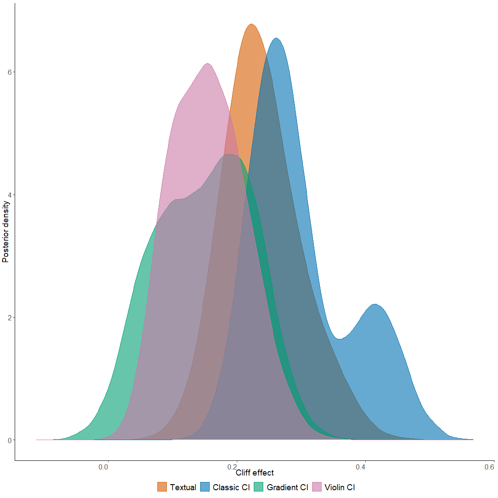<!-- -->

When reflecting these results to the descriptive statistics of the data, especially the cliff effect for each expertise group and visualization style, it should be noted that especially in VIS/HCI case there are large proportion of answers with a clear "negative drop" of confidence around $p=0.05$, which could be considered "equally wrong interpretation" as the cliff effect itself. These cases also negate the big changes to other direction making the overall drop for these groups smaller. 

<!-- Thus it could be interesting to study absolute changes of confidence, or alternatively clean these "outliers" (most of them are not really outliers as due to the experiment's design there is natural random variation in the answers) and reanalyse the data (which we did not do here as we wanted to stary true to our preregistration where we did not consider this). -->

For example, here is the proportion of curves where the the change in confidence $\delta < -0.2$ (average drop over all viz and expertise groups was estimated as $0.2$: 


```r
data %>% group_by(id, viz, expertise) %>% 
    summarize(difference = confidence[true_p==0.04] - confidence[true_p==0.06])  %>% 
    group_by(viz, expertise) %>%
    summarise(
        negative_cliff = round(mean(difference < -0.2), 2))
```

```
## `summarise()` regrouping output by 'id', 'viz' (override with `.groups` argument)
```

```
## `summarise()` regrouping output by 'viz' (override with `.groups` argument)
```

```
## # A tibble: 16 x 3
## # Groups:   viz [4]
##    viz      expertise                     negative_cliff
##    <fct>    <fct>                                  <dbl>
##  1 p        Stats/ML                                0   
##  2 p        VIS/HCI                                 0.09
##  3 p        Social science and humanities           0   
##  4 p        Physical and life sciences              0   
##  5 CI       Stats/ML                                0   
##  6 CI       VIS/HCI                                 0.03
##  7 CI       Social science and humanities           0   
##  8 CI       Physical and life sciences              0   
##  9 gradient Stats/ML                                0   
## 10 gradient VIS/HCI                                 0.09
## 11 gradient Social science and humanities           0.12
## 12 gradient Physical and life sciences              0   
## 13 violin   Stats/ML                                0   
## 14 violin   VIS/HCI                                 0.03
## 15 violin   Social science and humanities           0.03
## 16 violin   Physical and life sciences              0
```

```r
data %>% group_by(id, viz, expertise) %>% 
    summarize(difference = confidence[true_p==0.04] - confidence[true_p==0.06])  %>% 
    group_by(expertise) %>%
    summarise(
        negative_cliff = round(mean(difference < -0.2), 2))
```

```
## `summarise()` regrouping output by 'id', 'viz' (override with `.groups` argument)
```

```
## `summarise()` ungrouping output (override with `.groups` argument)
```

```
## # A tibble: 4 x 2
##   expertise                     negative_cliff
##   <fct>                                  <dbl>
## 1 Stats/ML                                0   
## 2 VIS/HCI                                 0.06
## 3 Social science and humanities           0.04
## 4 Physical and life sciences              0
```

```r
data %>% group_by(id, viz, expertise) %>% 
    summarize(difference = confidence[true_p==0.04] - confidence[true_p==0.06])  %>% 
    group_by(viz) %>%
    summarise(
        negative_cliff = round(mean(difference < -0.2), 2))
```

```
## `summarise()` regrouping output by 'id', 'viz' (override with `.groups` argument)
## `summarise()` ungrouping output (override with `.groups` argument)
```

```
## # A tibble: 4 x 2
##   viz      negative_cliff
##   <fct>             <dbl>
## 1 p                  0.03
## 2 CI                 0.01
## 3 gradient           0.06
## 4 violin             0.02
```


### Reanalysis with cleaned data

Finally we test how does the results depend on those confidence curves which have clearly positive slope or large increases in confidence when $p$-value increases.

We use simple linear model with logit-transformed $p$-value and trimmed logit-transformed confidence, and check whether the corresponding coefficient is clearly positive (arbitrarily chose as 0.1), and in addition to this we remove those curves where the difference between two consecutive confidence values are larger than 0.2 (this should of course be negative):


```r
data <- readRDS("experiment1/data/exp1_data.rds")
outliers_slope <- data %>% group_by(id, viz) %>%
  mutate(p_logit = qlogis(p), c_logit = qlogis(
    ifelse(confidence == 0, 0.001, ifelse(confidence == 1, 0.999, confidence)))) %>%
  summarize(
    slope = coef(lm(c_logit ~ p_logit))[2]) %>%
  filter(slope > 0.1)

outliers_diff <- data %>% group_by(id, viz) %>% 
  arrange(p, .by_group = TRUE) %>%
  mutate(diff = c(0,diff(confidence)), neg_diff = any(diff > 0.2)) %>%
  filter(neg_diff)

data_cleaned <- data %>%
  filter(!(interaction(id,viz) %in% 
      interaction(outliers_slope$id, outliers_slope$viz))) %>%
  filter(!(interaction(id,viz) %in% 
      interaction(outliers_diff$id, outliers_diff$viz))) 

data_cleaned <- data_cleaned %>% 
  mutate(
    logit_p = qlogis(p),
    p_lt0.05 = factor(p < 0.05, levels = c(TRUE, FALSE), labels = c("Yes", "No")),
    p_eq0.05 = factor(p == 0.05, levels = c(TRUE, FALSE), labels = c("Yes", "No")),
    cat_p = recode_factor(true_p, 
      "0.06" = ">0.05", "0.1" = ">0.05", "0.5" = ">0.05", "0.8" = ">0.05",
      .ordered = TRUE))

fit_exp1 <- brm(bf(
  confidence ~ 
    viz * p_lt0.05 * logit_p + 
    viz * p_eq0.05 +
    (viz + p_lt0.05 * logit_p + p_eq0.05 | id),
  zoi ~ 
    viz * true_p + (viz | id),
  coi ~ mo(cat_p),
  sigma ~ viz + (1 | id)),
  data = data_cleaned,
  family = logit_p_gaussian,
  stanvars = stanvar(scode = stan_funs, block = "functions"),
  chains = 4, cores = 4, iter = 2000, init = 0, 
  save_warmup = FALSE, refresh = 0)
```


```r
comb_exp1 <- fit_exp1$data %>% 
  data_grid(viz, logit_p, p_lt0.05, p_eq0.05, cat_p, true_p) %>% 
  filter(interaction(logit_p, p_lt0.05, p_eq0.05, cat_p, true_p) %in% 
      unique(interaction( 
        fit_exp1$data$logit_p, fit_exp1$data$p_lt0.05, 
        fit_exp1$data$p_eq0.05, fit_exp1$data$cat_p, 
        fit_exp1$data$true_p)))

f_mu_exp1 <- posterior_epred(fit_exp1, newdata = comb_exp1, re_formula = NA)

d <- data.frame(value = c(f_mu_exp1), 
  p = rep(comb_exp1$true_p, each = nrow(f_mu_exp1)),
  viz = rep(comb_exp1$viz, each = nrow(f_mu_exp1)),
  iter = 1:nrow(f_mu_exp1))
levels(d$viz) <- c("Textual", "Classic CI", "Gradient CI", "Violin CI")

sumr <- d %>% group_by(viz, p) %>%
  summarise(Estimate = mean(value), 
    Q2.5 = quantile(value, 0.025), 
    Q97.5 = quantile(value, 0.975)) %>%
  mutate(p = as.numeric(levels(p))[p])
```

```
## `summarise()` regrouping output by 'viz' (override with `.groups` argument)
```

```r
cols <- c("Textual" = "#D55E00", "Classic CI" = "#0072B2", 
  "Gradient CI" = "#009E73", "Violin CI" = "#CC79A7")
x_ticks <- c(0.001, 0.01, 0.04, 0.06, 0.1, 0.5, 0.8)
y_ticks <- c(0.05, seq(0.1, 0.9, by = 0.1), 0.95)
dodge <- 0.19

p1 <- sumr %>%
  ggplot(aes(x = p, y = Estimate, colour = viz)) + 
  geom_line(position = position_dodge(dodge), size = 0.1) +
  geom_linerange(data = sumr %>% filter(p < 0.03 | p > 0.07),
    aes(ymin = Q2.5, ymax = Q97.5), 
    position = position_dodge(dodge), size = 0.3,
    show.legend = FALSE) + 
  geom_point(position = position_dodge(dodge), size = 0.7, show.legend = FALSE) +
  ylab("Confidence") + xlab("p-value") + 
  scale_color_manual("Representation", values =  cols) + 
  scale_y_continuous(trans="logit", breaks = y_ticks, 
    minor_breaks = NULL, labels = y_ticks) + 
  scale_x_continuous(trans="logit",
    breaks = x_ticks, labels = x_ticks, minor_breaks = NULL) + 
  theme_classic() + 
  theme(legend.position = "bottom", 
    legend.title = element_blank(),
    axis.text.x = element_text(size = 12, angle = 45, hjust = 1, vjust = 1), 
    axis.text.y = element_text(size = 12),
    axis.title.x = element_text(size = 14, 
      margin = margin(t = -0.1, r = 0, b = -0.1, l = 0, unit = "cm")),
    axis.title.y = element_text(size = 14, 
      margin = margin(t = 0, r = -0.1, b = 0, l = -0.1, unit = "cm")),
    legend.text = element_text(size = 14))  + 
  geom_rect(xmin = qlogis(0.03), xmax = qlogis(0.07), ymin = qlogis(0.31), ymax = qlogis(0.82), 
    color = "grey70", alpha = 0, linetype = "dashed", size = 0.1) + 
  guides(colour = guide_legend(override.aes = list(size = 1.5)))


p2 <- sumr %>% filter(p > 0.02 & p < 0.09) %>%
  ggplot(aes(x = p, y = Estimate, colour = viz)) + 
  geom_line(position = position_dodge(0.1), size = 0.1) +
  geom_linerange(
    aes(ymin = Q2.5, ymax = Q97.5), 
    position = position_dodge(0.1), size = 0.3,
    show.legend = FALSE) + 
  geom_point(position = position_dodge(0.1), size = 0.7) +
  ylab("Confidence") + xlab("p-value") + 
  scale_color_manual("Representation", values =  cols) + 
  scale_y_continuous(trans="logit", breaks = y_ticks,
    minor_breaks = NULL, labels = y_ticks) + 
  scale_x_continuous(trans="logit",
    breaks = c(0.04, 0.05, 0.06), 
    labels = c(0.04, 0.05, 0.06), 
    minor_breaks = NULL) + 
  theme_classic() + 
  theme(legend.position = "none",  
    axis.title.x = element_blank(), axis.title.y = element_blank(),
    plot.background = element_blank(),
    plot.margin=unit(c(-4,-9,0,0), "mm"),
    axis.text.x = element_text(size = 12), 
    axis.text.y = element_text(size = 12)) 

p <- p1 + coord_cartesian(xlim = c(0.001, 0.9), ylim = c(0.045, 0.95)) + 
  annotation_custom(
    ggplotGrob(p2), 
    xmin = qlogis(0.2), xmax = qlogis(0.9), ymin = qlogis(0.3), ymax = qlogis(0.95))
p
```

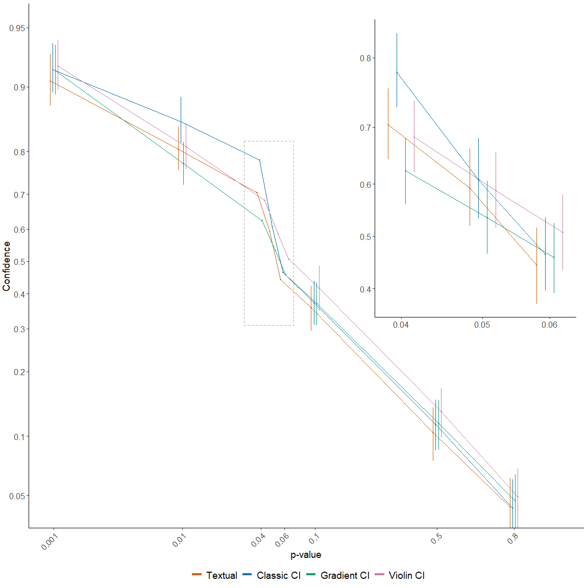<!-- -->

```r
d %>% group_by(viz, iter) %>% 
  summarise(difference = value[p == "0.04"] - value[p == "0.06"]) %>%
  summarise(mean = mean(difference), sd = sd(difference),
    "2.5%" = quantile(difference, 0.025), 
    "97.5" = quantile(difference, 0.975))
```

```
## `summarise()` regrouping output by 'viz' (override with `.groups` argument)
```

```
## `summarise()` ungrouping output (override with `.groups` argument)
```

```
## # A tibble: 4 x 5
##   viz          mean     sd `2.5%` `97.5`
##   <fct>       <dbl>  <dbl>  <dbl>  <dbl>
## 1 Textual     0.260 0.0268  0.208  0.313
## 2 Classic CI  0.316 0.0247  0.268  0.365
## 3 Gradient CI 0.166 0.0248  0.117  0.215
## 4 Violin CI   0.176 0.0230  0.130  0.220
```

Overall, the results are in line with the analysis of to full data, except that the average $\delta$ is larger in all groups.
    
### Subjective rankings of the representation styles

Now we focus on analysis the subjective rankings of the technique. Read the feedback data and merge it with the previous data which contains the expertise information: 


```r
files <- list.files(path, pattern = "subjective", full.names = TRUE)
n <- length(files)

rankdata <- data.frame(id = rep(1:n, each=4),
  viz = factor(rep(c("p", "ci", "violin", "gradient")), 
    levels=c("p", "ci", "violin", "gradient")),
  rank = factor(NA, levels=1:4))

for(i in 1:n) {
  fb <- fromJSON(files[i])
  rankdata$id[4*(i-1) + 1:4] <- strsplit(strsplit(files[i], "subjective")[[1]], ".txt")[[2]]
  rankdata$rank[4*(i-1) + 1:4] <- factor(fb$rank)
}

rankdata$viz <- recode_factor(rankdata$viz, "p" = "p", "ci" = "CI",
  "gradient" = "gradient", "violin" = "violin")
rankdata$rank <- factor(rankdata$rank, ordered = TRUE)
rankdata$id <- factor(rankdata$id, levels = levels(data$id))
ranks_exp1 <- distinct(inner_join(rankdata, data[,c("id", "viz", "expertise")]))
```


For analysing the subjective rankings of the representation styles, we use a Bayesian ordinal regression model. We test two models, one with expertise and another without it:

```r
fit_rank1 <- brm(rank ~ viz + (1 | id), family=cumulative, 
  data = ranks_exp1, refresh = 0)
saveRDS(fit_rank1, file = "experiment1/results/fit_rank1.rds")
```

Plot ranking probabilities:

```r
colsrank <- scales::brewer_pal(palette = "PiYG",
  direction = -1)(4)

effects_exp1 <- conditional_effects(fit_rank1, effects = "viz", 
  plot = FALSE, categorical = TRUE, reformula = NA)

p <- ggplot(effects_exp1[[1]], aes(x = viz, y = estimate__, colour = cats__)) + 
  geom_point(position=position_dodge(0.5)) + 
  geom_errorbar(width=0.25, aes(ymin=lower__, ymax = upper__), 
    position = position_dodge(0.5)) + 
  theme_classic() + 
  ylab("Ranking \n probability") + 
  xlab("Representation") +
  scale_x_discrete(labels =c("Textual", "Classic CI", "Gradient CI", "Violin CI")) +
  scale_color_manual("Rank", 
    values = colsrank,
    labels = c("1 (best)", "2", "3", "4 (worst)")) + 
  theme(legend.position = "bottom", 
    legend.title = element_blank(),
    axis.text.x = element_text(size = 12,hjust = 1, vjust = 1), 
    axis.text.y = element_text(size = 12),
    axis.title.x = element_text(size = 14),
    axis.title.y = element_text(size = 14),
    legend.text = element_text(size = 14)) 
p
```

<!-- -->


We see that the $p$-values are likely to be ranked very low, while violin CI and classic CI are the most preferred options, and gradient CI seems to divide opinions most.

## Two-sample experiment

Let us turn our attention to the second experiment, for which we essentially use the same workflow as for the first experiment.

### Creating the dataset


```r
path <- "experiment2/data"
answers <- list.files(path, pattern="answers", full.names = TRUE)
n <- length(answers)

# create a data frame for the results
data_raw <- data.frame(id = rep(1:n, each = 32), viz = NA, replication = NA, value = NA,
  expertise = NA, degree = NA, age = NA, experience = NA, tools = NA)

# read in answers, not optimal way will do
for(i in 1:n){
  x <- strsplit(fromJSON(answers[i]), ",")
  dem <- fromJSON(paste0(path,  "/demography", x[[1]][1], ".txt"))
  for(j in 1:32) {
    data_raw[32*(i-1) + j, c("id", "viz", "replication", "value")] <- x[[j]]
    data_raw[32*(i-1) + j, c("expertise", "degree", "age", "experience", "tools")] <- 
      dem[c("expertise", "level", "age", "experience", "tools")]
  }
}
saveRDS(data_raw, file = "experiment2/data/data_raw.rds")
# remove person who didn't answer on the demography part
data_raw <- data_raw[data_raw$expertise != "",]

true_p <- c(0.001, 0.01, 0.04, 0.05, 0.06, 0.1, 0.5, 0.8)

data2 <- data_raw %>% mutate(n = factor(ifelse(as.numeric(id) %% 8 < 4, 50, 200)),
  id = factor(id),
  viz = relevel(factor(viz, labels = c("CI", 
    "Gradient", 
    "Continuous Violin", 
    "Discrete Violin")),
    "CI"),
  replication = as.numeric(replication),
  value = as.numeric(value),
  p = true_p[replication],
  true_p = factor(p), # for monotonic but non-linear effect on confidence
  confidence = (value - 1) / 99,
  expertise = factor(expertise)) %>% arrange(id, viz)

# Classify the expertise
data2$expertise <- recode_factor(data2$expertise, 
  "Statistics" = "Stats/ML",
  "machine learning, statistics" = "Stats/ML",
  "Human Factors, experiment design" = "Stats/ML",
  "Consulting" = "Stats/ML",
  "Computer vision" = "Stats/ML",
  "Meta-research"  = "Stats/ML",
  "Epidemiology" = "Stats/ML",
  
  "infovis" = "VIS/HCI",
  "HCI and VIS" = "VIS/HCI",
  "HCI" = "VIS/HCI",
  "vis" = "VIS/HCI",
  "Vis and HCI" = "VIS/HCI", 
  "Visualisation" = "VIS/HCI",
  "Visualization" = "VIS/HCI",
  
  "sociology" = "Social science and humanities",
  "Sociology" = "Social science and humanities",
  "Psychology" = "Social science and humanities",
  "psychology" = "Social science and humanities",
  "health economics" = "Social science and humanities",
  "Sport psychology" = "Social science and humanities",
  "economics" = "Social science and humanities",
  
  "Psychology / Neuroscience" = "Physical and life sciences",
  "Ecology" = "Physical and life sciences",
  "Biology" = "Physical and life sciences",
  "Biology " = "Physical and life sciences",
  "Developmental Biology" = "Physical and life sciences",
  "Microbiology" = "Physical and life sciences"
)
data2$expertise <- relevel(data2$expertise, "Stats/ML")
```


### Descriptive statistics

As in first experiment, we first look at some descriptive statistics. 

```r
ids <- which(!duplicated(data2$id))
barplot(table(data2$expertise[ids]))
```

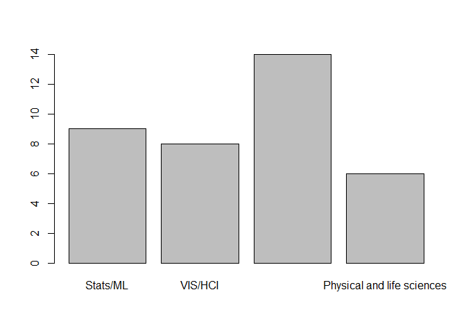<!-- -->

```r
barplot(table(data2$degree[ids]))
```

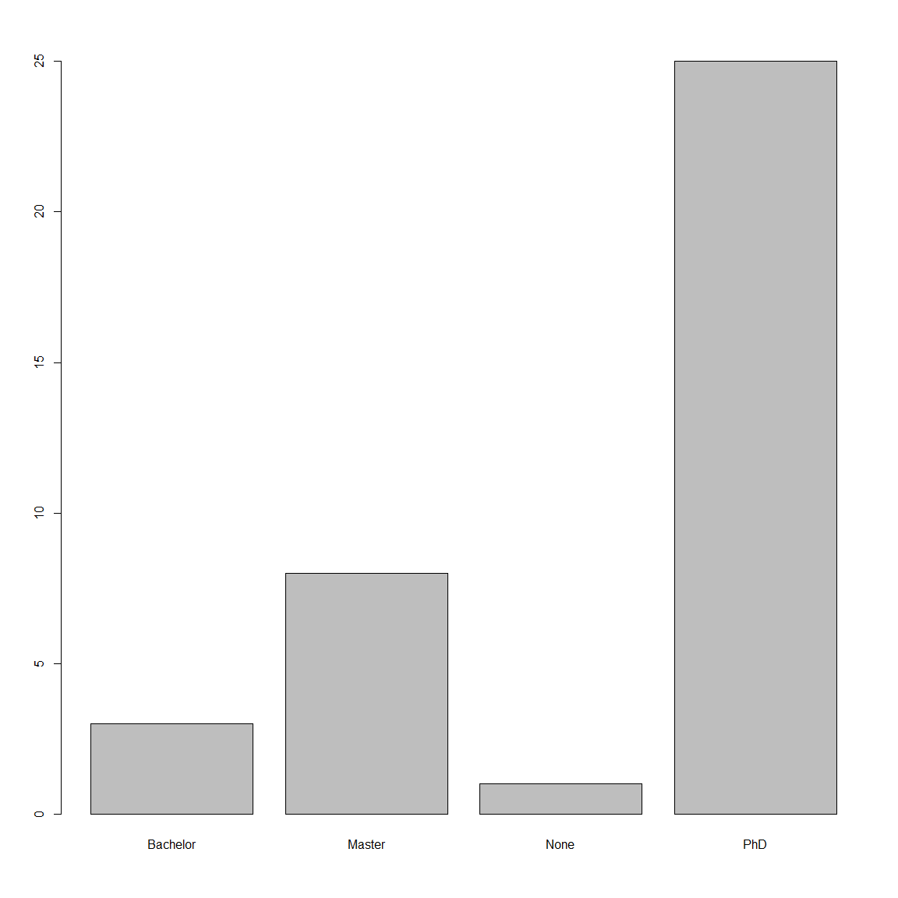<!-- -->

```r
hist(as.numeric(data2$age[ids]))
```

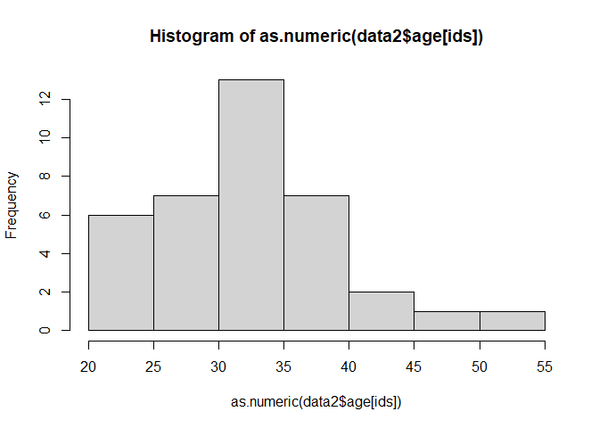<!-- -->

Again we now focus on the cliff effect as difference between confidence when $p$-value=0.04 versus $p$-value=0.06:

```r
data2 %>% group_by(id, viz) %>% 
  summarize(difference = confidence[true_p==0.04] - confidence[true_p==0.06])  %>% 
  group_by(viz) %>%
  summarise(
    mean = mean(difference), 
    median = median(difference),
    sd = sd(difference), 
    se = sd(difference) / sqrt(length(difference)),
    "2.5%" = quantile(difference, 0.025), 
    "97.5%" = quantile(difference, 0.975))
```

```
## `summarise()` regrouping output by 'id' (override with `.groups` argument)
```

```
## `summarise()` ungrouping output (override with `.groups` argument)
```

```
## # A tibble: 4 x 7
##   viz                  mean median     sd     se `2.5%` `97.5%`
##   <fct>               <dbl>  <dbl>  <dbl>  <dbl>  <dbl>   <dbl>
## 1 CI                0.0740  0.0606 0.123  0.0201 -0.220   0.284
## 2 Gradient          0.00928 0      0.124  0.0203 -0.207   0.252
## 3 Continuous Violin 0.0131  0      0.0850 0.0140 -0.154   0.173
## 4 Discrete Violin   0.0633  0.0404 0.180  0.0295 -0.168   0.501
```

```r
data2 %>% group_by(id, viz) %>% 
  summarize(difference = confidence[true_p==0.04] - confidence[true_p==0.06]) %>%
  ggplot(aes(x = viz, y = difference)) + 
  geom_violin() +
  geom_point(alpha = 0.5, position = position_jitter(0.1)) +
  scale_y_continuous("Difference in confidence when p-value is 0.06 vs 0.04") +
  scale_x_discrete("Representation") +
  theme_classic() 
```

```
## `summarise()` regrouping output by 'id' (override with `.groups` argument)
```

<!-- -->

Interestingly, while the cliff effect is again largest with classic CI, there are some cases where the discrete Violin CI has lead to very large drop in confidence. Overall the cliff effect seems to be much smaller than in the one-sample case (there the average drop was around 0.1-0.3 depending on the technique).

Now same but with subgrouping using sample size:

```r
data2 %>% group_by(id, viz, n) %>% 
  summarize(diff = confidence[true_p==0.04] - confidence[true_p==0.06])  %>% 
  group_by(viz, n) %>%
  summarise(
    mean = mean(diff), 
    sd = sd(diff), 
    se = sd(diff) / sqrt(length(diff)),
    "2.5%" = quantile(diff, 0.025), 
    "97.5%" = quantile(diff, 0.975))
```

```
## `summarise()` regrouping output by 'id', 'viz' (override with `.groups` argument)
```

```
## `summarise()` regrouping output by 'viz' (override with `.groups` argument)
```

```
## # A tibble: 8 x 7
## # Groups:   viz [4]
##   viz               n         mean     sd     se  `2.5%` `97.5%`
##   <fct>             <fct>    <dbl>  <dbl>  <dbl>   <dbl>   <dbl>
## 1 CI                50    8.44e- 2 0.107  0.0260 -0.0323   0.327
## 2 CI                200   6.52e- 2 0.136  0.0305 -0.255    0.239
## 3 Gradient          50    4.70e-18 0.115  0.0279 -0.216    0.152
## 4 Gradient          200   1.72e- 2 0.133  0.0297 -0.183    0.290
## 5 Continuous Violin 50    1.19e- 3 0.0730 0.0177 -0.113    0.143
## 6 Continuous Violin 200   2.32e- 2 0.0946 0.0212 -0.162    0.158
## 7 Discrete Violin   50    1.06e- 1 0.179  0.0433 -0.0303   0.570
## 8 Discrete Violin   200   2.73e- 2 0.177  0.0396 -0.236    0.437
```
and expertise:

```r
data2 %>% group_by(id, viz, expertise) %>% 
  summarize(diff = confidence[true_p==0.04] - confidence[true_p==0.06])  %>% 
  group_by(viz, expertise) %>%
  summarise(
    mean = mean(diff), 
    sd = sd(diff), 
    se = sd(diff) / sqrt(length(diff)),
    "2.5%" = quantile(diff, 0.025), 
    "97.5%" = quantile(diff, 0.975))
```

```
## `summarise()` regrouping output by 'id', 'viz' (override with `.groups` argument)
```

```
## `summarise()` regrouping output by 'viz' (override with `.groups` argument)
```

```
## # A tibble: 16 x 7
## # Groups:   viz [4]
##    viz            expertise                  mean     sd     se   `2.5%` `97.5%`
##    <fct>          <fct>                     <dbl>  <dbl>  <dbl>    <dbl>   <dbl>
##  1 CI             Stats/ML                0.0909  0.0674 0.0225 -0.00404  0.192 
##  2 CI             VIS/HCI                 0.0530  0.130  0.0460 -0.179    0.182 
##  3 CI             Social science and hu~  0.0743  0.0874 0.0234 -0.0338   0.226 
##  4 CI             Physical and life sci~  0.0758  0.237  0.0966 -0.258    0.370 
##  5 Gradient       Stats/ML               -0.0281  0.131  0.0437 -0.234    0.0909
##  6 Gradient       VIS/HCI                 0.00126 0.152  0.0538 -0.193    0.223 
##  7 Gradient       Social science and hu~  0.0310  0.127  0.0339 -0.145    0.274 
##  8 Gradient       Physical and life sci~  0.0253  0.0641 0.0262 -0.0631   0.0985
##  9 Continuous Vi~ Stats/ML                0.0258  0.0804 0.0268 -0.107    0.125 
## 10 Continuous Vi~ VIS/HCI                 0.00758 0.130  0.0460 -0.168    0.180 
## 11 Continuous Vi~ Social science and hu~  0.00433 0.0730 0.0195 -0.0977   0.121 
## 12 Continuous Vi~ Physical and life sci~  0.0219  0.0583 0.0238 -0.0354   0.119 
## 13 Discrete Viol~ Stats/ML               -0.00449 0.0639 0.0213 -0.113    0.0566
## 14 Discrete Viol~ VIS/HCI                 0.115   0.313  0.111  -0.274    0.618 
## 15 Discrete Viol~ Social science and hu~  0.0722  0.137  0.0366 -0.115    0.359 
## 16 Discrete Viol~ Physical and life sci~  0.0758  0.165  0.0674 -0.0947   0.347
```

```r
data2 %>% group_by(id, viz,expertise) %>% 
  summarize(
    difference = confidence[true_p==0.04] - confidence[true_p==0.06]) %>%
  ggplot(aes(x=viz, y = difference)) + geom_violin() + theme_classic() + 
  scale_y_continuous("Difference in confidence when p-value is 0.04 vs 0.06") +
  scale_x_discrete("Representation") +
  geom_point(aes(colour = expertise), position=position_jitter(0.1))
```

```
## `summarise()` regrouping output by 'id', 'viz' (override with `.groups` argument)
```

<!-- -->

It is difficult to say anything definite but there doesn't seem to be clear differences between samples sizes or expertise, although again it is VIS/HCI group which can be "blamed" for extreme changes in violin cases.

Let's check how the much extreme answers (full or zero confidence) there are in different groups:

```r
data2 %>% group_by(id, viz, n) %>% 
  mutate(extreme = confidence %in% c(0, 1))  %>% 
  group_by(viz, n) %>%
  summarise(
    mean = mean(extreme),
    sd = sd(extreme), 
    se = sd(extreme) / sqrt(length(extreme)))
```

```
## `summarise()` regrouping output by 'viz' (override with `.groups` argument)
```

```
## # A tibble: 8 x 5
## # Groups:   viz [4]
##   viz               n      mean    sd     se
##   <fct>             <fct> <dbl> <dbl>  <dbl>
## 1 CI                50    0.125 0.332 0.0285
## 2 CI                200   0.156 0.364 0.0288
## 3 Gradient          50    0.169 0.376 0.0323
## 4 Gradient          200   0.169 0.376 0.0297
## 5 Continuous Violin 50    0.140 0.348 0.0298
## 6 Continuous Violin 200   0.162 0.370 0.0293
## 7 Discrete Violin   50    0.147 0.355 0.0305
## 8 Discrete Violin   200   0.119 0.325 0.0257
```

```r
data2 %>% group_by(id, viz, expertise) %>% 
  mutate(extreme = confidence %in% c(0, 1))  %>% 
  group_by(viz, expertise) %>%
  summarise(
    mean = mean(extreme),
    sd = sd(extreme), 
    se = sd(extreme) / sqrt(length(extreme)))
```

```
## `summarise()` regrouping output by 'viz' (override with `.groups` argument)
```

```
## # A tibble: 16 x 5
## # Groups:   viz [4]
##    viz               expertise                       mean    sd     se
##    <fct>             <fct>                          <dbl> <dbl>  <dbl>
##  1 CI                Stats/ML                      0.0556 0.231 0.0272
##  2 CI                VIS/HCI                       0.125  0.333 0.0417
##  3 CI                Social science and humanities 0.205  0.406 0.0383
##  4 CI                Physical and life sciences    0.146  0.357 0.0515
##  5 Gradient          Stats/ML                      0.0278 0.165 0.0195
##  6 Gradient          VIS/HCI                       0.203  0.406 0.0507
##  7 Gradient          Social science and humanities 0.205  0.406 0.0383
##  8 Gradient          Physical and life sciences    0.25   0.438 0.0632
##  9 Continuous Violin Stats/ML                      0.0417 0.201 0.0237
## 10 Continuous Violin VIS/HCI                       0.172  0.380 0.0475
## 11 Continuous Violin Social science and humanities 0.196  0.399 0.0377
## 12 Continuous Violin Physical and life sciences    0.188  0.394 0.0569
## 13 Discrete Violin   Stats/ML                      0.0556 0.231 0.0272
## 14 Discrete Violin   VIS/HCI                       0.0938 0.294 0.0367
## 15 Discrete Violin   Social science and humanities 0.188  0.392 0.0370
## 16 Discrete Violin   Physical and life sciences    0.167  0.377 0.0544
```
Compared to first experiment, here Stats/ML group performs best.

### Model

Again, create some additional variables:

```r
data2 <- data2 %>% 
  mutate(
    logit_p = qlogis(p),
    p_lt0.05 = factor(p < 0.05, levels = c(TRUE, FALSE), labels = c("Yes", "No")),
    p_eq0.05 = factor(p == 0.05, levels = c(TRUE, FALSE), labels = c("Yes", "No")),
    cat_p = recode_factor(true_p, "0.06" = ">0.05", "0.1" = ">0.05", "0.5" = ">0.05", "0.8" = ">0.05",
      .ordered = TRUE))
```

And fit the same models as in first experiment:

```r
fit_exp2 <- brm(bf(
  confidence ~ 
    viz * p_lt0.05 * logit_p + 
    viz * p_eq0.05 +
    (viz + p_lt0.05 * logit_p + p_eq0.05 | id),
  zoi ~ 
    viz * true_p + (viz | id),
  coi ~ mo(cat_p),
  sigma ~ viz + (1 | id)),
  data = data2,
  family = logit_p_gaussian,
  stanvars = stanvar(scode = stan_funs, block = "functions"),
  chains = 4, cores = 4, iter = 2000, init = 0, 
  save_warmup = FALSE, save_all_pars = TRUE, refresh = 0)
```

And same with expertise:

```r
fit_expertise <- brm(bf(
  confidence ~ 
    expertise * viz * p_lt0.05 * logit_p + 
    expertise * viz * p_eq0.05 +
    (viz + p_lt0.05 * logit_p + p_eq0.05 | id),
  zoi ~ 
    expertise * viz + expertise * true_p + viz * true_p + (viz | id),
  coi ~ mo(cat_p),
  sigma ~ expertise * viz + (1 | id)),
  data = data,
  family = logit_p_gaussian,
  stanvars = stanvar(scode = stan_funs, block = "functions"),
  chains = 4, cores = 4, iter = 2000, init = 0, 
  save_warmup = FALSE, save_all_pars = TRUE, refresh = 0)
```


### Results


```r
fit_exp2
```

```
##  Family: logit_p_gaussian 
##   Links: mu = identity; sigma = log; zoi = logit; coi = logit 
## Formula: confidence ~ viz * p_lt0.05 * logit_p + viz * p_eq0.05 + (viz + p_lt0.05 * logit_p + p_eq0.05 | id) 
##          zoi ~ viz * true_p + (viz | id)
##          coi ~ mo(cat_p)
##          sigma ~ viz + (1 | id)
##    Data: data (Number of observations: 1184) 
## Samples: 4 chains, each with iter = 4000; warmup = 2000; thin = 1;
##          total post-warmup samples = 8000
## 
## Group-Level Effects: 
## ~id (Number of levels: 37) 
##                                                    Estimate Est.Error l-95% CI
## sd(Intercept)                                          1.30      0.20     0.92
## sd(vizGradient)                                        0.62      0.12     0.42
## sd(vizContinuousViolin)                                0.65      0.12     0.44
## sd(vizDiscreteViolin)                                  0.89      0.16     0.62
## sd(p_lt0.05No)                                         0.84      0.19     0.48
## sd(logit_p)                                            0.23      0.04     0.17
## sd(p_eq0.05No)                                         0.14      0.09     0.01
## sd(p_lt0.05No:logit_p)                                 0.33      0.06     0.22
## sd(zoi_Intercept)                                      3.87      0.73     2.66
## sd(zoi_vizGradient)                                    1.04      0.82     0.05
## sd(zoi_vizContinuousViolin)                            0.61      0.44     0.03
## sd(zoi_vizDiscreteViolin)                              0.83      0.60     0.04
## sd(sigma_Intercept)                                    0.28      0.05     0.20
## cor(Intercept,vizGradient)                            -0.08      0.18    -0.42
## cor(Intercept,vizContinuousViolin)                     0.14      0.18    -0.21
## cor(vizGradient,vizContinuousViolin)                   0.36      0.19    -0.04
## cor(Intercept,vizDiscreteViolin)                      -0.06      0.18    -0.39
## cor(vizGradient,vizDiscreteViolin)                     0.11      0.21    -0.31
## cor(vizContinuousViolin,vizDiscreteViolin)             0.33      0.19    -0.07
## cor(Intercept,p_lt0.05No)                             -0.80      0.11    -0.93
## cor(vizGradient,p_lt0.05No)                           -0.05      0.20    -0.45
## cor(vizContinuousViolin,p_lt0.05No)                   -0.18      0.20    -0.56
## cor(vizDiscreteViolin,p_lt0.05No)                      0.06      0.20    -0.34
## cor(Intercept,logit_p)                                 0.56      0.14     0.25
## cor(vizGradient,logit_p)                               0.04      0.20    -0.35
## cor(vizContinuousViolin,logit_p)                      -0.03      0.19    -0.41
## cor(vizDiscreteViolin,logit_p)                        -0.21      0.18    -0.55
## cor(p_lt0.05No,logit_p)                               -0.41      0.19    -0.71
## cor(Intercept,p_eq0.05No)                              0.17      0.30    -0.45
## cor(vizGradient,p_eq0.05No)                            0.06      0.31    -0.56
## cor(vizContinuousViolin,p_eq0.05No)                    0.22      0.31    -0.44
## cor(vizDiscreteViolin,p_eq0.05No)                      0.04      0.31    -0.57
## cor(p_lt0.05No,p_eq0.05No)                            -0.22      0.31    -0.75
## cor(logit_p,p_eq0.05No)                                0.14      0.31    -0.51
## cor(Intercept,p_lt0.05No:logit_p)                     -0.80      0.09    -0.94
## cor(vizGradient,p_lt0.05No:logit_p)                   -0.06      0.18    -0.41
## cor(vizContinuousViolin,p_lt0.05No:logit_p)           -0.19      0.18    -0.53
## cor(vizDiscreteViolin,p_lt0.05No:logit_p)              0.10      0.18    -0.26
## cor(p_lt0.05No,p_lt0.05No:logit_p)                     0.90      0.07     0.71
## cor(logit_p,p_lt0.05No:logit_p)                       -0.47      0.17    -0.74
## cor(p_eq0.05No,p_lt0.05No:logit_p)                    -0.26      0.31    -0.77
## cor(zoi_Intercept,zoi_vizGradient)                     0.38      0.42    -0.61
## cor(zoi_Intercept,zoi_vizContinuousViolin)            -0.09      0.45    -0.85
## cor(zoi_vizGradient,zoi_vizContinuousViolin)           0.12      0.44    -0.75
## cor(zoi_Intercept,zoi_vizDiscreteViolin)               0.03      0.44    -0.78
## cor(zoi_vizGradient,zoi_vizDiscreteViolin)             0.15      0.44    -0.72
## cor(zoi_vizContinuousViolin,zoi_vizDiscreteViolin)     0.05      0.44    -0.80
##                                                    u-95% CI Rhat Bulk_ESS
## sd(Intercept)                                          1.73 1.00     1805
## sd(vizGradient)                                        0.88 1.00     2322
## sd(vizContinuousViolin)                                0.90 1.00     2399
## sd(vizDiscreteViolin)                                  1.25 1.00     1793
## sd(p_lt0.05No)                                         1.23 1.00     1425
## sd(logit_p)                                            0.31 1.00     2093
## sd(p_eq0.05No)                                         0.34 1.00     2145
## sd(p_lt0.05No:logit_p)                                 0.45 1.00     1413
## sd(zoi_Intercept)                                      5.50 1.00     1532
## sd(zoi_vizGradient)                                    3.08 1.00     1851
## sd(zoi_vizContinuousViolin)                            1.63 1.00     2570
## sd(zoi_vizDiscreteViolin)                              2.25 1.00     1908
## sd(sigma_Intercept)                                    0.39 1.00     2094
## cor(Intercept,vizGradient)                             0.28 1.00     2416
## cor(Intercept,vizContinuousViolin)                     0.49 1.00     2325
## cor(vizGradient,vizContinuousViolin)                   0.69 1.00     2134
## cor(Intercept,vizDiscreteViolin)                       0.30 1.01     1736
## cor(vizGradient,vizDiscreteViolin)                     0.49 1.00     1463
## cor(vizContinuousViolin,vizDiscreteViolin)             0.66 1.00     1492
## cor(Intercept,p_lt0.05No)                             -0.54 1.00     2439
## cor(vizGradient,p_lt0.05No)                            0.35 1.00     2658
## cor(vizContinuousViolin,p_lt0.05No)                    0.22 1.00     2446
## cor(vizDiscreteViolin,p_lt0.05No)                      0.45 1.00     2376
## cor(Intercept,logit_p)                                 0.79 1.00     2000
## cor(vizGradient,logit_p)                               0.41 1.00     1805
## cor(vizContinuousViolin,logit_p)                       0.34 1.00     2078
## cor(vizDiscreteViolin,logit_p)                         0.16 1.00     2467
## cor(p_lt0.05No,logit_p)                                0.00 1.00     1516
## cor(Intercept,p_eq0.05No)                              0.71 1.00     6954
## cor(vizGradient,p_eq0.05No)                            0.63 1.00     6189
## cor(vizContinuousViolin,p_eq0.05No)                    0.75 1.00     4951
## cor(vizDiscreteViolin,p_eq0.05No)                      0.62 1.00     6389
## cor(p_lt0.05No,p_eq0.05No)                             0.44 1.00     6094
## cor(logit_p,p_eq0.05No)                                0.68 1.00     5273
## cor(Intercept,p_lt0.05No:logit_p)                     -0.57 1.00     2162
## cor(vizGradient,p_lt0.05No:logit_p)                    0.31 1.00     3085
## cor(vizContinuousViolin,p_lt0.05No:logit_p)            0.18 1.00     2763
## cor(vizDiscreteViolin,p_lt0.05No:logit_p)              0.44 1.00     2717
## cor(p_lt0.05No,p_lt0.05No:logit_p)                     0.98 1.00     1838
## cor(logit_p,p_lt0.05No:logit_p)                       -0.11 1.00     1984
## cor(p_eq0.05No,p_lt0.05No:logit_p)                     0.41 1.00     3754
## cor(zoi_Intercept,zoi_vizGradient)                     0.94 1.00     4286
## cor(zoi_Intercept,zoi_vizContinuousViolin)             0.76 1.00     7473
## cor(zoi_vizGradient,zoi_vizContinuousViolin)           0.85 1.00     4938
## cor(zoi_Intercept,zoi_vizDiscreteViolin)               0.80 1.00     6398
## cor(zoi_vizGradient,zoi_vizDiscreteViolin)             0.87 1.00     3762
## cor(zoi_vizContinuousViolin,zoi_vizDiscreteViolin)     0.82 1.00     4427
##                                                    Tail_ESS
## sd(Intercept)                                          3076
## sd(vizGradient)                                        4008
## sd(vizContinuousViolin)                                3786
## sd(vizDiscreteViolin)                                  3229
## sd(p_lt0.05No)                                         2064
## sd(logit_p)                                            3479
## sd(p_eq0.05No)                                         2986
## sd(p_lt0.05No:logit_p)                                 2073
## sd(zoi_Intercept)                                      3131
## sd(zoi_vizGradient)                                    2832
## sd(zoi_vizContinuousViolin)                            4035
## sd(zoi_vizDiscreteViolin)                              2572
## sd(sigma_Intercept)                                    4326
## cor(Intercept,vizGradient)                             3788
## cor(Intercept,vizContinuousViolin)                     4054
## cor(vizGradient,vizContinuousViolin)                   3928
## cor(Intercept,vizDiscreteViolin)                       3320
## cor(vizGradient,vizDiscreteViolin)                     2687
## cor(vizContinuousViolin,vizDiscreteViolin)             3297
## cor(Intercept,p_lt0.05No)                              3648
## cor(vizGradient,p_lt0.05No)                            3921
## cor(vizContinuousViolin,p_lt0.05No)                    4104
## cor(vizDiscreteViolin,p_lt0.05No)                      4132
## cor(Intercept,logit_p)                                 3472
## cor(vizGradient,logit_p)                               3884
## cor(vizContinuousViolin,logit_p)                       3301
## cor(vizDiscreteViolin,logit_p)                         4093
## cor(p_lt0.05No,logit_p)                                3018
## cor(Intercept,p_eq0.05No)                              5579
## cor(vizGradient,p_eq0.05No)                            5290
## cor(vizContinuousViolin,p_eq0.05No)                    6162
## cor(vizDiscreteViolin,p_eq0.05No)                      6208
## cor(p_lt0.05No,p_eq0.05No)                             5488
## cor(logit_p,p_eq0.05No)                                5523
## cor(Intercept,p_lt0.05No:logit_p)                      3956
## cor(vizGradient,p_lt0.05No:logit_p)                    4880
## cor(vizContinuousViolin,p_lt0.05No:logit_p)            4920
## cor(vizDiscreteViolin,p_lt0.05No:logit_p)              5098
## cor(p_lt0.05No,p_lt0.05No:logit_p)                     2917
## cor(logit_p,p_lt0.05No:logit_p)                        3757
## cor(p_eq0.05No,p_lt0.05No:logit_p)                     4678
## cor(zoi_Intercept,zoi_vizGradient)                     5014
## cor(zoi_Intercept,zoi_vizContinuousViolin)             5422
## cor(zoi_vizGradient,zoi_vizContinuousViolin)           4880
## cor(zoi_Intercept,zoi_vizDiscreteViolin)               5182
## cor(zoi_vizGradient,zoi_vizDiscreteViolin)             5348
## cor(zoi_vizContinuousViolin,zoi_vizDiscreteViolin)     5925
## 
## Population-Level Effects: 
##                                        Estimate Est.Error l-95% CI u-95% CI
## Intercept                                 -2.29      0.37    -3.01    -1.58
## sigma_Intercept                           -0.28      0.07    -0.42    -0.13
## zoi_Intercept                             -3.01      0.97    -5.00    -1.19
## coi_Intercept                             -2.46      0.34    -3.19    -1.82
## vizGradient                                0.10      0.39    -0.67     0.85
## vizContinuousViolin                       -0.01      0.41    -0.81     0.80
## vizDiscreteViolin                          0.98      0.43     0.14     1.84
## p_lt0.05No                                -0.30      0.30    -0.91     0.29
## logit_p                                   -0.66      0.06    -0.79    -0.53
## p_eq0.05No                                -0.13      0.16    -0.44     0.19
## vizGradient:p_lt0.05No                    -0.40      0.33    -1.04     0.25
## vizContinuousViolin:p_lt0.05No            -0.12      0.35    -0.82     0.58
## vizDiscreteViolin:p_lt0.05No              -0.72      0.36    -1.43    -0.01
## vizGradient:logit_p                        0.18      0.06     0.06     0.31
## vizContinuousViolin:logit_p                0.12      0.07    -0.02     0.25
## vizDiscreteViolin:logit_p                  0.17      0.07     0.04     0.30
## p_lt0.05No:logit_p                        -0.03      0.09    -0.21     0.14
## vizGradient:p_eq0.05No                     0.30      0.20    -0.10     0.69
## vizContinuousViolin:p_eq0.05No             0.32      0.22    -0.11     0.74
## vizDiscreteViolin:p_eq0.05No               0.10      0.22    -0.33     0.54
## vizGradient:p_lt0.05No:logit_p            -0.24      0.08    -0.40    -0.07
## vizContinuousViolin:p_lt0.05No:logit_p    -0.25      0.09    -0.42    -0.06
## vizDiscreteViolin:p_lt0.05No:logit_p      -0.30      0.09    -0.48    -0.13
## sigma_vizGradient                         -0.22      0.08    -0.37    -0.06
## sigma_vizContinuousViolin                 -0.02      0.08    -0.19     0.14
## sigma_vizDiscreteViolin                   -0.01      0.08    -0.17     0.16
## zoi_vizGradient                           -0.35      1.07    -2.55     1.64
## zoi_vizContinuousViolin                    0.03      0.95    -1.83     1.89
## zoi_vizDiscreteViolin                     -0.08      1.00    -2.13     1.84
## zoi_true_p0.01                            -6.70      2.39   -11.95    -2.55
## zoi_true_p0.04                            -3.71      1.70    -7.44    -0.74
## zoi_true_p0.05                            -3.67      1.63    -7.09    -0.72
## zoi_true_p0.06                            -2.01      1.28    -4.70     0.28
## zoi_true_p0.1                             -3.70      1.70    -7.34    -0.70
## zoi_true_p0.5                              0.77      0.88    -0.94     2.54
## zoi_true_p0.8                              3.31      0.85     1.71     5.06
## zoi_vizGradient:true_p0.01                 6.18      2.60     1.53    11.81
## zoi_vizContinuousViolin:true_p0.01         6.21      2.57     1.66    11.67
## zoi_vizDiscreteViolin:true_p0.01           5.56      2.62     0.77    11.20
## zoi_vizGradient:true_p0.04                 1.40      2.18    -2.81     5.88
## zoi_vizContinuousViolin:true_p0.04         0.05      2.34    -4.58     4.69
## zoi_vizDiscreteViolin:true_p0.04          -0.12      2.37    -4.79     4.57
## zoi_vizGradient:true_p0.05                 1.36      2.14    -2.81     5.64
## zoi_vizContinuousViolin:true_p0.05         1.65      2.05    -2.39     5.72
## zoi_vizDiscreteViolin:true_p0.05          -0.18      2.31    -4.74     4.35
## zoi_vizGradient:true_p0.06                -0.33      1.89    -4.22     3.31
## zoi_vizContinuousViolin:true_p0.06        -1.69      2.09    -5.94     2.28
## zoi_vizDiscreteViolin:true_p0.06          -1.82      2.13    -6.24     2.16
## zoi_vizGradient:true_p0.1                  2.46      2.03    -1.41     6.61
## zoi_vizContinuousViolin:true_p0.1         -0.01      2.32    -4.47     4.62
## zoi_vizDiscreteViolin:true_p0.1           -0.14      2.36    -4.80     4.49
## zoi_vizGradient:true_p0.5                  0.05      1.28    -2.47     2.57
## zoi_vizContinuousViolin:true_p0.5         -0.05      1.23    -2.46     2.38
## zoi_vizDiscreteViolin:true_p0.5           -0.78      1.29    -3.31     1.76
## zoi_vizGradient:true_p0.8                  0.42      1.28    -2.00     3.00
## zoi_vizContinuousViolin:true_p0.8         -0.28      1.17    -2.54     2.03
## zoi_vizDiscreteViolin:true_p0.8           -0.65      1.20    -2.97     1.73
## coi_mocat_p                                0.92      0.13     0.69     1.19
##                                        Rhat Bulk_ESS Tail_ESS
## Intercept                              1.00     1289     2927
## sigma_Intercept                        1.00     2694     4261
## zoi_Intercept                          1.00     1104     2008
## coi_Intercept                          1.00     6027     4681
## vizGradient                            1.00     1677     2987
## vizContinuousViolin                    1.00     1898     2872
## vizDiscreteViolin                      1.00     1809     3083
## p_lt0.05No                             1.00     1160     2277
## logit_p                                1.00     1353     2603
## p_eq0.05No                             1.00     2527     3926
## vizGradient:p_lt0.05No                 1.00     1413     2671
## vizContinuousViolin:p_lt0.05No         1.00     1622     2697
## vizDiscreteViolin:p_lt0.05No           1.00     1563     2863
## vizGradient:logit_p                    1.00     1502     3332
## vizContinuousViolin:logit_p            1.00     1704     3045
## vizDiscreteViolin:logit_p              1.00     1684     3526
## p_lt0.05No:logit_p                     1.00     1321     2277
## vizGradient:p_eq0.05No                 1.00     2849     4271
## vizContinuousViolin:p_eq0.05No         1.00     3114     4632
## vizDiscreteViolin:p_eq0.05No           1.00     3256     4926
## vizGradient:p_lt0.05No:logit_p         1.00     1634     3581
## vizContinuousViolin:p_lt0.05No:logit_p 1.00     1814     3444
## vizDiscreteViolin:p_lt0.05No:logit_p   1.00     1759     3720
## sigma_vizGradient                      1.00     4641     4868
## sigma_vizContinuousViolin              1.00     4301     5810
## sigma_vizDiscreteViolin                1.00     4364     5265
## zoi_vizGradient                        1.00     1695     2753
## zoi_vizContinuousViolin                1.00     1601     2737
## zoi_vizDiscreteViolin                  1.00     1791     3004
## zoi_true_p0.01                         1.00     1838     2803
## zoi_true_p0.04                         1.00     2695     3666
## zoi_true_p0.05                         1.00     2141     3525
## zoi_true_p0.06                         1.00     2229     4022
## zoi_true_p0.1                          1.00     2179     3757
## zoi_true_p0.5                          1.00     1627     2481
## zoi_true_p0.8                          1.00     1683     2906
## zoi_vizGradient:true_p0.01             1.00     1905     2746
## zoi_vizContinuousViolin:true_p0.01     1.00     1853     2819
## zoi_vizDiscreteViolin:true_p0.01       1.00     1958     2618
## zoi_vizGradient:true_p0.04             1.00     2925     3456
## zoi_vizContinuousViolin:true_p0.04     1.00     3453     4293
## zoi_vizDiscreteViolin:true_p0.04       1.00     3336     4029
## zoi_vizGradient:true_p0.05             1.00     2497     4068
## zoi_vizContinuousViolin:true_p0.05     1.00     2431     4686
## zoi_vizDiscreteViolin:true_p0.05       1.00     3047     5081
## zoi_vizGradient:true_p0.06             1.00     2800     4232
## zoi_vizContinuousViolin:true_p0.06     1.00     3432     4546
## zoi_vizDiscreteViolin:true_p0.06       1.00     3406     5464
## zoi_vizGradient:true_p0.1              1.00     2143     3293
## zoi_vizContinuousViolin:true_p0.1      1.00     2696     4434
## zoi_vizDiscreteViolin:true_p0.1        1.00     2897     4447
## zoi_vizGradient:true_p0.5              1.00     1910     3474
## zoi_vizContinuousViolin:true_p0.5      1.00     1942     3043
## zoi_vizDiscreteViolin:true_p0.5        1.00     2012     3586
## zoi_vizGradient:true_p0.8              1.00     1930     3101
## zoi_vizContinuousViolin:true_p0.8      1.00     1919     2996
## zoi_vizDiscreteViolin:true_p0.8        1.00     2087     3421
## coi_mocat_p                            1.00     5952     5446
## 
## Simplex Parameters: 
##                 Estimate Est.Error l-95% CI u-95% CI Rhat Bulk_ESS Tail_ESS
## coi_mocat_p1[1]     0.87      0.07     0.72     0.97 1.00     8478     4650
## coi_mocat_p1[2]     0.04      0.04     0.00     0.13 1.00     8740     4119
## coi_mocat_p1[3]     0.04      0.03     0.00     0.13 1.00     9485     4539
## coi_mocat_p1[4]     0.05      0.05     0.00     0.18 1.00     7281     5264
## 
## Samples were drawn using sampling(NUTS). For each parameter, Bulk_ESS
## and Tail_ESS are effective sample size measures, and Rhat is the potential
## scale reduction factor on split chains (at convergence, Rhat = 1).
```

Now we look at some figures. First we draw some samples from posterior predictive distribution and see how well our simulated replications match with our data:

```r
pp_check(fit_exp2, type = "hist", nsamples = 11)
```

```
## `stat_bin()` using `bins = 30`. Pick better value with `binwidth`.
```

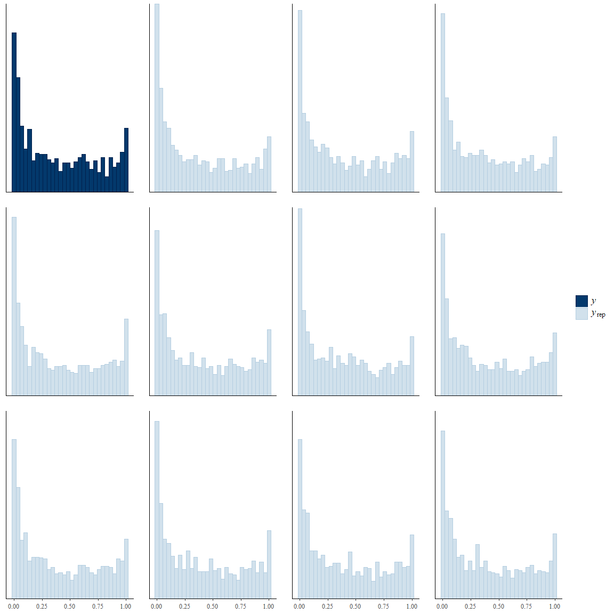<!-- -->

```r
pp_check(fit_exp2, type = "stat_grouped", group = "true_p", stat = "median")
```

```
## Using all posterior samples for ppc type 'stat_grouped' by default.
## `stat_bin()` using `bins = 30`. Pick better value with `binwidth`.
```

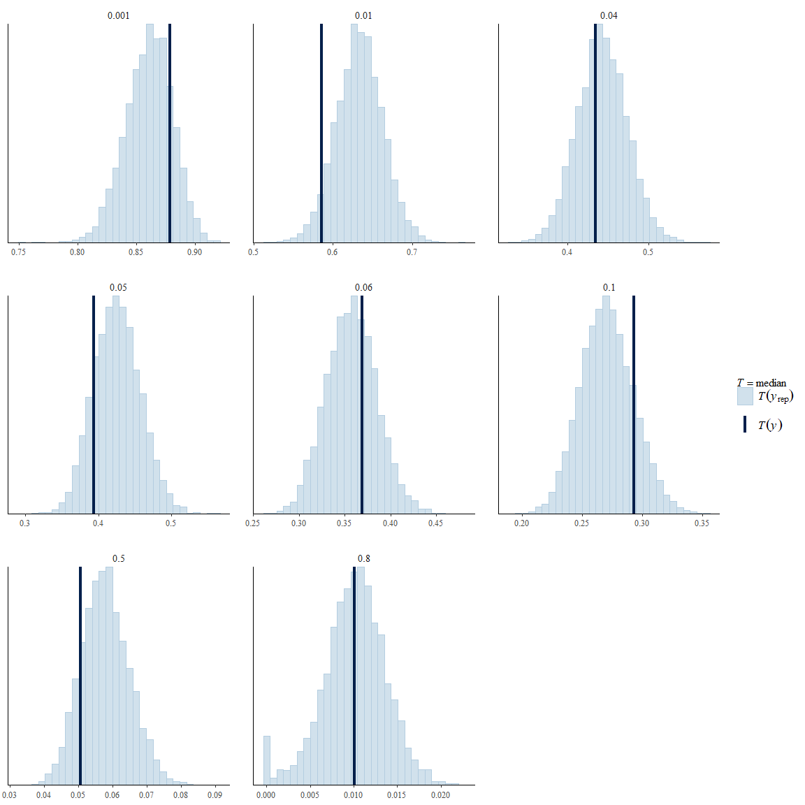<!-- -->

```r
pp_check(fit_exp2, type = "stat_grouped", group = "viz", stat = "mean")
```

```
## Using all posterior samples for ppc type 'stat_grouped' by default.
## `stat_bin()` using `bins = 30`. Pick better value with `binwidth`.
```

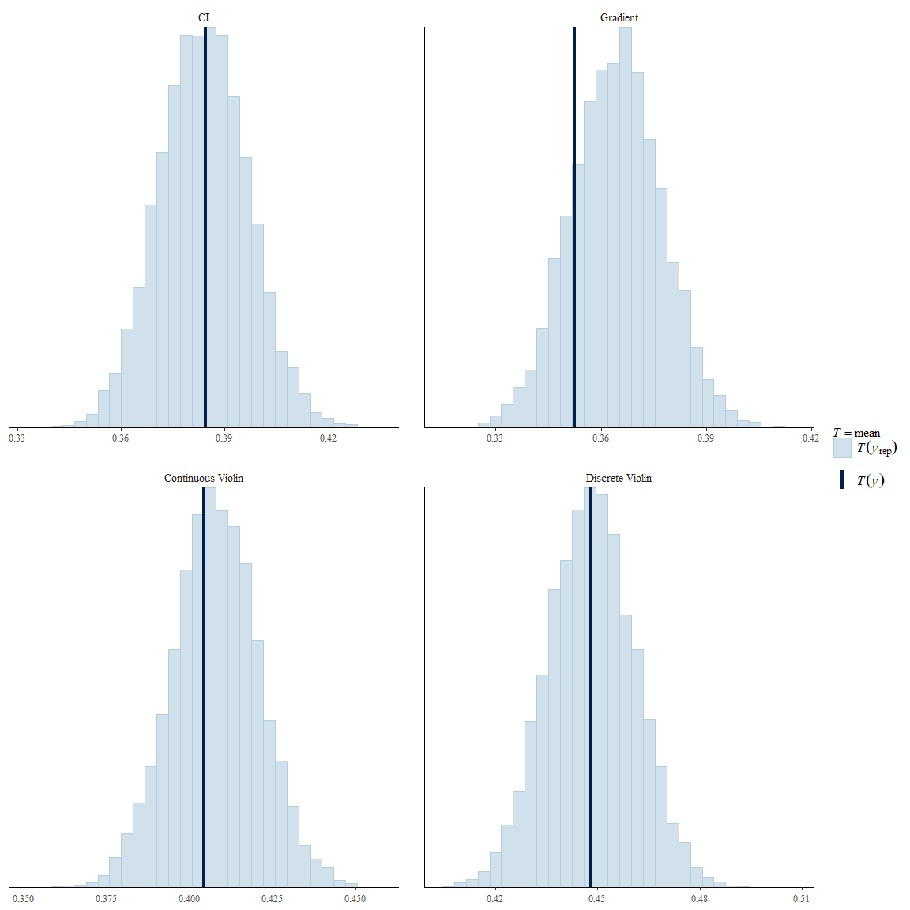<!-- -->

Note the difference compared to the first experiment: There is much less extremely confident answers than in the first case which was pretty symmetrical between the zero and full confidence answers. These posterior predictive samples are nicely in line with the data (it is feasible that the data could have been generated by this model).

Now we are ready to analyze the results. First, the posterior curves of the confidence given the underlying $p$-value:

```r
comb_exp2 <- fit_exp2$data %>% 
  data_grid(viz, logit_p, p_lt0.05, p_eq0.05, cat_p, true_p) %>% 
  filter(interaction(logit_p, p_lt0.05, p_eq0.05, cat_p, true_p) %in% 
      unique(interaction( 
        fit_exp2$data$logit_p, fit_exp2$data$p_lt0.05, 
        fit_exp2$data$p_eq0.05, fit_exp2$data$cat_p, 
        fit_exp2$data$true_p)))

f_mu_exp2 <- posterior_epred(fit_exp2, newdata = comb_exp2, re_formula = NA)

d <- data.frame(value = c(f_mu_exp2), 
  p = rep(comb_exp2$true_p, each = nrow(f_mu_exp2)),
  viz = rep(comb_exp2$viz, each = nrow(f_mu_exp2)),
  iter = 1:nrow(f_mu_exp2))

levels(d$viz) <- c("Classic CI", "Gradient CI", "Cont. violin CI", "Disc. violin CI")
cols  <- c("Classic CI" = "#0072B2", 
  "Gradient CI" = "#009E73", "Cont. violin CI" = "#CC79A7",
  "Disc. violin CI" = "#E69F00")
```


```r
sumr <- d %>% group_by(viz, p) %>%
  summarise(Estimate = mean(value), 
    Q2.5 = quantile(value, 0.025), 
    Q97.5 = quantile(value, 0.975)) %>%
  mutate(p = as.numeric(levels(p))[p])
```

```
## `summarise()` regrouping output by 'viz' (override with `.groups` argument)
```

```r
x_ticks <- c(0.001, 0.01, 0.04, 0.06, 0.1, 0.5, 0.8)
y_ticks <- c(0.05, seq(0.1, 0.9, by = 0.1), 0.95)
dodge <- 0.19
p1 <- sumr %>%
  ggplot(aes(x = p, y = Estimate, colour = viz)) + 
  geom_line(position = position_dodge(dodge), size = 0.1) +
  geom_linerange(data = sumr %>% filter(p < 0.03 | p > 0.07),
    aes(ymin = Q2.5, ymax = Q97.5), 
    position = position_dodge(dodge), size = 0.3,
    show.legend = FALSE) + 
  geom_point(position = position_dodge(dodge), size = 0.7, show.legend = FALSE) +
  ylab("Confidence") + xlab("p-value") + 
  scale_color_manual("Representation", values = cols) + 
  scale_y_continuous(trans="logit", breaks = y_ticks, 
    minor_breaks = NULL, labels = y_ticks) + 
  scale_x_continuous(trans="logit",
    breaks = x_ticks, labels = x_ticks, minor_breaks = NULL) + 
  theme_classic() + 
  theme(legend.position = "bottom", 
    legend.title = element_blank(),
    axis.text.x = element_text(size = 12, angle = 45, hjust = 1, vjust = 1), 
    axis.text.y = element_text(size = 12),
    axis.title.x = element_text(size = 14, 
      margin = margin(t = -0.1, r = 0, b = -0.3, l = 0, unit = "cm")),
    axis.title.y = element_text(size = 14, 
      margin = margin(t = 0, r = -0.1, b = 0, l = -0.1, unit = "cm")),
    legend.text = element_text(size = 14))  + 
  geom_rect(xmin = qlogis(0.03), xmax = qlogis(0.07), ymin = qlogis(0.31), ymax = qlogis(0.82), 
    color = "grey70", alpha = 0, linetype = "dashed", size = 0.1) + 
  guides(colour = guide_legend(override.aes = list(size = 1.5)))


p2 <- sumr %>% filter(p > 0.02 & p < 0.09) %>%
  ggplot(aes(x = p, y = Estimate, colour = viz)) + 
  geom_line(position = position_dodge(0.1), size = 0.1) +
  geom_linerange(
    aes(ymin = Q2.5, ymax = Q97.5), 
    position = position_dodge(0.1), size = 0.3,
    show.legend = FALSE) + 
  geom_point(position = position_dodge(0.1), size = 0.7) +
  ylab("Confidence") + xlab("p-value") + 
  scale_color_manual("Representation", values = cols) + 
  scale_y_continuous(trans="logit", breaks = y_ticks,
    minor_breaks = NULL, labels = y_ticks) + 
  scale_x_continuous(trans="logit",
    breaks = c(0.04, 0.05, 0.06), 
    labels = c(0.04, 0.05, 0.06), 
    minor_breaks = NULL) + 
  theme_classic() + 
  theme(legend.position = "none",  
    axis.title.x = element_blank(), axis.title.y = element_blank(),
    plot.background = element_blank(),
    plot.margin=unit(c(-4,-9,0,0), "mm"),
    axis.text.x = element_text(size = 12), 
    axis.text.y = element_text(size = 12)) 

p <- p1 + coord_cartesian(xlim = c(0.001, 0.9), ylim = c(0.045, 0.95)) + 
  annotation_custom(
    ggplotGrob(p2), 
    xmin = qlogis(0.2), xmax = qlogis(0.9), ymin = qlogis(0.3), ymax = qlogis(0.95))
p
```

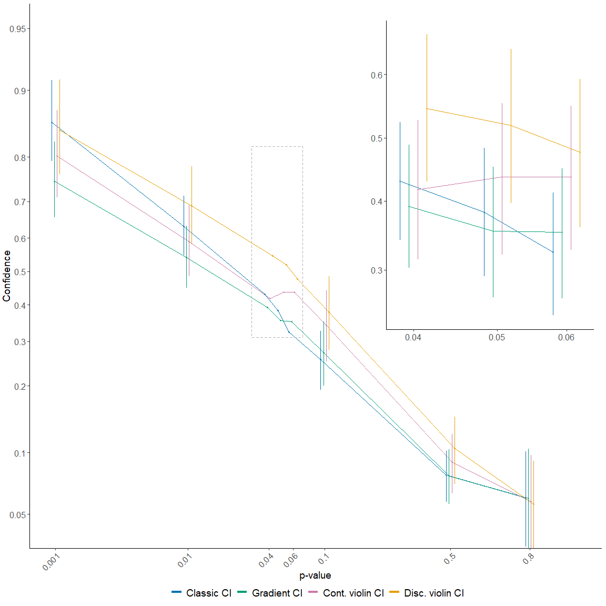<!-- -->


And the probability of extreme answer:

```r
f_zoi_exp2 <- fitted(fit_exp2, newdata = comb_exp2, re_formula = NA, dpar = "zoi")
df_01_exp2 <- data.frame(
  p = plogis(comb_exp2$logit_p),
  viz = comb_exp2$viz,
  f_zoi_exp2)
levels(df_01_exp2$viz) <- levels(d$viz)
y_ticks <- c(0.001, 0.01, seq(0.1,0.9,by=0.2))

p <- df_01_exp2 %>%
  ggplot(aes(x = p, y = Estimate, colour = viz)) +
  geom_linerange(aes(ymin = Q2.5, ymax = Q97.5),
    position = position_dodge(width=0.19)) +
  geom_line(alpha=0.5, position = position_dodge(width=0.19))  +
  ylab("Probability of all-or-none answer") + xlab("p-value") +
  scale_color_manual("Representation", values = cols) + 
  theme_classic() +
  scale_y_continuous(trans = "logit",
    breaks = y_ticks, labels = y_ticks, minor_breaks = NULL) +
  scale_x_continuous(trans = "logit",
    breaks = x_ticks, labels = x_ticks, minor_breaks = NULL) +
  theme(axis.text.x = element_text(angle = 90, hjust = 1, size = 10), legend.position = "bottom",
    axis.title.x = element_text(size = 12),
    axis.text.y = element_text(size = 10), axis.title.y = element_text(size = 12),
    legend.text=element_text(size = 10), strip.text.x = element_text(size = 10))
p
```

<!-- -->


Again we can compute the average drop in perceived confidence when moving from $p = 0.04$ to $p=0.06$:


```r
d %>% group_by(viz, iter) %>% 
  summarise(difference = value[p == "0.04"] - value[p == "0.06"]) %>%
  summarise(mean = mean(difference), sd = sd(difference),
    "2.5%" = quantile(difference, 0.025), 
    "97.5" = quantile(difference, 0.975))
```

```
## `summarise()` regrouping output by 'viz' (override with `.groups` argument)
```

```
## `summarise()` ungrouping output (override with `.groups` argument)
```

```
## # A tibble: 4 x 5
##   viz                mean     sd    `2.5%` `97.5`
##   <fct>             <dbl>  <dbl>     <dbl>  <dbl>
## 1 Classic CI       0.107  0.0336  0.0403   0.173 
## 2 Gradient CI      0.0390 0.0305 -0.0212   0.100 
## 3 Cont. violin CI -0.0198 0.0343 -0.0869   0.0475
## 4 Disc. violin CI  0.0699 0.0358  0.000347 0.141
```

There is a peculiar rise in confidence level in case of continuous Violin CI when the underlying $p$-value is 0.05, but overall, compared to the first experiment the results here do not show strong differences in cliff effect or dichotomous thinking, and actually is no clear signs of these phenomena in this experiment:


```r
p <- d %>% group_by(viz, iter) %>% 
  summarise(difference = value[p == "0.04"] - value[p == "0.06"]) %>% 
  ggplot(aes(x = difference, fill = viz, colour = viz)) + 
  geom_density(bw = 0.01, alpha = 0.6) +
  theme_classic() + 
  scale_fill_manual("Representation", values = cols) + 
  scale_colour_manual("Representation", values = cols) + 
  ylab("Posterior density") + 
  xlab("E[confidence(p=0.04) - confidence(p=0.06)]") +
  theme(legend.position = "bottom", 
    legend.title = element_blank(),
    axis.text.x = element_text(size = 12, hjust = 1, vjust = 1), 
    axis.text.y = element_text(size = 12),
    axis.title.x = element_text(size = 14),
    axis.title.y = element_text(size = 14),
    legend.text = element_text(size = 14)) 
```

```
## `summarise()` regrouping output by 'viz' (override with `.groups` argument)
```

```r
p 
```

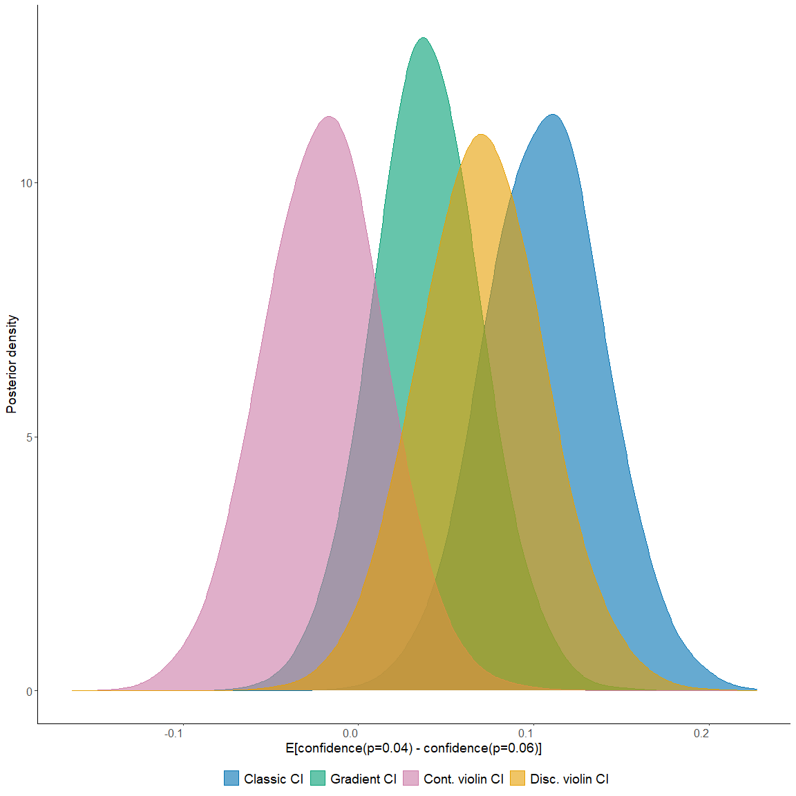<!-- -->


```r
postprob <- d %>% group_by(viz, iter) %>% 
  summarise(difference = value[p == "0.04"] - value[p == "0.06"]) %>%
  group_by(iter) %>% 
  mutate(ci_vs_gradient = difference[viz == "Classic CI"] - 
      difference[viz == "Gradient CI"],
    ci_vs_cviolin = difference[viz == "Classic CI"] - 
      difference[viz == "Cont. violin CI"],
    ci_vs_dviolin = difference[viz == "Classic CI"] - 
      difference[viz == "Disc. violin CI"],
    gradient_vs_cviolin = difference[viz == "Gradient CI"] - 
      difference[viz == "Cont. violin CI"],
    gradient_vs_dviolin = difference[viz == "Gradient CI"] - 
      difference[viz == "Disc. violin CI"],
    cviolin_vs_dviolin = difference[viz == "Cont. violin CI"] - 
      difference[viz == "Disc. violin CI"]) %>%
  ungroup() %>% summarise(
    "P(CI > gradient)" = mean(ci_vs_gradient > 0),
    "P(CI > cviolin)" = mean(ci_vs_cviolin > 0),
    "P(CI > dviolin)" = mean(ci_vs_dviolin > 0),
    "P(gradient > cont violin)" = mean(gradient_vs_cviolin > 0),
    "P(gradient > disc violin)" = mean(gradient_vs_dviolin > 0),
    "P(cont violin > disc violin)" = mean(cviolin_vs_dviolin > 0))
```

```
## `summarise()` regrouping output by 'viz' (override with `.groups` argument)
```

```r
round(t(as.data.frame(postprob)), 2)
```

```
##                              [,1]
## P(CI > gradient)             0.96
## P(CI > cviolin)              1.00
## P(CI > dviolin)              0.80
## P(gradient > cont violin)    0.93
## P(gradient > disc violin)    0.22
## P(cont violin > disc violin) 0.02
```

### Results for the model with expertise

Now we consider expanded model with with expertise as predictor:


```r
fit_expertise <- brm(bf(
  confidence ~ 
    expertise * viz * p_lt0.05 * logit_p + 
    expertise * viz * p_eq0.05 +
    (viz + p_lt0.05 * logit_p + p_eq0.05 | id),
  zoi ~ 
    expertise * viz + viz * true_p + (viz | id),
  coi ~ mo(cat_p),
  sigma ~ expertise * viz + (1 | id)),
  data = data2,
  family = logit_p_gaussian,
  stanvars = stanvar(scode = stan_funs, block = "functions"),
  chains = 4, cores = 4, iter = 2000, init = 0, 
  save_warmup = FALSE, save_all_pars = TRUE, refresh = 0)
```


```r
comb_exp2 <- fit_expertise$data %>% 
  data_grid(expertise, viz, logit_p, p_lt0.05, p_eq0.05, cat_p, true_p) %>% 
  filter(interaction(expertise, logit_p, p_lt0.05, p_eq0.05, cat_p, true_p) %in% 
      unique(interaction(fit_expertise$data$expertise, 
        fit_expertise$data$logit_p, fit_expertise$data$p_lt0.05, 
        fit_expertise$data$p_eq0.05, fit_expertise$data$cat_p, 
        fit_expertise$data$true_p)))

f_mu_exp2 <- posterior_epred(fit_expertise, newdata = comb_exp2, re_formula = NA)

d <- data.frame(value = c(f_mu_exp2), 
  p = rep(comb_exp2$true_p, each = nrow(f_mu_exp2)),
  viz = rep(comb_exp2$viz, each = nrow(f_mu_exp2)),
  expertise = rep(comb_exp2$expertise, each = nrow(f_mu_exp2)),
  iter = 1:nrow(f_mu_exp2))

levels(d$viz) <- c("Classic CI", "Gradient CI", "Cont. violin CI", "Disc. violin CI")
cols  <- c("Classic CI" = "#0072B2", 
  "Gradient CI" = "#009E73", "Cont. violin CI" = "#CC79A7",
  "Disc. violin CI" = "#E69F00")
```

Here are posterior curves for the four different groups:

```r
sumr <- d %>% group_by(viz, p, expertise) %>%
  summarise(Estimate = mean(value), 
    Q2.5 = quantile(value, 0.025), 
    Q97.5 = quantile(value, 0.975)) %>%
  mutate(p = as.numeric(levels(p))[p])
```

```
## `summarise()` regrouping output by 'viz', 'p' (override with `.groups` argument)
```

```r
x_ticks <- c(0.001, 0.01, 0.04, 0.06, 0.1, 0.5, 0.8)
y_ticks <- c(0.05, seq(0.1, 0.9, by = 0.1), 0.95)
dodge <- 0.19

p11 <- sumr %>% filter(expertise == "Stats/ML") %>%
  ggplot(aes(x = p, y = Estimate, colour = viz)) + 
  geom_line(position = position_dodge(dodge), size = 0.1) +
  geom_linerange(data = sumr %>% filter(p < 0.03 | p > 0.07),
    aes(ymin = Q2.5, ymax = Q97.5), 
    position = position_dodge(dodge), size = 0.3,
    show.legend = FALSE) + 
  geom_point(position = position_dodge(dodge), size = 0.7, show.legend = FALSE) +
  ylab("Confidence") + xlab("p-value") + 
  scale_color_manual("Representation", values =  cols) + 
  scale_y_continuous(trans="logit", breaks = y_ticks, 
    minor_breaks = NULL, labels = y_ticks) + 
  scale_x_continuous(trans="logit",
    breaks = x_ticks, labels = x_ticks, minor_breaks = NULL) + 
  theme_classic() + 
  theme(legend.position = "bottom", 
    legend.margin = margin(t = -0.1, b = 0, unit = "cm"),
    legend.title = element_blank(),
    axis.text.x = element_text(size = 12, angle = 45, hjust = 1, vjust = 1), 
    axis.text.y = element_text(size = 12),
    axis.title.x = element_text(size = 14, 
      margin = margin(t = -0.1, r = 0, b = -0.3, l = 0, unit = "cm")),
    axis.title.y = element_text(size = 14, 
      margin = margin(t = 0, r = -0.1, b = 0, l = -0.1, unit = "cm")),
    legend.text = element_text(size = 14))  + 
  geom_rect(xmin = qlogis(0.03), xmax = qlogis(0.07), 
    ymin = qlogis(0.31), ymax = qlogis(0.82), 
    color = "grey70", alpha = 0, linetype = "dashed", size = 0.1) + 
  guides(colour = guide_legend(override.aes = list(size = 1.5))) 


p21 <- sumr %>% filter(expertise == "Stats/ML") %>% 
  filter(p > 0.02 & p < 0.09) %>%
  ggplot(aes(x = p, y = Estimate, colour = viz)) + 
  geom_line(position = position_dodge(0.1), size = 0.1) +
  geom_linerange(
    aes(ymin = Q2.5, ymax = Q97.5), 
    position = position_dodge(0.1), size = 0.3,
    show.legend = FALSE) + 
  geom_point(position = position_dodge(0.1), size = 0.7) +
  ylab("Confidence") + xlab("p-value") + 
  scale_color_manual("Representation", values =  cols) + 
  scale_y_continuous(trans="logit", breaks = y_ticks,
    minor_breaks = NULL, labels = y_ticks) + 
  scale_x_continuous(trans="logit",
    breaks = c(0.04, 0.05, 0.06), 
    labels = c(0.04, 0.05, 0.06), 
    minor_breaks = NULL) + 
  theme_classic() + 
  theme(legend.position = "none",  
    axis.title.x = element_blank(), axis.title.y = element_blank(),
    plot.background = element_blank(),
    plot.margin=unit(c(-4,-9,0,0), "mm"),
    axis.text.x = element_text(size = 12), 
    axis.text.y = element_text(size = 12)) 

yrange <- c(min(sumr$Q2.5)-0.001, max(sumr$Q97.5) +0.001)
p1 <- p11 + coord_cartesian(xlim = c(0.001, 0.9), 
  ylim = yrange) + 
  annotation_custom(
    ggplotGrob(p21), 
    xmin = qlogis(0.2), xmax = qlogis(0.9), ymin = qlogis(0.3), ymax = qlogis(0.95))

p12 <- sumr %>% filter(expertise == "VIS/HCI") %>%
  ggplot(aes(x = p, y = Estimate, colour = viz)) + 
  geom_line(position = position_dodge(dodge), size = 0.1) +
  geom_linerange(data = sumr %>% filter(p < 0.03 | p > 0.07),
    aes(ymin = Q2.5, ymax = Q97.5), 
    position = position_dodge(dodge), size = 0.3,
    show.legend = FALSE) + 
  geom_point(position = position_dodge(dodge), size = 0.7, show.legend = FALSE) +
  ylab("Confidence") + xlab("p-value") + 
  scale_color_manual("Representation", values =  cols) + 
  scale_y_continuous(trans="logit", breaks = y_ticks, minor_breaks = NULL, labels = y_ticks) + 
  scale_x_continuous(trans="logit",
    breaks = x_ticks, labels = x_ticks, minor_breaks = NULL) + 
  theme_classic() + 
  theme(legend.position = "bottom", 
    legend.title = element_blank(),
    axis.text.x = element_text(size = 12, angle = 45, hjust = 1, vjust = 1), 
    axis.text.y = element_text(size = 12),
    axis.title.x = element_text(size = 14, margin = margin(t = -0.1, r = 0, b = -0.3, l = 0, unit = "cm")),
    axis.title.y = element_text(size = 14, margin = margin(t = 0, r = -0.1, b = 0, l = -0.1, unit = "cm")),
    legend.text = element_text(size = 14))  + 
  geom_rect(xmin = qlogis(0.03), xmax = qlogis(0.07), ymin = qlogis(0.31), ymax = qlogis(0.82), 
    color = "grey70", alpha = 0, linetype = "dashed", size = 0.1) + 
  guides(colour = guide_legend(override.aes = list(size = 1.5))) 


p22 <- sumr %>% filter(expertise == "VIS/HCI") %>% 
  filter(p > 0.02 & p < 0.09) %>%
  ggplot(aes(x = p, y = Estimate, colour = viz)) + 
  geom_line(position = position_dodge(0.1), size = 0.1) +
  geom_linerange(
    aes(ymin = Q2.5, ymax = Q97.5), 
    position = position_dodge(0.1), size = 0.3,
    show.legend = FALSE) + 
  geom_point(position = position_dodge(0.1), size = 0.7) +
  ylab("Confidence") + xlab("p-value") + 
   scale_color_manual("Representation", values =  cols) + 
  scale_y_continuous(trans="logit", breaks = y_ticks,
    minor_breaks = NULL, labels = y_ticks) + 
  scale_x_continuous(trans="logit",
    breaks = c(0.04, 0.05, 0.06), 
    labels = c(0.04, 0.05, 0.06), 
    minor_breaks = NULL) + 
  theme_classic() + 
  theme(legend.position = "none",  
    axis.title.x = element_blank(), axis.title.y = element_blank(),
    plot.background = element_blank(),
    plot.margin=unit(c(-4,-9,0,0), "mm"),
    axis.text.x = element_text(size = 12), 
    axis.text.y = element_text(size = 12)) 

p2 <- p12 + coord_cartesian(xlim = c(0.001, 0.9), ylim = yrange) + 
  annotation_custom(
    ggplotGrob(p22), 
    xmin = qlogis(0.2), xmax = qlogis(0.9), ymin = qlogis(0.3), ymax = qlogis(0.95))

p13 <- sumr %>% filter(expertise == "Social science and humanities") %>%
  ggplot(aes(x = p, y = Estimate, colour = viz)) + 
  geom_line(position = position_dodge(dodge), size = 0.1) +
  geom_linerange(data = sumr %>% filter(p < 0.03 | p > 0.07),
    aes(ymin = Q2.5, ymax = Q97.5), 
    position = position_dodge(dodge), size = 0.3,
    show.legend = FALSE) + 
  geom_point(position = position_dodge(dodge), size = 0.7, show.legend = FALSE) +
  ylab("Confidence") + xlab("p-value") + 
  scale_color_manual("Representation", values =  cols) + 
  scale_y_continuous(trans="logit", breaks = y_ticks, minor_breaks = NULL, labels = y_ticks) + 
  scale_x_continuous(trans="logit",
    breaks = x_ticks, labels = x_ticks, minor_breaks = NULL) + 
  theme_classic() + 
  theme(legend.position = "bottom", 
    legend.title = element_blank(),
    axis.text.x = element_text(size = 12, angle = 45, hjust = 1, vjust = 1), 
    axis.text.y = element_text(size = 12),
    axis.title.x = element_text(size = 14, margin = margin(t = -0.1, r = 0, b = -0.3, l = 0, unit = "cm")),
    axis.title.y = element_text(size = 14, margin = margin(t = 0, r = -0.1, b = 0, l = -0.1, unit = "cm")),
    legend.text = element_text(size = 14))  + 
  geom_rect(xmin = qlogis(0.03), xmax = qlogis(0.07), ymin = qlogis(0.31), ymax = qlogis(0.82), 
    color = "grey70", alpha = 0, linetype = "dashed", size = 0.1) + 
  guides(colour = guide_legend(override.aes = list(size = 1.5))) 


p23 <- sumr %>% filter(expertise == "Social science and humanities") %>% 
  filter(p > 0.02 & p < 0.09) %>%
  ggplot(aes(x = p, y = Estimate, colour = viz)) + 
  geom_line(position = position_dodge(0.1), size = 0.1) +
  geom_linerange(
    aes(ymin = Q2.5, ymax = Q97.5), 
    position = position_dodge(0.1), size = 0.3,
    show.legend = FALSE) + 
  geom_point(position = position_dodge(0.1), size = 0.7) +
  ylab("Confidence") + xlab("p-value") + 
  scale_color_manual("Representation", values =  cols) + 
  scale_y_continuous(trans="logit", breaks = y_ticks,
    minor_breaks = NULL, labels = y_ticks) + 
  scale_x_continuous(trans="logit",
    breaks = c(0.04, 0.05, 0.06), 
    labels = c(0.04, 0.05, 0.06), 
    minor_breaks = NULL) + 
  theme_classic() + 
  theme(legend.position = "none",  
    axis.title.x = element_blank(), axis.title.y = element_blank(),
    plot.background = element_blank(),
    plot.margin=unit(c(-4,-9,0,0), "mm"),
    axis.text.x = element_text(size = 12), 
    axis.text.y = element_text(size = 12)) 

p3 <- p13 + coord_cartesian(xlim = c(0.001, 0.9), ylim = yrange) + 
  annotation_custom(
    ggplotGrob(p23), 
    xmin = qlogis(0.2), xmax = qlogis(0.9), ymin = qlogis(0.3), ymax = qlogis(0.95))


p14 <- sumr %>% filter(expertise == "Physical and life sciences") %>%
  ggplot(aes(x = p, y = Estimate, colour = viz)) + 
  geom_line(position = position_dodge(dodge), size = 0.1) +
  geom_linerange(data = sumr %>% filter(p < 0.03 | p > 0.07),
    aes(ymin = Q2.5, ymax = Q97.5), 
    position = position_dodge(dodge), size = 0.3,
    show.legend = FALSE) + 
  geom_point(position = position_dodge(dodge), size = 0.7, show.legend = FALSE) +
  ylab("Confidence") + xlab("p-value") + 
  scale_color_manual("Representation", values =  cols) + 
  scale_y_continuous(trans="logit", breaks = y_ticks, minor_breaks = NULL, labels = y_ticks) + 
  scale_x_continuous(trans="logit",
    breaks = x_ticks, labels = x_ticks, minor_breaks = NULL) + 
  theme_classic() + 
  theme(legend.position = "bottom", 
    legend.title = element_blank(),
    axis.text.x = element_text(size = 12, angle = 45, hjust = 1, vjust = 1), 
    axis.text.y = element_text(size = 12),
    axis.title.x = element_text(size = 14, margin = margin(t = -0.1, r = 0, b = -0.3, l = 0, unit = "cm")),
    axis.title.y = element_text(size = 14, margin = margin(t = 0, r = -0.1, b = 0, l = -0.1, unit = "cm")),
    legend.text = element_text(size = 14))  + 
  geom_rect(xmin = qlogis(0.03), xmax = qlogis(0.07), ymin = qlogis(0.31), ymax = qlogis(0.82), 
    color = "grey70", alpha = 0, linetype = "dashed", size = 0.1) + 
  guides(colour = guide_legend(override.aes = list(size = 1.5))) 


p24 <- sumr %>% filter(expertise == "Physical and life sciences") %>% 
  filter(p > 0.02 & p < 0.09) %>%
  ggplot(aes(x = p, y = Estimate, colour = viz)) + 
  geom_line(position = position_dodge(0.1), size = 0.1) +
  geom_linerange(
    aes(ymin = Q2.5, ymax = Q97.5), 
    position = position_dodge(0.1), size = 0.3,
    show.legend = FALSE) + 
  geom_point(position = position_dodge(0.1), size = 0.7) +
  ylab("Confidence") + xlab("p-value") + 
  scale_color_manual("Representation", values =  cols) + 
  scale_y_continuous(trans="logit", breaks = y_ticks,
    minor_breaks = NULL, labels = y_ticks) + 
  scale_x_continuous(trans="logit",
    breaks = c(0.04, 0.05, 0.06), 
    labels = c(0.04, 0.05, 0.06), 
    minor_breaks = NULL) + 
  theme_classic() + 
  theme(legend.position = "none",  
    axis.title.x = element_blank(), axis.title.y = element_blank(),
    plot.background = element_blank(),
    plot.margin=unit(c(-4,-9,0,0), "mm"),
    axis.text.x = element_text(size = 12), 
    axis.text.y = element_text(size = 12)) 

p4 <- p14 + coord_cartesian(xlim = c(0.001, 0.9), ylim = yrange) + 
  annotation_custom(
    ggplotGrob(p24), 
    xmin = qlogis(0.2), xmax = qlogis(0.9), ymin = qlogis(0.3), ymax = qlogis(0.95))


library(patchwork)
p <- (p1 + ggtitle("Stats/ML")) + (p2 + ggtitle("VIS/HCI")) + 
  (p3 + ggtitle("Social sciences and humanities")) + 
  (p4 + ggtitle("Physical and life sciences"))
p
```

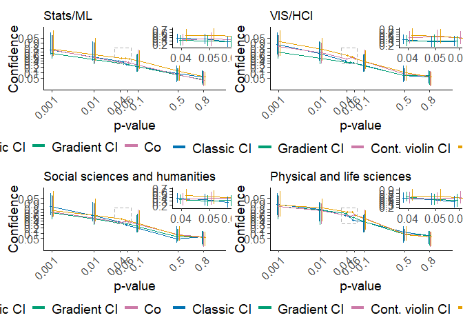<!-- -->

And the expertise-specific cliff effects:

```r
d %>% group_by(expertise, viz, iter) %>% 
  summarise(difference = value[p == "0.04"] - value[p == "0.06"]) %>%
  summarise(mean = mean(difference), sd = sd(difference),
    "2.5%" = quantile(difference, 0.025), 
    "97.5" = quantile(difference, 0.975))
```

```
## `summarise()` regrouping output by 'expertise', 'viz' (override with `.groups` argument)
```

```
## `summarise()` regrouping output by 'expertise' (override with `.groups` argument)
```

```
## # A tibble: 16 x 6
## # Groups:   expertise [4]
##    expertise                     viz                 mean     sd   `2.5%` `97.5`
##    <fct>                         <fct>              <dbl>  <dbl>    <dbl>  <dbl>
##  1 Stats/ML                      Classic CI       0.114   0.0451  0.0261  0.203 
##  2 Stats/ML                      Gradient CI      0.0347  0.0470 -0.0598  0.127 
##  3 Stats/ML                      Cont. violin CI -0.00827 0.0607 -0.127   0.113 
##  4 Stats/ML                      Disc. violin CI  0.0244  0.0566 -0.0858  0.137 
##  5 VIS/HCI                       Classic CI       0.0697  0.0809 -0.0852  0.229 
##  6 VIS/HCI                       Gradient CI      0.00578 0.102  -0.165   0.230 
##  7 VIS/HCI                       Cont. violin CI -0.00502 0.0968 -0.191   0.189 
##  8 VIS/HCI                       Disc. violin CI  0.117   0.0943 -0.0680  0.303 
##  9 Social science and humanities Classic CI       0.116   0.0611  0.00253 0.237 
## 10 Social science and humanities Gradient CI      0.0254  0.0512 -0.0704  0.127 
## 11 Social science and humanities Cont. violin CI -0.0321  0.0586 -0.151   0.0828
## 12 Social science and humanities Disc. violin CI  0.0809  0.0650 -0.0490  0.208 
## 13 Physical and life sciences    Classic CI       0.168   0.124  -0.0683  0.429 
## 14 Physical and life sciences    Gradient CI      0.155   0.122  -0.0416  0.458 
## 15 Physical and life sciences    Cont. violin CI -0.0253  0.0957 -0.188   0.180 
## 16 Physical and life sciences    Disc. violin CI  0.113   0.0902 -0.0390  0.307
```

As with the model without expertise, we see no clear signs of cliff effect here.

### Reanalysis with cleaned data

Finally we again test how does the results depend on those confidence curves which have clearly positive slope or large increases in confidence when $p$-value increases.

We use simple linear model with logit-transformed $p$-value and trimmed logit-transformed confidence, and check whether the corresponding coefficient is clearly positive (arbitrarily chose as 0.1), and in addition to this we remove those curves where the difference between two consecutive confidence values are larger than 0.2 (this should of course be negative):


```r
data <- readRDS("experiment2/data/exp2_data.rds")
outliers_slope <- data %>% group_by(id, viz) %>%
  mutate(p_logit = qlogis(p), c_logit = qlogis(
    ifelse(confidence == 0, 0.001, ifelse(confidence == 1, 0.999, confidence)))) %>%
  summarize(
    slope = coef(lm(c_logit ~ p_logit))[2]) %>%
  filter(slope > 0.1)

outliers_diff <- data %>% group_by(id, viz) %>% 
  arrange(p, .by_group = TRUE) %>%
  mutate(diff = c(0,diff(confidence)), neg_diff = any(diff > 0.2)) %>%
  filter(neg_diff)

data_cleaned <- data %>%
  filter(!(interaction(id,viz) %in% 
      interaction(outliers_slope$id, outliers_slope$viz))) %>%
  filter(!(interaction(id,viz) %in% 
      interaction(outliers_diff$id, outliers_diff$viz))) 

data_cleaned <- data_cleaned %>% 
  mutate(
    logit_p = qlogis(p),
    p_lt0.05 = factor(p < 0.05, levels = c(TRUE, FALSE), labels = c("Yes", "No")),
    p_eq0.05 = factor(p == 0.05, levels = c(TRUE, FALSE), labels = c("Yes", "No")),
    cat_p = recode_factor(true_p, 
      "0.06" = ">0.05", "0.1" = ">0.05", "0.5" = ">0.05", "0.8" = ">0.05",
      .ordered = TRUE))

fit_exp2 <- brm(bf(
  confidence ~ 
    viz * p_lt0.05 * logit_p + 
    viz * p_eq0.05 +
    (viz + p_lt0.05 * logit_p + p_eq0.05 | id),
  zoi ~ 
    viz * true_p + (viz | id),
  coi ~ mo(cat_p),
  sigma ~ viz + (1 | id)),
  data = data_cleaned,
  family = logit_p_gaussian,
  stanvars = stanvar(scode = stan_funs, block = "functions"),
  chains = 4, cores = 4, iter = 2000, init = 0, 
  save_warmup = FALSE, refresh = 0)
```


```r
comb_exp2 <- fit_exp2$data %>% 
  data_grid(viz, logit_p, p_lt0.05, p_eq0.05, cat_p, true_p) %>% 
  filter(interaction(logit_p, p_lt0.05, p_eq0.05, cat_p, true_p) %in% 
      unique(interaction( 
        fit_exp2$data$logit_p, fit_exp2$data$p_lt0.05, 
        fit_exp2$data$p_eq0.05, fit_exp2$data$cat_p, 
        fit_exp2$data$true_p)))

f_mu_exp2 <- posterior_epred(fit_exp2, newdata = comb_exp2, re_formula = NA)

d <- data.frame(value = c(f_mu_exp2), 
  p = rep(comb_exp2$true_p, each = nrow(f_mu_exp2)),
  viz = rep(comb_exp2$viz, each = nrow(f_mu_exp2)),
  iter = 1:nrow(f_mu_exp2))

levels(d$viz) <- c("Classic CI", "Gradient CI", "Cont. violin CI", "Disc. violin CI")

sumr <- d %>% group_by(viz, p) %>%
  summarise(Estimate = mean(value), 
    Q2.5 = quantile(value, 0.025), 
    Q97.5 = quantile(value, 0.975)) %>%
  mutate(p = as.numeric(levels(p))[p])
```

```
## `summarise()` regrouping output by 'viz' (override with `.groups` argument)
```

```r
cols  <- c("Classic CI" = "#0072B2", 
  "Gradient CI" = "#009E73", "Cont. violin CI" = "#CC79A7",
  "Disc. violin CI" = "#E69F00")
x_ticks <- c(0.001, 0.01, 0.04, 0.06, 0.1, 0.5, 0.8)
y_ticks <- c(0.05, seq(0.1, 0.9, by = 0.1), 0.95)
dodge <- 0.19

p1 <- sumr %>%
  ggplot(aes(x = p, y = Estimate, colour = viz)) + 
  geom_line(position = position_dodge(dodge), size = 0.1) +
  geom_linerange(data = sumr %>% filter(p < 0.03 | p > 0.07),
    aes(ymin = Q2.5, ymax = Q97.5), 
    position = position_dodge(dodge), size = 0.3,
    show.legend = FALSE) + 
  geom_point(position = position_dodge(dodge), size = 0.7, show.legend = FALSE) +
  ylab("Confidence") + xlab("p-value") + 
  scale_color_manual("Representation", values =  cols) + 
  scale_y_continuous(trans="logit", breaks = y_ticks, 
    minor_breaks = NULL, labels = y_ticks) + 
  scale_x_continuous(trans="logit",
    breaks = x_ticks, labels = x_ticks, minor_breaks = NULL) + 
  theme_classic() + 
  theme(legend.position = "bottom", 
    legend.title = element_blank(),
    axis.text.x = element_text(size = 12, angle = 45, hjust = 1, vjust = 1), 
    axis.text.y = element_text(size = 12),
    axis.title.x = element_text(size = 14, 
      margin = margin(t = -0.1, r = 0, b = -0.1, l = 0, unit = "cm")),
    axis.title.y = element_text(size = 14, 
      margin = margin(t = 0, r = -0.1, b = 0, l = -0.1, unit = "cm")),
    legend.text = element_text(size = 14))  + 
  geom_rect(xmin = qlogis(0.03), xmax = qlogis(0.07), ymin = qlogis(0.31), ymax = qlogis(0.82), 
    color = "grey70", alpha = 0, linetype = "dashed", size = 0.1) + 
  guides(colour = guide_legend(override.aes = list(size = 1.5)))


p2 <- sumr %>% filter(p > 0.02 & p < 0.09) %>%
  ggplot(aes(x = p, y = Estimate, colour = viz)) + 
  geom_line(position = position_dodge(0.1), size = 0.1) +
  geom_linerange(
    aes(ymin = Q2.5, ymax = Q97.5), 
    position = position_dodge(0.1), size = 0.3,
    show.legend = FALSE) + 
  geom_point(position = position_dodge(0.1), size = 0.7) +
  ylab("Confidence") + xlab("p-value") + 
  scale_color_manual("Representation", values =  cols) + 
  scale_y_continuous(trans="logit", breaks = y_ticks,
    minor_breaks = NULL, labels = y_ticks) + 
  scale_x_continuous(trans="logit",
    breaks = c(0.04, 0.05, 0.06), 
    labels = c(0.04, 0.05, 0.06), 
    minor_breaks = NULL) + 
  theme_classic() + 
  theme(legend.position = "none",  
    axis.title.x = element_blank(), axis.title.y = element_blank(),
    plot.background = element_blank(),
    plot.margin=unit(c(-4,-9,0,0), "mm"),
    axis.text.x = element_text(size = 12), 
    axis.text.y = element_text(size = 12)) 

p <- p1 + coord_cartesian(xlim = c(0.001, 0.9), ylim = c(0.045, 0.95)) + 
  annotation_custom(
    ggplotGrob(p2), 
    xmin = qlogis(0.2), xmax = qlogis(0.9), ymin = qlogis(0.3), ymax = qlogis(0.95))
p
```

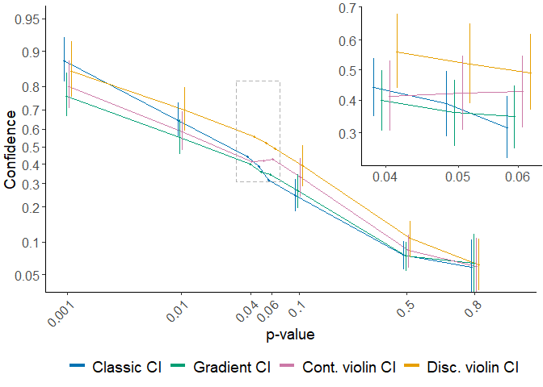<!-- -->

```r
d %>% group_by(viz, iter) %>% 
  summarise(difference = value[p == "0.04"] - value[p == "0.06"]) %>%
  summarise(mean = mean(difference), sd = sd(difference),
    "2.5%" = quantile(difference, 0.025), 
    "97.5" = quantile(difference, 0.975))
```

```
## `summarise()` regrouping output by 'viz' (override with `.groups` argument)
```

```
## `summarise()` ungrouping output (override with `.groups` argument)
```

```
## # A tibble: 4 x 5
##   viz                mean     sd    `2.5%` `97.5`
##   <fct>             <dbl>  <dbl>     <dbl>  <dbl>
## 1 Classic CI       0.125  0.0348  0.0565   0.193 
## 2 Gradient CI      0.0527 0.0314 -0.00831  0.114 
## 3 Cont. violin CI -0.0152 0.0347 -0.0834   0.0522
## 4 Disc. violin CI  0.0692 0.0370 -0.000345 0.143
```

Overall, the results are very similar to the analysis with the full data.
    
    
### Subjective rankings for second experiment

Read the data:

```r
path <- "experiment2/data"
files <- list.files(path, pattern = "subjective", full.names = TRUE)
n <- length(files)
rankdata2 <- data.frame(id = rep(1:n, each = 4),
  viz = factor(rep(c("violin2", "ci", "violin", "gradient")), 
    levels = c("violin2", "ci", "violin", "gradient")),
  rank = factor(NA, levels = 1:4))
for(i in 1:n) {
  fb <- fromJSON(files[i])
  rankdata2$id[4*(i-1) + 1:4] <- strsplit(strsplit(files[i], "subjective")[[1]], ".txt")[[2]]
  rankdata2$rank[4*(i-1) + 1:4] <- factor(fb$rank)
}
rankdata2$viz <- recode_factor(rankdata2$viz, "ci" = "CI", 
  "gradient" = "Gradient", 
  "violin" = "Continuous Violin", 
  "violin2" = "Discrete Violin")
rankdata2$viz <- relevel(rankdata2$viz, "CI")
rankdata2$rank <- factor(rankdata2$rank, ordered = TRUE)
rankdata2$id <- factor(rankdata2$id, levels = levels(data2$id))
ranks_exp2 <- distinct(inner_join(rankdata2, data2[, c("id", "viz", "expertise")]))
```


And fit the same model as in the first experiment:

```r
fit_rank2 <- brm(rank ~ viz + (1 | id), family = cumulative, 
  data = ranks_exp2, refresh = 0)
saveRDS(fit_rank2, file = "experiment2/results/fit_rank2.rds")
```

The ranking probabilities:

```r
effects_exp2 <- conditional_effects(fit_rank2, effects = "viz", 
  plot = FALSE, categorical = TRUE, 
  reformula=NA)

p <- ggplot(effects_exp2[[1]], aes(x = viz, y = estimate__, colour = cats__)) + 
  geom_point(position=position_dodge(0.5)) + 
  geom_errorbar(width=0.25, aes(ymin=lower__, ymax = upper__), 
    position = position_dodge(0.5)) + 
  theme_classic() + 
  ylab("Ranking \n probability") + xlab("Representation") +
  scale_x_discrete(labels = 
      c("Classic CI", "Gradient CI", "Cont. violin CI", "Disc. violin CI")) +
  scale_color_manual("Rank", 
    values = colsrank,
    labels = c("1 (best)", "2", "3", "4 (worst)")) + 
  theme(legend.position = "bottom", 
    legend.title = element_blank(),
    axis.text.x = element_text(size = 12,hjust = 1, vjust = 1), 
    axis.text.y = element_text(size = 12),
    axis.title.x = element_text(size = 14),
    axis.title.y = element_text(size = 14),
    legend.text = element_text(size = 14)) 
p
```

<!-- -->


Preferences between different techniques seem to be quite similar, except there seems to be preferences towards discrete violin CI plot.
